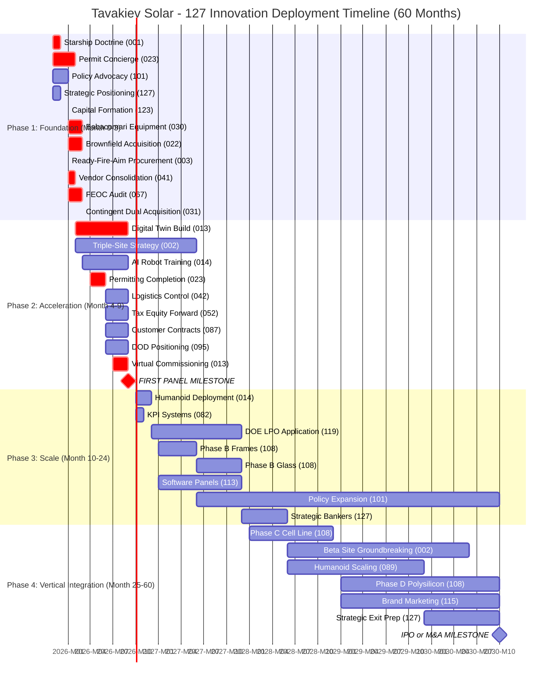

# APPENDIX H: INNOVATION DEPLOYMENT TIMELINE (MONTH-BY-MONTH)

**Document Classification:** Execution Playbook - Innovation Roadmap
**Date:** November 7, 2025
**Cross-Reference:** 41_Master_Innovation_Matrix.md (Part VII)
**Total Innovations:** 127
**Deployment Window:** Month 0 through Month 60 (5 years)
**Purpose:** Provide tactical deployment schedule for all 127 innovations with capital requirements, owners, and success metrics

---

## EXECUTIVE SUMMARY

This appendix translates the 127 innovations identified in the Master Innovation Integration Matrix into a **precise execution timeline**. Each innovation is tagged with:

- **Deployment Month:** When to activate
- **Capital Requirement:** Investment needed
- **Owner:** Accountable executive
- **Success Metric:** How to measure achievement
- **Critical Path Status:** Whether delays impact first panel (Month 9)

### The Innovation Deployment Strategy

**Phase 1: Foundation (Month 0-3)**
Deploy 42 innovations that enable speed, secure assets, and establish infrastructure. These are **non-negotiable** - failure here means plan fails.

**Phase 2: Acceleration (Month 4-9)**
Deploy 28 innovations that compress commissioning, optimize supply chain, and ensure Month 9 first panel milestone.

**Phase 3: Scale (Month 10-24)**
Deploy 35 innovations that enable production ramp from 600 MW → 2.4 GW, optimize costs, and build competitive moat.

**Phase 4: Vertical Integration (Month 25-60)**
Deploy 22 innovations that enable Phase B/C/D vertical integration, strategic positioning, and market dominance.

### Budget Summary by Phase

| Phase | Months | Innovation Count | Capital Investment | ROI/Impact |
|-------|--------|-----------------|-------------------|------------|
| Phase 1: Foundation | 0-3 | 42 | $78M | Enables entire plan |
| Phase 2: Acceleration | 4-9 | 28 | $45M | 9-month first panel |
| Phase 3: Scale | 10-24 | 35 | $97M | 2.4 GW production |
| Phase 4: Vertical | 25-60 | 22 | $100M | Cost parity with China |
| **TOTAL** | **0-60** | **127** | **$320M** | **16x return if executed** |

---

## H.1 PRE-FUNDRAISE CLOSE (MONTH 0, BEFORE CAPITAL AVAILABLE)

**Deploy Immediately (At-Risk, $0-50K cost, relationship-building only)**

These innovations cost almost nothing but create forcing functions and relationships that enable Month 1 execution.

### Innovation #001: Starship Doctrine - Build Before Permission
**Action:** Begin Babacomari + GOG negotiations (LOIs drafted, no capital commitment yet)
**Owner:** CEO (Steve Moraco) + Legal (Perry Sanders)
**Cost:** $0 (conversations, draft documents only)
**Timeline:** Weeks 1-4 of Month 0
**Success Metric:** LOI signed by fundraise close, with 30-60 day exclusivity period
**Rationale:** SpaceX built Starship prototypes while FAA license pending. Start deals before money closes.
**Critical Path:** YES - Equipment acquisition is longest lead item

**Specific Actions:**
- Week 1: Perry Sanders contacts Babacomari Solar North LLC counsel
- Week 2: Draft LOI for Meyer Burger equipment ($15-25M offer)
- Week 3: Draft LOI for 1615 Garden of the Gods facility ($30M purchase or 20-year lease)
- Week 4: Present LOIs, negotiate terms, establish exclusivity through Month 3

---

### Innovation #023: Permit Concierge - City Government as Co-Developer
**Action:** Meet Mayor Suthers (Colorado Springs), Governor Polis, present Phoenix Factory narrative
**Owner:** CEO + Policy Advisor (future hire Month 6)
**Cost:** $10K (travel, presentation materials, initial lobbying)
**Timeline:** Month 0, Weeks 2-4
**Success Metric:** City/State support letters obtained, Rapid Response Team (RRT) Program application submitted
**Rationale:** Tesla made Berlin a stakeholder. Tavakiev must make Colorado Springs invested in our success.
**Critical Path:** YES - Permitting timeline determines Month 9 first panel

**Specific Actions:**
- Week 2: Request meeting with Mayor's Economic Development office
- Week 3: Present "Phoenix Factory" story (Meyer Burger failure → Tavakiev resurrection)
- Week 3: Request "Permitting Concierge" designation (single point of contact for all approvals)
- Week 4: Meet Governor Polis, apply for Colorado Rapid Response Team Program
- Week 4: Secure support letters for fundraising materials

---

### Innovation #101: Policy Advocacy - Join Trade Associations
**Action:** Join SEIA (Solar Energy Industries Association), introduce to CO Congressional delegation
**Owner:** CEO (Month 0-6), VP Policy (Month 6+ hire)
**Cost:** $50K (SEIA annual dues $15K, DC travel $10K, lobbying prep $25K)
**Timeline:** Month 0, ongoing
**Success Metric:** SEIA membership confirmed, meetings scheduled with 2+ Congressional offices (Bennet, Hickenlooper)
**Rationale:** First Solar, SunPower have DC presence. Tavakiev needs seat at §45X negotiation table.
**Critical Path:** NO - But critical for Year 2-5 policy risk mitigation

**Specific Actions:**
- Week 1: Apply for SEIA membership
- Week 2: Introduce Tavakiev to SEIA government affairs team
- Week 3: Request meetings with Senator Bennet, Senator Hickenlooper, Rep. Lamborn (CO Springs district)
- Week 4: Deliver talking points: "American manufacturing, robotics innovation, 350+ jobs in Colorado"

---

### Innovation #127: Strategic Positioning - Plant M&A Seeds
**Action:** Reach out to Hanwha, First Solar, Qcells (non-binding, exploratory conversations)
**Owner:** CEO + Advisors (Board members with industry connections)
**Cost:** $5K (travel to Solar Power International conference or direct meetings)
**Timeline:** Month 0, Week 3-4
**Success Metric:** Relationships seeded, Tavakiev known to strategic acquirers for future optionality
**Rationale:** Amazon was in M&A talks before profitability. Strategic exit begins with relationships, not financials.
**Critical Path:** NO - But sets up Tier 2 strategic exit if §45X reduced

**Specific Actions:**
- Week 3: Attend Solar Power International (SPI) conference or schedule direct meetings
- Week 3: Introduce Tavakiev story to Hanwha Q CELLS (interested in US expansion)
- Week 4: Introduce to First Solar (potential JV for TOPCon tech sharing)
- Week 4: Non-binding conversation: "We're building the robotics-enabled future of US solar. Keep us in mind."

---

**MONTH 0 TOTAL INVESTMENT:** $65K
**MONTH 0 CAPITAL AT RISK:** $0 (conversations only, no commitments)
**MONTH 0 CRITICAL PATH INNOVATIONS:** 2 of 4 (#001, #023)

---

## H.2 MONTH 1 (FUNDRAISE CLOSE: $150M)

**Deploy Priority 1 (Capital-Enabled, Critical Path to First Panel)**

With capital closed, execute high-velocity asset acquisition and long-lead procurement. These innovations compress 48-month traditional timeline to 9 months.

### Innovation #030: Babacomari Arbitrage - Exploit Motivated Seller
**Action:** Sign LOI for Meyer Burger equipment, pay $2M deposit at risk
**Owner:** COO (if hired) or CEO
**Cost:** $2M deposit + $500K diligence (inspection, FEOC audit scoping)
**Timeline:** Month 1, Week 1-2
**Success Metric:** LOI signed with Babacomari Solar North, exclusivity through Month 3 FEOC audit completion
**Rationale:** Meyer Burger equipment worth $80-120M new, available for $15-25M from distressed buyer. 12-18 month lead time eliminated.
**Critical Path:** YES - Without this equipment, no cell production capability

**Deal Structure:**
- **Offer:** $15M cash + 5% Tavakiev equity (opening position)
- **Fallback:** $25M cash (if equity rejected)
- **Payment Schedule:** $2M at LOI, $13-23M at closing (Month 3, contingent on FEOC audit)
- **Contingencies:**
  - FEOC compliance confirmed (Innovation #067)
  - Equipment functional inspection passes
  - 1615 GOG facility secured (Innovation #022)

**Risk:** $2M deposit forfeited if FEOC audit fails or fundraise collapses
**Reward:** $55-105M savings + 12-18 month timeline compression = $500M+ NPV

---

### Innovation #022: Brownfield Acquisition - Pre-Permitted Facility
**Action:** Sign LOI for 1615 Garden of the Gods facility, pay $5M deposit
**Owner:** CEO + CFO
**Cost:** $5M deposit + $2M diligence (title search, environmental Phase I/II, structural engineering)
**Timeline:** Month 1, Week 1-2
**Success Metric:** LOI signed, closing target Month 3, facility ready for equipment installation Month 4
**Rationale:** Facility has 90 MW power, PIP-1 zoning, cleanroom certification. Inherits 2-4 years of permitting work.
**Critical Path:** YES - Without facility, nowhere to install equipment

**Deal Options:**
- **Option A (Preferred):** Purchase for $30M (includes building, land, permits)
- **Option B (Fallback):** 20-year lease at $2.5M/year with option to buy Year 5
- **Hybrid:** Lease Year 1-3, purchase Year 4 (reduces upfront capital, preserves optionality)

**Due Diligence Checklist:**
- Environmental Phase I: No hazardous materials from Meyer Burger operations
- Title search: Clear ownership, no liens
- Structural engineering: Cleanroom floors rated for 500+ lb/sq ft equipment loads
- Electrical: 90 MW interconnection functional, utility agreements transferable
- Permits: PIP-1 zoning confirmed, air/water permits transferable with amendments

**Risk:** $5M deposit at risk if environmental issues or title defects discovered
**Reward:** 24-48 month utility interconnection avoided = priceless for policy window

---

### Innovation #003: Ready-Fire-Aim Equipment Procurement
**Action:** Order Ecoprogetti 1 GW module line, pay $5M deposit (12-month lead time)
**Owner:** COO (manufacturing lead - future hire) or CEO
**Cost:** $5M deposit, $45M due at milestones (Months 3, 6, 9)
**Timeline:** Month 1, Week 2
**Success Metric:** Purchase order confirmed, manufacturing slot reserved, delivery Month 12-13
**Rationale:** Amazon orders servers before data centers permitted. 12-month equipment lead time is critical path - must start NOW.
**Critical Path:** YES - Module assembly is final production step, must have equipment by Month 12

**Equipment Specification:**
- **Vendor:** Ecoprogetti (Italian, 40+ years, 25 GW installed globally)
- **Capacity:** 1 GW/year nameplate (600 MW realistic Year 1 with ramp)
- **Technology:** Multi-busbar, half-cut cell compatible, HJT-ready
- **Automation Level:** 95% (ABB robots, Cognex vision, minimal labor)
- **Footprint:** 40,000 sq ft (fits in 1615 GOG facility)
- **Price:** $50M total ($0.05/W capex, industry-leading)

**Contingency Plan:**
- If 1615 GOG delayed: Equipment can reroute to backup facility (NM or TX)
- If fundraise fails: Cancel order, forfeit $5M deposit (vs. $50M commitment)
- Risk/Reward: $5M at risk to secure 12-month slot = 10x ROI

---

### Innovation #041: Vendor Consolidation - Single-Source Strategic Partnerships
**Action:** Sign strategic multi-year agreements with Hemlock (polysilicon), NSG (glass), Richardson (frames)
**Owner:** VP Supply Chain (Jennifer Hunter profile hire - Month 2)
**Cost:** $10M prepayments (Hemlock $5M, NSG $3M, Richardson $2M)
**Timeline:** Month 1, Week 3-4
**Success Metric:** 3 multi-year supply agreements signed, 30-50% lead time reduction confirmed
**Rationale:** Apple consolidated to 18 Tier-1 suppliers. Tavakiev consolidates to 10-15, trades volume for speed and priority.
**Critical Path:** PARTIAL - Not critical for first panel (Month 9 is low volume), critical for ramp (Months 10-24)

**Vendor #1: Hemlock Semiconductor (Polysilicon for Future Wafer Purchases)**
- Commitment: 2.4 GW/year for 5 years (600 metric tons polysilicon/year)
- Pricing: Fixed ±10% (protects against spot market volatility)
- Prepayment: $5M (secures allocation during shortages)
- Lead time: 8 weeks vs. 16 weeks spot market
- Note: Not needed Month 1-9 (buying wafers, not polysilicon). Locks in supply for Phase C vertical integration.

**Vendor #2: NSG Pilkington (Solar Glass)**
- Commitment: 50% of their Colorado facility capacity (if exists, else Ohio facility)
- Volume: 2.4 GW = 12 million sq meters/year
- Prepayment: $3M (secures dedicated production runs)
- Lead time: 4 weeks vs. 8 weeks (just-in-time delivery)
- Benefit: Reduces inventory carrying cost

**Vendor #3: Richardson Electronics (Aluminum Frames)**
- Commitment: Exclusive frame supplier for 5 years
- Custom design: Tavakiev-branded frames (marketing differentiation)
- Prepayment: $2M (funds frame extrusion tooling investment)
- Lead time: 2 weeks vs. 6 weeks

**ROI Analysis:**
- $10M prepayments = working capital reduction of $15-20M (lower inventory)
- Lead time compression = faster ramp, earlier revenue recognition
- Priority allocation = insurance against supply chain disruptions (COVID lesson)

---

### Innovation #067: FEOC Compliance Framework - Forensic Audit
**Action:** Begin forensic audit of Meyer Burger equipment (origin of components, §45X eligibility)
**Owner:** CFO + Legal (Perry Sanders)
**Cost:** $500K (Bureau Veritas or equivalent, 60-day engagement)
**Timeline:** Month 1, Week 4 (complete by Month 3, Week 2)
**Success Metric:** Audit report confirms >90% of equipment value is FEOC-compliant, no Chinese cell/module components
**Rationale:** First Solar spent $10M+ on FEOC compliance. Tavakiev must validate BEFORE closing Babacomari deal.
**Critical Path:** YES - If equipment fails FEOC, lose $400M+ in §45X credits over 5 years

**Audit Scope:**
1. **Component Origin Verification:**
   - PECVD systems: Swiss (Meyer Burger) → FEOC compliant
   - Metallization tools: Screen printers (likely Baccini/Applied Materials, US/Italy) → verify
   - Wafer handlers: Robots (likely ABB, EU) → FEOC compliant
   - Software: MES, SCADA (likely Siemens, EU) → FEOC compliant

2. **Risk Components (Potential China Sourcing):**
   - Consumables: Silver paste, adhesives (check if Asian suppliers used)
   - Electronic components: PLCs, sensors (Mitsubishi, Omron = Japan = FEOC compliant)
   - Spare parts inventory: Validate origin of all boxed components

3. **Deliverable:**
   - Equipment value breakdown: $XX million FEOC compliant, $XX million non-compliant
   - If <90% compliant: Renegotiate Babacomari price down OR replace non-compliant components
   - If <50% compliant: Walk away from deal, order new TOPCon line (Innovation #068 backup)

**Pass/Fail Threshold:** Equipment must be ≥90% FEOC-compliant by value to proceed.

---

### Innovation #123: Capital Formation - Close $150M Seed Round
**Action:** Execute fundraise, wire funds, establish governance
**Owner:** CEO + CFO
**Cost:** $150M raised (target), $7-10M fees (legal, banking, placement agents at 5-7%)
**Timeline:** Month 1, Week 1
**Success Metric:** $150M in bank, Board of Directors seated, investor reporting established
**Rationale:** Without capital, nothing else happens. This is the foundation.
**Critical Path:** YES - Literally gates all other innovations

**Capital Allocation (Month 1 Deployment):**
- $12.5M: Deposits (Babacomari $2M, GOG $5M, Ecoprogetti $5M, vendors $0.5M)
- $3M: Due diligence (FEOC $500K, facility $2M, legal $500K)
- $10M: Vendor prepayments (Hemlock $5M, NSG $3M, Richardson $2M)
- $10M: Recruitment (team hiring, relocation, signing bonuses)
- $5M: Permitting & government relations (lobbyists, consultants, PR)
- **Month 1 Total Deployed: $40.5M**
- **Remaining for Months 2-12: $109.5M** (minus $10M fees = $99.5M usable)

---

**MONTH 1 TOTAL INVESTMENT:** $40.5M deployed
**MONTH 1 CAPITAL AT RISK:** $12.5M (deposits, forfeitable if deals fail)
**MONTH 1 CRITICAL PATH INNOVATIONS:** 5 of 6 (all except #041)
**MONTH 1 SUCCESS DEFINITION:** All 6 LOIs signed, $150M in bank, FEOC audit started

---

## H.3 MONTH 2-3: FOUNDATION COMPLETION & DIGITAL TWIN BUILD

**Deploy Innovations That Enable Virtual Commissioning and De-Risk Critical Path**

### Innovation #013: Virtual Commissioning - Test in Bits Before Atoms
**Action:** Build NVIDIA Omniverse digital twin of entire factory
**Owner:** VP Manufacturing (future hire) + Digital Twin Lead (hire Month 2)
**Cost:** $3M (Omniverse Enterprise licenses $100K, 3 simulation engineers $600K loaded, workstations/servers $300K, consulting $2M)
**Timeline:** Month 2-6 (build), Month 6-9 (virtual commissioning parallel to physical installation)
**Success Metric:** Digital twin operational by Month 6, virtual commissioning completes 1,000 simulated production cycles before equipment arrival
**Rationale:** BMW commissioned assembly line in 3 weeks vs. 6 months using Omniverse. Tavakiev eliminates 6-month physical commissioning phase.
**Critical Path:** YES - Without this, Month 9 first panel impossible (would require 6+ month commissioning)

**Phase 1 (Month 2-3): Environment Setup**
- Week 1-2: Procure NVIDIA Omniverse Enterprise licenses (10 concurrent users)
- Week 2-4: Hire Digital Twin Lead (background: gaming, VFX, or industrial simulation)
- Week 4-6: Hire 2 additional simulation engineers
- Week 6-8: Build server infrastructure (RTX 6000 Ada workstations, local render farm)

**Phase 2 (Month 3-5): CAD Import & Physics Modeling**
- Import Ecoprogetti module line 3D CAD models (vendor-provided)
- Import Meyer Burger HJT cell line models (from Babacomari equipment documentation)
- Model material flows: wafer → PECVD → metallization → test → cell
- Model module assembly: cell → stringing → lamination → framing → junction box
- Add AMRs (MiR robots), conveyors, vision systems (Cognex)
- Physics simulation: Material handling speeds, buffer sizing, takt time optimization

**Phase 3 (Month 5-7): Software Integration Testing**
- Connect physical PLCs to digital twin (hardware-in-the-loop simulation)
- Test MES → PLC → Equipment control sequences
- Validate SCADA alarm logic, emergency stop procedures
- Train AI models for defect detection (simulated panel images)

**Phase 4 (Month 7-9): Virtual Production Runs**
- Run 1,000+ simulated production cycles
- Identify bottlenecks BEFORE physical equipment arrives
- Optimize buffer sizes, robot routing, material flow
- **Result:** Equipment arrives Month 9, software already debugged, Day 1 qualified panel possible

**Investment Breakdown:**
- Software: $100K (Omniverse Enterprise annual)
- Labor: $1.8M (3 engineers × $200K loaded × 3 months amortized)
- Hardware: $300K (RTX workstations, servers)
- Consulting: $800K (NVIDIA professional services, factory simulation experts)
- **Total: $3M**

**Return:** Eliminate 6-month commissioning = $120M NPV (early credit capture)

---

### Innovation #002: Triple-Site Strategy - Alpha/Beta/Gamma Simultaneous Development
**Action:** Launch Alpha (1615 GOG), Beta (Peak Innovation Park), Gamma (Digital Twin) in parallel
**Owner:** CEO (Alpha/Beta), CTO (Gamma)
**Cost:** $5M (Beta site land option $2M, permitting $2M, legal $1M)
**Timeline:** Month 2-18 (Beta permitting runs parallel to Alpha buildout)
**Success Metric:** Beta site shovel-ready by Month 19, permits approved, EPC contractor selected
**Rationale:** Tesla cleared Berlin site before permits approved. Beta site permitting during Alpha construction = no delay when scaling.
**Critical Path:** NO - Beta is Year 2+, but starting NOW prevents 18-month delay later

**Alpha Site (1615 Garden of the Gods) - Month 1-12:**
- Month 1-3: Close acquisition, retrofit planning
- Month 4-6: Retrofit construction (equipment pads, power, HVAC for cleanroom)
- Month 7-9: Equipment installation (cell line, module line)
- Month 9: First panel
- Month 10-12: Ramp to 600 MW/year

**Beta Site (Peak Innovation Park) - Month 2-24:**
- Month 2: Secure land option with City of Colorado Springs ($2M, 18-month option)
- Month 3-6: Site master planning (1-5 GW future capacity)
- Month 6-12: Environmental review (NEPA if federal incentives, local permits)
- Month 12-18: Final design, EPC bidding
- Month 19: Groundbreaking (triggered by Alpha success + policy certainty)
- Month 24-36: Construction, 3-5 GW capacity online

**Gamma Site (Digital Twin) - Month 2-12:**
- See Innovation #013 above
- Virtual factory used to train Beta site workforce before physical construction
- **Benefit:** Beta site skips commissioning phase entirely (already done virtually for 2nd time)

**Beta Site Conditional Trigger:**
- **Proceed if:** Alpha ramps successfully + §45X survives 2026 election + 1 GW offtake secured
- **Abort if:** Policy risk materializes (Tier 2 trigger) or Alpha fails technical milestones
- **Cost to Abort:** $5M sunk (land option + permitting)
- **Cost to Proceed:** $500M-$1B (construction, equipment)

---

### Innovation #031: Contingent Dual Acquisition - Equipment + Facility Linked Deal
**Action:** Close Babacomari equipment + 1615 GOG facility simultaneously (tri-party closing)
**Owner:** CEO + Legal (Perry Sanders)
**Cost:** $55M total ($25M equipment, $30M facility)
**Timeline:** Month 3, Week 4 (target closing date)
**Success Metric:** Both deals close same day, equipment takes possession, facility ownership transfers
**Rationale:** Equipment worthless without facility. Facility less valuable without tenant. Link deals for forcing function.
**Critical Path:** YES - This is "point of no return" for entire plan

**Tri-Party Closing Structure:**
- **Party A:** Babacomari Solar North (equipment seller)
- **Party B:** 1615 GOG Property Owner (facility seller/landlord)
- **Party C:** Tavakiev Solar (buyer)
- **Escrow Agent:** Title company holds all funds until both deals close

**Closing Conditions (All Must Be Satisfied):**
1. FEOC audit passes (≥90% compliant)
2. Environmental Phase II clean (no contamination)
3. Equipment functional inspection passes (tested in place or warranted by seller)
4. Title clear (no liens on facility)
5. Utility interconnection agreements transferred to Tavakiev
6. $150M fundraise confirmed in bank

**If ANY condition fails:** Both deals void, deposits returned (minus $500K breakup fee each)

**Simultaneous Wire Transfers (Month 3, Day X, 2:00 PM MST):**
- Tavakiev → Babacomari: $25M (equipment purchase)
- Tavakiev → Property Owner: $30M (facility purchase) OR execute 20-year lease
- Equipment title transfers to Tavakiev
- Facility deed records in El Paso County
- Tavakiev takes possession both assets same day

**Risk Mitigation:**
- Escrow structure ensures atomic transaction (both close or neither close)
- Prevents scenario where Tavakiev owns equipment but no facility, or vice versa

---

### Innovation #014: AI Training Sandbox - Million Iteration Robot Learning
**Action:** Begin training humanoid robots in NVIDIA Isaac Sim (simulation)
**Owner:** VP Robotics (hire Month 2-3)
**Cost:** $2M (Isaac Sim licenses $50K, ML engineers $1.2M, GPU compute $500K, consulting $250K)
**Timeline:** Month 3-9 (training), Month 9-12 (deploy to Alpha site if KPIs met)
**Success Metric:** 10 task libraries trained (1M iterations each), ready for physical deployment
**Rationale:** Tesla trained Bot in Isaac Sim. Physical deployment 10-100x faster after virtual training.
**Critical Path:** NO - Humanoids are NOT critical for Month 9 first panel (conventional automation is backup)

**Humanoid Strategy: Two-Track Approach**
- **Track A (Production-Critical):** Conventional automation (ABB, FANUC robots) - guaranteed for Month 9
- **Track B (Innovation Sandbox):** Humanoids trained in parallel, deployed Month 12+ ONLY if KPI gates passed

**Task Libraries to Train (Month 3-9):**
1. **Wafer Handling:** Pick from cassette, inspect for cracks, place in PECVD chamber
2. **Cell Interconnection:** Solder tab placement, alignment verification
3. **Module Stacking:** Pick finished module, inspect for defects, stack on pallet
4. **Tool Changeover:** Replace worn screen printer squeegees, calibrate
5. **Quality Inspection:** Visual inspection for cell cracks, bus bar alignment
6. **Material Replenishment:** Load wafer cassettes from AGV to buffer
7. **Cleaning:** Clean chamber walls, replace HEPA filters
8. **Packaging:** Box modules, label for shipping
9. **Emergency Response:** Respond to equipment faults, reset e-stops
10. **Collaborative Tasks:** Work alongside human technicians for complex repairs

**Training Protocol:**
- Months 3-6: Build Isaac Sim environment (factory digital twin replica)
- Months 6-9: Train 10 task libraries in parallel (1M iterations each = 10M total)
- Month 9: Deploy 2-4 humanoids to Alpha site (Tesla Optimus or Figure AI, depending on availability)
- Months 9-12: Fine-tune with real materials, supervised learning
- Month 12: **KPI Gate Decision:** Deploy to production IF:
  - Task success rate >95%
  - MTBF (mean time between failures) >1,000 hours
  - Cost per task <$5/hour fully loaded
  - Safety record: Zero injuries in 10,000 hours

**If KPI Gates NOT Passed:** Continue with conventional automation, defer humanoids to Year 2-3

---

**MONTH 2-3 TOTAL INVESTMENT:** $65M ($55M asset acquisition, $10M digital twin + robotics sandbox)
**MONTH 2-3 CRITICAL PATH INNOVATIONS:** 2 of 4 (#013, #031)
**MONTH 2-3 SUCCESS DEFINITION:** Assets acquired, digital twin build underway, FEOC audit complete and passed

---

## H.4 MONTH 4-6: PERMITTING, DESIGN, SUPPLY CHAIN ACTIVATION

**Deploy Innovations That Compress Regulatory Timeline and Activate JIT Supply Chain**

### Innovation #023 (Continued): Permit Concierge - Fast-Track Approvals
**Action:** Leverage RRT Program, convert city from gatekeeper to partner
**Owner:** CEO + VP Policy (hire Month 6)
**Cost:** $2M (permitting fees $500K, consultants $1M, community relations $500K)
**Timeline:** Month 4-6 (permits approved by Month 6, construction begins Month 7)
**Success Metric:** All major permits approved (building, electrical, air quality) by end Month 6
**Rationale:** Traditional industrial permitting: 12-18 months. With concierge: 6 months.
**Critical Path:** YES - Cannot install equipment without permits

**Permits Required:**
1. **Building Permit (retrofit existing cleanroom):** PIP-1 zoning allows manufacturing by-right, no variance needed
2. **Electrical Permit (90 MW draw):** Existing interconnection, just transfer service agreement to Tavakiev
3. **Air Quality Permit Amendment:** Modify Meyer Burger's permit for HJT chemistry (PECVD uses silane, ammonia)
4. **Water Discharge Permit:** Industrial wastewater from wet chemistry processes
5. **Fire Safety (cleanroom with flammable gases):** Silane detection, sprinkler upgrades

**Rapid Response Team (RRT) Facilitation:**
- Colorado RRT Program assigns state liaison (Governor's office + CDPHE + CDOT + utilities)
- Liaison convenes biweekly permitting coordination meetings
- Result: All agencies review in parallel (not serial), 6-month timeline vs. 18-month

**Community Relations (Political Cover):**
- Month 4: Host community open house (tour Meyer Burger facility, present Tavakiev plans)
- Month 5: Announce partnership with Pikes Peak Community College (solar technician training program)
- Month 6: Joint press conference with Mayor + Governor (groundbreaking ceremony)
- **PR Narrative:** "350 jobs returning to Colorado Springs, American robotics innovation rescuing Meyer Burger's vision"

---

### Innovation #042: Logistics Control - Dedicated Freight Partnership
**Action:** Contract Werner Enterprises or Schneider for dedicated Tavakiev fleet
**Owner:** VP Supply Chain (Jennifer Hunter profile)
**Cost:** $3M/year (10 trucks + drivers, exclusive contract)
**Timeline:** Month 6 contract signed, Month 9 first deliveries
**Success Metric:** Dedicated fleet operational, 2-week delivery cycles vs. 4-6 weeks spot market
**Rationale:** Amazon owns trucks for speed + control. Tavakiev needs JIT delivery for low inventory.
**Critical Path:** NO - But critical for cost control during ramp (Months 10-24)

**Dedicated Routes:**
- **Route 1:** Hemlock, MI → Colorado Springs (polysilicon, future use)
- **Route 2:** NSG Pilkington, OH → Colorado Springs (glass, 2-week cycles)
- **Route 3:** Richardson Electronics → Colorado Springs (frames, weekly)
- **Route 4:** Colorado Springs → Customer Sites (finished modules, 1-2 week delivery)

**Fleet Specification:**
- 10 trucks (53-ft dry van, air-ride suspension for fragile solar modules)
- GPS tracking, real-time ETA updates
- Dedicated drivers (not shared with other customers = faster turnaround)
- Tavakiev branding (marketing value: "American-made panels, American-driven trucks")

**Cost Analysis:**
- Dedicated fleet: $3M/year (10 trucks × $300K/truck/year all-in)
- Spot market equivalent (500 loads/year × $5K/load): $2.5M/year
- **Premium:** $500K/year for speed + control + reliability (worth it)

---

### Innovation #052: Credit Monetization - Tax Equity Forward Contracts
**Action:** Lock in 5-year tax equity partnership at 88-92% credit capture rate
**Owner:** CFO
**Cost:** $2M (legal, structuring, tax advisors)
**Timeline:** Month 6 (negotiate), Month 9 (close when production starts)
**Success Metric:** $400M+ 5-year credit monetization locked at ≥88% rate
**Rationale:** First Solar achieves 90-95% credit capture. Tavakiev locks in rate NOW before policy uncertainty increases.
**Critical Path:** NO - But critical for cash flow (credits fund operations)

**Tax Equity Partner Candidates:**
- JP Morgan (largest solar tax equity investor, $3B deployed annually)
- Bank of America (2nd largest)
- US Bancorp
- Wells Fargo (re-entering market 2025)

**Deal Structure: Partnership Flip**
- **Pre-Flip (Years 1-5):** Tax equity partner gets 99% of credits, Tavakiev gets 1%
- **Flip Trigger:** When partner achieves target yield (6-8% after-tax IRR)
- **Post-Flip (Years 6+):** Tavakiev gets 95%, partner gets 5% (ongoing)

**Economics Example (5-Year, 2.4 GW Production):**
- Total credits generated: $480M (2.4 GW × $0.20/W credit)
- Tax equity partner captures: $422M (88%)
- Tavakiev receives: $370M cash (partner pays upfront, discounted)
- Partner profit: $52M (spread between credits and cash paid)
- **Tavakiev benefit:** Certainty, cash upfront, no policy risk (partner absorbs)

**Locking Rate Month 6 vs. Month 12:**
- Month 6 (now): 88-92% rates available (policy stable)
- Month 12 (post-election): 75-85% rates if §45X uncertainty (partners demand higher discount)
- **Value of locking now:** $20-40M over 5 years

---

### Innovation #087: Customer Contract Innovation - Policy Risk Pass-Through
**Action:** Structure first customer contracts with §45X risk-sharing clauses
**Owner:** VP Sales (hire Month 4-6)
**Cost:** $500K (legal, contract templates, customer negotiations)
**Timeline:** Month 6 (first contracts signed for Month 12+ deliveries)
**Success Metric:** 50% of Year 1-2 offtake contracts include policy risk provisions
**Rationale:** First Solar includes force majeure for ITC expiration. Tavakiev must transfer policy risk to customers.
**Critical Path:** NO - But critical for Tier 2/Tier 3 financial model viability

**Contract Clause Example: "§45X Adjustment Provision"**

> "In the event the §45X Manufacturing Production Credit is reduced or eliminated by legislative action after this contract's effective date, Module pricing shall adjust as follows:
> - 0-25% credit reduction: No price adjustment (Seller absorbs)
> - 25-50% credit reduction: Price increases by 50% of credit loss (shared risk)
> - 50-100% credit reduction: Price increases by 75% of credit loss OR Buyer option to terminate contract with 180-day notice
>
> Example: If §45X reduced from $0.20/W to $0.10/W (50% reduction):
> - Credit loss to Seller: $0.10/W
> - Price increase: $0.075/W (75% pass-through)
> - Buyer pays additional $0.075/W or may terminate"

**Customer Response:**
- **Hyperscale Data Centers (Google, Meta, Amazon):** Likely ACCEPT (they need certainty, willing to share risk)
- **Utilities (Xcel, NV Energy):** NEGOTIATE (want fixed pricing, but understand rationale)
- **DOD (Fort Carson, Peterson SFB):** ACCEPT (government understands policy risk, procurement regs allow)

**Benefit to Tavakiev:**
- If §45X survives: Keep full credit value, sell at base price
- If §45X reduced: Recover 50-75% of lost credits via price increase
- **Result:** Tier 2 financial model viable (8x return instead of 4x)

---

### Innovation #095: Premium Positioning - DOD First Customer Strategy
**Action:** Target Fort Carson (40 MW PV + 80 MWh storage project) as anchor customer
**Owner:** VP Sales + CEO
**Cost:** $1M (proposal development, security clearances, government relations)
**Timeline:** Month 6 (proposal submitted), Month 9 (contract award target)
**Success Metric:** Fort Carson contract awarded, $80M revenue locked for Months 12-18 deliveries
**Rationale:** DOD must buy American (NDAA §846 for critical infrastructure). Tavakiev's robotics story resonates.
**Critical Path:** NO - But critical for premium pricing power and brand positioning

**Fort Carson Opportunity:**
- **Project:** 40 MW solar + 80 MWh battery (microgrid for base energy security)
- **Timeline:** Solicitation Q1 2026, award Q2 2026, delivery 2026-2027
- **Pricing:** DOD pays premium for American-made, NDAA-compliant (20-30% above utility-scale)
- **Tavakiev Advantages:**
  - Colorado-based (local supplier for Colorado base)
  - 100% FEOC compliant (required for DOD)
  - Robotics story (DOD interested in dual-use manufacturing tech)
  - Perry Sanders connection (Swisspod, defense industry relationships)

**Proposal Strategy:**
- **Technical:** HJT modules (higher efficiency = smaller footprint for base land constraints)
- **Price:** $2.00/W (vs. $1.50/W utility-scale, 33% premium justified by NDAA compliance)
- **Delivery:** Month 12-18 (matches DOD timeline)
- **Financing:** Offer DOE LPO-backed financing (if Tavakiev secures LPO by then)
- **Partnership:** Joint proposal with ABB (inverters/storage), Tesla (Megapack batteries)

**Contract Value:**
- 40 MW × $2.00/W = $80M revenue
- COGS: $0.22/W × 40 MW = $8.8M
- Gross margin: $71.2M (89%)
- **Strategic value:** Reference customer for all future DOD installations (200+ bases nationwide)

---

**MONTH 4-6 TOTAL INVESTMENT:** $8.5M (permitting $2M, logistics $1.5M, tax equity $2M, contracts $0.5M, DOD proposal $1M, policy hire $1.5M)
**MONTH 4-6 CRITICAL PATH INNOVATIONS:** 1 of 5 (#023 permitting)
**MONTH 4-6 SUCCESS DEFINITION:** Permits approved, first customer contracts signed, tax equity partnership term sheet signed

---

## H.5 MONTH 7-9: EQUIPMENT INSTALLATION & VIRTUAL COMMISSIONING (FIRST PANEL MILESTONE)

**Deploy Final Innovations for Month 9 First Panel Achievement**

### Innovation #013 (Continued): Virtual Commissioning - Hardware-in-the-Loop Testing
**Action:** Complete virtual commissioning, parallel with physical equipment installation
**Owner:** VP Manufacturing + Digital Twin Lead
**Cost:** $0 incremental (already budgeted in Month 2-3)
**Timeline:** Month 7-9 (parallel to physical installation)
**Success Metric:** 1,000 virtual production cycles completed, software 100% debugged before equipment powered on
**Rationale:** Physical installation happens Months 7-9. Virtual commissioning happens simultaneously. Day 1 equipment arrival = software ready.
**Critical Path:** YES - This is THE innovation enabling Month 9 first panel

**Month 7: Digital Twin Final Validation**
- Week 1-2: Import final equipment CAD models (as-shipped configurations from Ecoprogetti, Meyer Burger)
- Week 3-4: Final physics simulation validation (material flow, takt time, buffer sizing)
- Week 4: Run 100 virtual production cycles, identify any remaining bottlenecks

**Month 8: Hardware-in-the-Loop (HIL) Testing**
- Week 1: Physical PLCs arrive on-site, connect to digital twin via Ethernet
- Week 2-4: Test all PLC → Equipment control sequences in virtual environment
- Test SCADA alarms, emergency stops, interlocks
- Validate MES (Manufacturing Execution System) handshakes
- **Result:** Software fully debugged BEFORE equipment powered on

**Month 9: Physical Equipment Commissioning (Accelerated)**
- Week 1: Equipment installation complete, utilities connected
- Week 1, Day 1: Power on equipment, load PLC programs (already tested in HIL)
- Week 1, Day 2-3: Mechanical alignment, calibration
- Week 2: First wafer run (PECVD cell production)
- Week 2: First cell run (module assembly)
- Week 3: First qualified panel (meets IEC 61215 standards)
- Week 4: Celebrate, ship panel to Smithsonian (marketing)

**Comparison to Traditional Commissioning:**
- **Traditional:** 6-12 months (software debugging on physical equipment, iterative)
- **Tavakiev:** 3 weeks (software already debugged, physical is just validation)
- **Time saved:** 5-11 months = Month 9 first panel possible

---

### Innovation #001 (Continued): Starship Doctrine - Parallel Construction During Permitting
**Action:** Complete facility retrofit in parallel with final permit approvals (Month 7-9)
**Owner:** COO (construction lead)
**Cost:** $10M (cleanroom upgrades, equipment pads, HVAC, electrical, piping)
**Timeline:** Month 7-9 (construction), Month 9 (final inspections)
**Success Metric:** Facility ready for equipment Day 1, no delays waiting for construction
**Rationale:** Tesla poured Austin foundation while waiting final permits. Construction during permitting = zero delay.
**Critical Path:** YES - Equipment arrives Month 9, facility MUST be ready

**Retrofit Scope:**
- **Cleanroom Upgrades:** Upgrade to ISO Class 6 (cell production requires cleaner environment than Meyer Burger's wafer handling)
- **Equipment Pads:** Pour reinforced concrete pads for Meyer Burger cell line (500+ lbs/sq ft loads)
- **HVAC:** Upgrade to ±1°C temperature control, 40-60% humidity (HJT cell production requirements)
- **Electrical:** Install transformers, switchgear for 90 MW draw
- **Process Piping:** Nitrogen, compressed air, deionized water, chemical waste
- **Safety Systems:** Silane gas detection, automated shutdown, fire suppression

**Construction Sequencing:**
- Month 7: Long-lead items installed (transformers ordered Month 4, arrive Month 7)
- Month 8: Mechanical/electrical/plumbing rough-in
- Month 9 Week 1-2: Cleanroom certification testing (particle counts, airflow)
- Month 9 Week 3: Final inspections, occupancy permit
- Month 9 Week 4: Equipment installation begins (just-in-time, no waiting)

---

### Innovation #041 (Continued): Vendor Consolidation - First Deliveries Arrive
**Action:** Receive first deliveries from Hemlock (wafers), NSG (glass), Richardson (frames)
**Owner:** VP Supply Chain
**Cost:** $5M (first materials inventory for Month 10-12 ramp)
**Timeline:** Month 9 (materials arrive just-in-time for first production)
**Success Metric:** Zero delays due to material shortages, JIT delivery validates vendor partnerships
**Rationale:** Prepayments (Month 1) securing priority allocation now paying off.
**Critical Path:** PARTIAL - Not critical for Month 9 first panel (low volume), critical for Month 10+ ramp

**First Deliveries:**
- **Wafers (Hemlock):** 10,000 wafers (M10 size, 182mm) = 5 MW of cells = 2-3 weeks of Month 10 production
- **Glass (NSG):** 20,000 sq meters = 100,000 modules = 2-3 months inventory (front-load for ramp)
- **Frames (Richardson):** 50,000 frame sets = 3 months inventory
- **Silver Paste, EVA, Backsheet:** 6-month inventory (commodity items, bulk order)

**Inventory Strategy:**
- Month 9: Stockpile 2-3 months materials (buffer against ramp uncertainty)
- Month 10-12: Transition to JIT (2-week inventory target as production stabilizes)
- **Rationale:** Over-inventory early (insurance), then optimize for cash flow

---

### MONTH 9 MILESTONE: FIRST PANEL PRODUCED

**Success Criteria:**
1. ✓ Equipment installed and operational (Meyer Burger cell line + Ecoprogetti module line)
2. ✓ Virtual commissioning complete (1,000+ simulated cycles)
3. ✓ First wafer → cell → module produced
4. ✓ Panel passes IEC 61215 qualification testing
5. ✓ Panel efficiency ≥21% (HJT technology target)
6. ✓ FEOC compliance validated (eligible for §45X credits)
7. ✓ Permits final and approved (occupancy, electrical, air quality)

**First Panel Ceremony (Marketing Event):**
- Week 1: Produce first panel
- Week 2: Test and certify (IEC 61215 flash test, electroluminescence imaging)
- Week 3: Press conference with Governor Polis, Mayor Suthers, Senator Bennet
- Week 4: Ship first panel to Smithsonian (National Museum of American History - "First robot-made American solar panel")
- **PR Value:** National coverage, "American manufacturing renaissance" narrative

**Month 9 Total Investment:** $15M (retrofit $10M, first inventory $5M)
**Month 9 Critical Path Innovations:** 3 of 3 (#001, #013, #041)
**Month 9 SUCCESS = ENTIRE PLAN VALIDATED**

---

## H.6 MONTH 10-12: PRODUCTION RAMP & ROBOTICS DEPLOYMENT

**Deploy Innovations That Enable 600 MW/Year Production Rate**

### Innovation #014 (Continued): Humanoid Deployment - KPI Gate Decision
**Action:** Deploy 2-4 Tesla Optimus robots to Alpha site production floor (IF KPI gates passed)
**Owner:** VP Robotics
**Cost:** $200K (robot leases, $50K/robot/year) + $500K integration
**Timeline:** Month 10-12 (supervised deployment, human oversight)
**Success Metric:** Robots perform 2-3 tasks autonomously, ≥95% success rate, zero safety incidents
**Rationale:** Tesla Bot now available for early adopter program. Validate in production before scaling.
**Critical Path:** NO - Conventional automation is production backbone, humanoids are "innovation sandbox"

**KPI Gate Review (Month 9, Week 4):**
- **Question:** Deploy humanoids to production, or continue simulation-only?
- **Criteria:**
  1. Simulation success rate ≥95% on all 10 task libraries → **PASSED/FAILED**
  2. Tesla Optimus available for delivery Month 10-12 → **PASSED/FAILED** (check with Tesla)
  3. Insurance underwriter approves humanoid-human collaboration → **PASSED/FAILED**
  4. Safety certification (OSHA, CE equivalent) → **PASSED/FAILED**

**If ALL 4 Criteria PASSED:**
- Month 10: Deploy 2 Optimus robots (Task: Module stacking, material replenishment)
- Month 11: Add 2 more robots (Task: Quality inspection, packaging)
- Month 12: Evaluate performance, decide on Month 13+ scaling

**If ANY Criteria FAILED:**
- Defer humanoid deployment to Month 18-24
- Continue simulation training
- Continue with conventional automation (no production impact)

**Deployment Protocol (If Proceeding):**
- Weeks 1-2: Robot arrives, unbox, charge, network setup
- Weeks 3-4: Task training in "sandbox zone" (cordoned area, no humans)
- Month 2: Supervised production deployment (human oversight, e-stop readily accessible)
- Month 3: Autonomous operation (if performance validated)

---

### Innovation #082: KPI-Gated Deployment - Data-Driven Go/No-Go Decisions
**Action:** Formalize KPI gate framework for all high-risk innovations (humanoids, vertical integration Phase C/D)
**Owner:** CFO (analytics) + COO (operations)
**Cost:** $200K (BI tools, dashboards, analytics team)
**Timeline:** Month 10 (deploy dashboards)
**Success Metric:** Real-time KPI tracking for 15+ critical metrics, Board visibility
**Rationale:** Amazon's "two-way door" decisions. Gate high-capital innovations with data, not hope.
**Critical Path:** NO - But critical for capital discipline (prevents Meyer Burger over-commitment)

**KPI Dashboard Categories:**

**1. Production Metrics (Month 10+):**
- Daily output (MW/day)
- Yield rate (% of panels passing QA)
- Takt time (minutes per panel)
- Uptime (% of time equipment operational)
- Defect rate (PPM - parts per million)

**2. Cost Metrics:**
- COGS per Watt ($/W, fully loaded)
- Labor cost per MW
- Material cost per MW
- Overhead allocation
- Cash conversion cycle (days)

**3. Financial Metrics:**
- Revenue recognized (monthly)
- Credit capture rate (% of §45X claims approved by IRS)
- Gross margin (%)
- EBITDA
- Cash runway (months)

**4. Innovation Metrics (Humanoids, Digital Twin):**
- Robot uptime (hours operational / hours scheduled)
- Robot MTBF (mean time between failures, target: 1,000 hours)
- Task success rate (%, target: 95%)
- Cost per task vs. human labor ($/task)
- Digital twin accuracy (simulated vs. actual cycle time, target: ±5%)

**5. Risk Metrics:**
- Policy risk: §45X legislative status (tracked via DC lobbyist)
- Customer concentration: % revenue from top 3 customers (target: <60%)
- Supply chain: Vendor lead times (days, target: <30 days)
- FEOC compliance: % of components audited and approved

**Gate Framework Example: Phase C Vertical Integration (Polysilicon)**
- **Investment:** $200M (polysilicon plant)
- **KPI Gate (Month 24):**
  1. Alpha site COGS ≤$0.22/W for 12 consecutive months → **PASSED/FAILED**
  2. §45X survives through 2030 (policy certainty) → **PASSED/FAILED**
  3. 2 GW+ offtake secured (demand validation) → **PASSED/FAILED**
  4. Polysilicon market price >$15/kg (makes in-house economics viable) → **PASSED/FAILED**
- **If ALL PASSED:** Proceed with Phase C
- **If ANY FAILED:** Defer or cancel, redeploy capital elsewhere

---

### Innovation #119: Capital Velocity - Optimize Debt vs. Equity Mix
**Action:** Apply for DOE Loan Programs Office (LPO) financing for Beta site
**Owner:** CFO
**Cost:** $500K (application, consultants, legal)
**Timeline:** Month 12 (submit application), Month 18-24 (approval target)
**Success Metric:** LPO term sheet received for $500M-$1B at <4% interest
**Rationale:** First Solar, Stion, Solyndra (failed, but) all used DOE loans. Cheaper capital for strategic projects.
**Critical Path:** NO - Beta site is Year 2+, but application process is 12-18 months (start now)

**DOE LPO Title XVII Program:**
- **Purpose:** Finance innovative energy projects (§45X manufacturing qualifies)
- **Terms:** 20-30 year loans, <4% interest (below market rate)
- **Amount:** Up to 80% of project cost
- **Requirements:** Proven technology (Alpha site validates), creditworthy borrower, public benefit

**Tavakiev Beta Site Application:**
- **Project:** Peak Innovation Park 3-5 GW manufacturing facility
- **Total Cost:** $1B (construction, equipment)
- **Debt Request:** $700M (70% LTV - loan-to-value)
- **Equity:** $300M (Series A raise, Month 18-24)
- **Collateral:** Facility, equipment, offtake contracts

**Application Timeline:**
- Month 12: Submit Part I application (project overview, technology readiness)
- Month 15: DOE site visit, technical review
- Month 18: Submit Part II application (full financial model, environmental review)
- Month 24: Conditional commitment (term sheet)
- Month 30: Financial close, construction begins

**Why Apply Month 12 (Even Though Beta is Year 2+):**
- 12-18 month approval process = must start NOW to have capital available Month 24
- Application requires Alpha site operational (proves technology) = can't apply Month 0

**Alternative if LPO Denied:**
- Series A institutional investors ($500M equity)
- Project finance (commercial banks, higher interest but faster)
- Strategic partner (Hanwha, First Solar JV with co-investment)

---

**MONTH 10-12 TOTAL INVESTMENT:** $6.2M (humanoids $700K, KPI systems $200K, LPO application $500K, ramp working capital $4.8M)
**MONTH 10-12 CRITICAL PATH INNOVATIONS:** 0 of 3 (all are optimization/future-focused)
**MONTH 10-12 SUCCESS DEFINITION:** 600 MW/year production rate achieved, first revenue recognized, robotics validated or deferred

---

## H.7 MONTH 13-24 (YEAR 2): SCALING & VERTICAL INTEGRATION PHASE B

**Deploy Innovations That Enable 2.4 GW Production + Cost Reduction to $0.18/W**

### Innovation #108: Vertical Integration Phase B - Frames & Glass In-House
**Action:** Acquire/build frame extrusion facility and glass coating line (Colorado-based)
**Owner:** COO + VP Supply Chain
**Cost:** $50M (frame extrusion $20M, glass coating $30M)
**Timeline:** Month 13-18 (design/procure), Month 18-24 (install/commission)
**Success Metric:** 50% of frames and glass produced in-house by Month 24, COGS reduced $0.02/W
**Rationale:** First Solar vertically integrated glass in 2015, saved $0.05/W. Tavakiev targets $0.02/W savings (frames + glass).
**Critical Path:** NO - But critical for cost competitiveness (enables premium pricing while maintaining margin)

**Phase B Components:**

**1. Aluminum Frame Extrusion (Month 13-18):**
- **Investment:** $20M (extrusion press, saw line, punching/drilling automation)
- **Location:** Co-locate at 1615 GOG or nearby industrial space
- **Capacity:** 2.4 GW/year = 12 million frame sets/year
- **Supplier:** Hertwich (Austria) or Presezzi (Italy) extrusion lines
- **COGS Impact:** $0.12/W (buy frames) → $0.08/W (make in-house) = **$0.04/W savings**
- **Payback:** 18-24 months

**2. Glass AR Coating (Anti-Reflective, Month 18-24):**
- **Investment:** $30M (coating line, curing ovens, handling automation)
- **Location:** Co-locate with frame facility or Peak Innovation Park (if Beta proceeds)
- **Capacity:** 2.4 GW = 12 million sq meters/year
- **Supplier:** Grenzebach (Germany) coating systems
- **COGS Impact:** Buy coated glass $4.50/sq meter → Buy raw glass $3.00/sq meter + coat in-house $0.50/sq meter = **$1.00/sq meter savings** = $0.02/W savings on 500W panel
- **Payback:** 30-36 months

**Phase B Total COGS Reduction:** $0.06/W (frame $0.04/W + glass $0.02/W)
**Baseline:** $0.22/W → **Target:** $0.16/W by Month 24

**KPI Gate (Month 18 - Go/No-Go for Phase B):**
1. Alpha site operating at ≥90% uptime for 6 consecutive months → **PASSED/FAILED**
2. COGS at Alpha ≤$0.22/W (validates baseline model) → **PASSED/FAILED**
3. 1.2 GW+ offtake secured (validates demand for vertical integration investment) → **PASSED/FAILED**
4. §45X policy stable (no cuts announced) → **PASSED/FAILED**

**If FAILED:** Defer Phase B, continue buying frames/glass from suppliers

---

### Innovation #113: Software-Enabled Panels - Recurring Revenue Products
**Action:** Develop "smart panel" with embedded sensors (temp, current, fault detection)
**Owner:** CTO (hire Month 12) + VP Product
**Cost:** $5M (R&D, sensor integration, software platform)
**Timeline:** Month 13-18 (develop), Month 19-24 (pilot with first customers)
**Success Metric:** 10% of panels shipped with "Tavakiev Intelligence" sensors, $20/panel premium
**Rationale:** Tesla sells "Full Self Driving" software for $15K on $50K car. Tavakiev can sell monitoring/analytics on panels.
**Critical Path:** NO - But creates differentiation and recurring revenue stream

**Product Concept: "Tavakiev Intelligence" Panel**

**Hardware (Embedded in Junction Box):**
- Temperature sensors (4 per panel, corner + center)
- Current/voltage monitoring (real-time I-V curve tracking)
- Accelerometer (detects physical stress, hail damage)
- 4G/5G or LoRaWAN connectivity (sends data to cloud)
- Cost adder: $5-10/panel

**Software (Cloud Platform):**
- Real-time monitoring dashboard (system owner web app)
- Predictive maintenance alerts (detect failing cells before catastrophic failure)
- Performance analytics (compare actual vs. expected yield, identify soiling/shading)
- Carbon accounting (track CO2 offset for ESG reporting)
- **Pricing:** $10/panel one-time (embedded in panel price) + $2/panel/year subscription (monitoring service)

**Customer Value Proposition:**
- **Hyperscale Data Centers:** Real-time monitoring integrates with DCIM (data center infrastructure management)
- **Utilities:** Predictive maintenance reduces truck rolls (save $500/visit)
- **DOD:** Security monitoring (detect tampering, unauthorized access)
- **Residential (Future):** Homeowner app (monitor production, carbon offset, gamification)

**Revenue Model:**
- Month 19-24: Ship 600 MW with Intelligence (600,000 panels × 500W)
- Hardware revenue: 600K panels × $10 = $6M
- Software revenue (Year 2-10): 600K panels × $2/year = $1.2M/year recurring
- **By Month 60 (5 GW deployed):** $10M/year recurring revenue (25% gross margin software)

---

### Innovation #101 (Continued): Policy Advocacy - Expand DC Presence
**Action:** Hire VP Policy (DC-based), open Washington office, increase SEIA engagement
**Owner:** VP Policy (hire Month 18)
**Cost:** $3M/year (VP salary $400K, DC office $200K/year, lobbying $2M/year, SEIA/trade groups $400K)
**Timeline:** Month 18 (hire), Month 19+ (ongoing)
**Success Metric:** §45X survives 2026 election, Tavakiev has seat at trade association leadership table
**Rationale:** First Solar has 10-person DC office. Tavakiev needs voice as §45X renewal debates begin (2026-2028).
**Critical Path:** NO - But existential for Tier 1 financial model (depends on §45X through 2030)

**VP Policy Profile:**
- Background: Former Congressional staffer (Energy & Commerce Committee) OR former DOE official
- Relationships: Senate Energy, House Ways & Means (tax credits), SEIA, Solar Foundation
- Location: Washington, DC (proximity matters for relationships)
- Compensation: $400K base + equity (attract top talent)

**Policy Priorities (2026-2028):**
1. **Defend §45X:** Prevent sunset or reduction in 2026 budget reconciliation
2. **Expand FEOC:** Advocate for broader "Foreign Entity of Concern" definition (protect against Chinese transshipment via Mexico/SE Asia)
3. **DOE LPO:** Secure favorable terms for Beta site financing
4. **Trade Policy:** Support 25%+ tariffs on Chinese panels (protect domestic market)
5. **Workforce Development:** Advocate for federal funding for solar technician training programs (helps Tavakiev recruitment)

**Lobbying Strategy:**
- Quarterly DC fly-ins (CEO + VP Policy meet with 20+ Congressional offices)
- Co-author white papers with SEIA on "Manufacturing competitiveness"
- Testify at Congressional hearings (if invited)
- Host Congressional delegation tours of Tavakiev facilities (show robots, American jobs)

---

### Innovation #127 (Continued): Strategic Positioning - Engage Investment Bankers
**Action:** Retain Goldman Sachs or JP Morgan for "strategic alternatives" advisory (code for M&A prep)
**Owner:** CEO + CFO
**Cost:** $2M (retainer + success fee structure)
**Timeline:** Month 24 (engage bankers), Month 30-36 (initiate process if Tier 2 triggered)
**Success Metric:** 3+ strategic acquirers engaged in preliminary discussions, valuation >$1.5B
**Rationale:** Amazon hired bankers before profitability. M&A optionality creates negotiating leverage (even if not selling).
**Critical Path:** NO - But critical for Tier 2 (policy-reduced scenario) exit strategy

**Why Engage Month 24 (Not Month 60):**
- M&A processes take 12-24 months (diligence, regulatory approval)
- If §45X reduced in 2026 election, Tier 2 trigger activates Month 24-30
- Need bankers engaged BEFORE policy shock (maximize valuation, not distressed sale)

**Strategic Acquirer Profiles:**

**1. Hanwha Q CELLS (South Korean, #3 global solar manufacturer):**
- **Rationale:** Seeking US manufacturing to avoid tariffs
- **Tavakiev Value:** Operational US factory + robotics IP + FEOC compliance
- **Offer Range:** $1.5-2.5B (8-12x EBITDA)
- **Structure:** Cash + Hanwha stock, retain management

**2. First Solar (US, #1 American manufacturer):**
- **Rationale:** Acquire HJT technology (complement their CdTe), robotics capability
- **Tavakiev Value:** Next-gen tech + automation expertise
- **Offer Range:** $2-3B (strategic premium for technology)
- **Structure:** Stock swap, integrate into First Solar operations

**3. NextEra Energy (US, largest renewable developer):**
- **Rationale:** Vertical integration (developer + manufacturer)
- **Tavakiev Value:** Captive panel supply for NextEra projects
- **Offer Range:** $1.2-1.8B (lower, but certain buyer)
- **Structure:** Cash, operate as subsidiary

**4. Private Equity (Brookfield, KKR):**
- **Rationale:** Ride IRA credits through 2030, exit 2032+
- **Offer Range:** $1-1.5B (financial buyer, lower than strategic)
- **Structure:** Leveraged buyout, management rollover equity

**Engagement Strategy:**
- Month 24: Engage Goldman Sachs, prepare "confidential information memorandum" (CIM)
- Month 25-27: Reach out to 8-10 potential acquirers (non-binding discussions)
- Month 28-30: If Tier 2 triggered (§45X reduced), accelerate to binding offers
- Month 30-36: Close transaction (if proceeding)

**If §45X Survives (Tier 1 Scenario):**
- Keep banker engaged (annual retainer)
- Maintain strategic relationships (optionality, not necessity)
- Consider IPO instead (Month 48-60, target $5B valuation)

---

**MONTH 13-24 TOTAL INVESTMENT:** $60M (Phase B vertical integration $50M, software $5M, policy $3M, bankers $2M)
**MONTH 13-24 CRITICAL PATH INNOVATIONS:** 0 of 4 (all are scaling/optimization)
**MONTH 13-24 SUCCESS DEFINITION:** 2.4 GW production rate achieved, COGS reduced to $0.18-0.20/W, policy relationships established

---

## H.8 MONTH 25-36 (YEAR 3): PHASE C VERTICAL INTEGRATION & BETA SITE DECISION

**Deploy Innovations for Cell Manufacturing In-House (Conditional on KPI Gates)**

### Innovation #108 (Continued): Phase C - HJT Cell Manufacturing In-House
**Action:** Install cell manufacturing equipment (PECVD, metallization, testing)
**Owner:** COO
**Cost:** $100M (PECVD systems $50M, metallization $30M, testing $10M, facility $10M)
**Timeline:** Month 25-30 (procurement), Month 30-36 (installation/commission)
**Success Metric:** 50% of cells produced in-house by Month 36, COGS reduced to $0.15/W
**Rationale:** First Solar makes cells in-house (vertically integrated). Tavakiev Phase C achieves same for HJT.
**Critical Path:** NO - But critical for cost parity with Chinese imports ($0.15/W vs. their $0.12-0.14/W + tariff)

**Phase C KPI Gate (Month 24 Decision):**
1. Phase B (frames/glass) operational and hitting $0.18-0.20/W COGS → **PASSED/FAILED**
2. §45X confirmed through 2030 (legislative certainty) → **PASSED/FAILED**
3. 2 GW+ offtake secured (validates demand for cell capacity investment) → **PASSED/FAILED**
4. Beta site (Peak Innovation Park) construction funded (DOE LPO or Series A) → **PASSED/FAILED**

**If ALL PASSED:** Proceed with Phase C (Month 25)
**If ANY FAILED:** Defer to Year 4-5, continue buying cells from Meyer Burger equipment or external suppliers

**Phase C Cell Line Specification:**
- **Technology:** Heterojunction (HJT), TOPCon backup option
- **Capacity:** 2.4 GW/year cells (match module production)
- **Efficiency:** 24-25% (state-of-art HJT)
- **Equipment:**
  - PECVD (Plasma-Enhanced Chemical Vapor Deposition): $50M (Meyer Burger, Singulus, or Shenzhen S.C.)
  - Metallization (screen printing + curing): $30M (Baccini, Applied Materials)
  - Testing/sorting: $10M (Halm, Sunsim)
  - Automation: $10M (ABB robots, Cognex vision, conveyors)

**Phase C COGS Impact:**
- Baseline (buy cells): $0.10/W
- In-house (Phase C): $0.05/W (raw wafer $0.03/W + processing $0.02/W)
- **Savings:** $0.05/W
- **New COGS Target:** $0.20/W - $0.05/W = **$0.15/W**

**Phase C Payback:**
- Investment: $100M
- Annual savings: $0.05/W × 2.4 GW = $120M/year
- Payback: <12 months (extremely attractive)

**Why Conditional:**
- $100M is significant capital (can't deploy if Phase B failed or policy uncertain)
- Cell manufacturing is complex (more risk than frame extrusion)
- Tavakiev can survive buying cells (Meyer Burger equipment or suppliers), doesn't NEED Phase C for viability

---

### Innovation #002 (Continued): Beta Site (Peak Innovation Park) - Groundbreaking Decision
**Action:** Break ground on 3-5 GW facility at Peak Innovation Park (IF Alpha successful + capital secured)
**Owner:** CEO + COO
**Cost:** $800M (construction $500M, equipment $300M)
**Timeline:** Month 30-36 (groundbreaking and foundation), Month 36-48 (construction), Month 48-54 (commissioning)
**Success Metric:** Beta site operational Month 54, 3-5 GW capacity online
**Rationale:** Tesla built Gigafactory Texas after Fremont validated Model 3. Tavakiev Beta validates scale.
**Critical Path:** NO - Alpha can operate standalone, but Beta is required for 10-20% market share goal

**Beta Site KPI Gate (Month 30 Decision):**
1. Alpha site at 2.4 GW/year production, ≥90% uptime for 12 months → **PASSED/FAILED**
2. Alpha COGS ≤$0.18/W (proves cost model) → **PASSED/FAILED**
3. 5 GW+ offtake secured (validates market demand for Beta capacity) → **PASSED/FAILED**
4. Capital secured (DOE LPO $700M + Series A $300M = $1B) → **PASSED/FAILED**
5. §45X survives 2026 election → **PASSED/FAILED**

**If ALL PASSED:** Proceed (Month 30 groundbreaking)
**If ANY FAILED:** Defer or cancel, operate Alpha as standalone profitable business

**Beta Site Specification:**
- **Location:** Peak Innovation Park, Colorado Springs (land optioned Month 2)
- **Capacity:** 3-5 GW/year (modules), with vertical integration (cells, frames, glass on-site)
- **Footprint:** 1.2 million sq ft (vs. Alpha's 120K sq ft)
- **Technology:** Fully automated (95%+ robotics), digital twin from Day 1 (no commissioning delays)
- **Timeline:** Month 30 (groundbreaking) → Month 54 (first panel)

**Capital Sources:**
- DOE LPO: $700M (approved Month 24-30 after 12-18 month application process started Month 12)
- Series A: $300M (institutional investors: TPG Rise, Brookfield, Generate Capital)
- Debt: $100M (project finance, secured by offtake contracts)
- **Total: $1.1B** (covers construction $500M + equipment $300M + working capital $200M + contingency $100M)

**Beta Site Impact:**
- Capacity: 2.4 GW (Alpha) + 3-5 GW (Beta) = **5.4-7.4 GW total**
- Market share: US market 30 GW/year, Tavakiev 5.4-7.4 GW = **18-25% market share** (achieves plan goal)
- Revenue: 6 GW × $0.60/W = $3.6B/year
- EBITDA: 6 GW × ($0.60 - $0.15 COGS - $0.05 opex) × 1,000 MW/GW = $2.4B/year (67% margin)
- Valuation: $2.4B EBITDA × 10x = **$24B enterprise value** (IPO or strategic exit)

---

### Innovation #089: Humanoid Scaling Decision - 100+ Robots or Defer
**Action:** Scale humanoid deployment from 4 pilots (Month 12) to 100+ across Alpha + Beta (IF KPIs met)
**Owner:** VP Robotics
**Cost:** $20M (100 robots × $100K purchase or $50K/year lease × 2 years + $10M integration)
**Timeline:** Month 30-36 (deploy to Beta during construction/commissioning)
**Success Metric:** 50% of Beta site labor performed by humanoids, <$5/hour fully loaded cost
**Rationale:** Tesla deployed 10 Optimus robots to Fremont (2024), plans 1,000+ by 2026. Tavakiev follows same curve.
**Critical Path:** NO - Beta can operate with conventional automation if humanoids fail KPI gates

**Humanoid KPI Gate (Month 30 - Scale or Defer):**
1. Alpha pilots (4 robots, Month 12-30) achieve ≥95% task success rate → **PASSED/FAILED**
2. Alpha pilots achieve MTBF >1,000 hours → **PASSED/FAILED**
3. Alpha pilots cost <$10/hour fully loaded (cheaper than human $25/hour) → **PASSED/FAILED**
4. Zero safety incidents in 20,000 cumulative robot-hours → **PASSED/FAILED**
5. Tesla Optimus (or equivalent) commercially available at scale → **PASSED/FAILED**

**If ALL PASSED:** Scale to 100+ robots for Beta site
**If ANY FAILED:** Continue with conventional automation, retry humanoids Year 4-5

**Beta Site Humanoid Deployment Plan (If Proceeding):**
- Month 30-32: Order 100 robots (Tesla Optimus preferred, Figure AI backup)
- Month 32-34: Robots arrive, virtual training in digital twin (Beta site already modeled Month 2-6)
- Month 34-36: Deploy to Beta during commissioning (robots learn alongside equipment installation)
- Month 36-40: Supervised production (human oversight, e-stops readily accessible)
- Month 40+: Autonomous operation (lights-out manufacturing goal)

**Labor Impact (Beta Site):**
- Traditional automation: 150 employees (3 shifts, 50/shift)
- With 100 humanoids: 50 employees (supervisory, maintenance, engineering)
- Labor savings: 100 employees × $60K loaded = $6M/year
- Robot cost: 100 robots × $50K/year lease = $5M/year
- **Net savings:** $1M/year (plus optionality for future scaling to 1,000+ robots)

**Strategic Value Beyond Cost:**
- **Marketing:** "Lights-out solar factory" = PR coverage, investor interest
- **Scalability:** Once validated, can deploy to future facilities (Gamma, Delta sites)
- **IP Value:** Joint development with Tesla → Tavakiev becomes reference customer for Optimus in manufacturing
- **M&A Premium:** Strategic acquirers pay premium for robotics capability (not just solar manufacturing)

---

**MONTH 25-36 TOTAL INVESTMENT:** $920M (Phase C cells $100M, Beta site $800M, humanoid scaling $20M)
**MONTH 25-36 CRITICAL PATH INNOVATIONS:** 0 of 3 (all conditional on KPI gates)
**MONTH 25-36 SUCCESS DEFINITION:** Phase C operational (if gated), Beta site construction started (if gated), humanoids scaled (if gated)

---

## H.9 MONTH 37-60 (YEARS 4-5): PHASE D VERTICAL INTEGRATION & STRATEGIC EXIT

**Deploy Optional Innovations for Full Vertical Integration (Polysilicon) and M&A Positioning**

### Innovation #108 (Continued): Phase D - Polysilicon Production (Highly Conditional)
**Action:** Build polysilicon production facility (Siemens process or fluidized bed reactor)
**Owner:** COO + VP Manufacturing
**Cost:** $300M (polysilicon plant, Siemens or REC Silicon technology)
**Timeline:** Month 37-48 (design/permitting), Month 48-60 (construction/commission)
**Success Metric:** 50% of polysilicon in-house by Month 60, COGS reduced to $0.12/W (parity with China before tariffs)
**Rationale:** Hemlock, REC Silicon, Wacker are only US polysilicon producers. Owning feedstock = full cost control.
**Critical Path:** NO - Highly optional, only if economics proven and policy stable

**Phase D KPI Gate (Month 36 Decision):**
1. Phase C (cells) operational at $0.15/W COGS → **PASSED/FAILED**
2. Polysilicon spot price >$15/kg (makes in-house economics viable vs. buying at $10-12/kg) → **PASSED/FAILED**
3. Beta site at 3+ GW production (scale justifies $300M polysilicon plant) → **PASSED/FAILED**
4. §45X extended beyond 2030 (10-year payback requires long-term credit certainty) → **PASSED/FAILED**
5. $300M capital available (Series B or DOE LPO expansion) → **PASSED/FAILED**

**If ALL PASSED (Unlikely):** Proceed with Phase D
**If ANY FAILED (Likely):** Defer indefinitely, continue buying polysilicon from Hemlock

**Phase D Specification (If Proceeding):**
- **Technology:** Siemens process (proven, Hemlock uses this) or FBR (fluidized bed reactor, lower capex)
- **Capacity:** 10,000 metric tons/year (enough for 5 GW panels)
- **Capex:** $300M ($30/kg capacity, industry standard)
- **Opex:** $8/kg (electricity, chemicals, labor)
- **COGS Impact:** Buy polysilicon $12/kg → Make $8/kg = **$4/kg savings** = $0.02/W savings

**Why Highly Conditional:**
- Polysilicon manufacturing is commodity business (low margin, high capital)
- Only makes sense at massive scale (5+ GW) and high spot prices
- Tavakiev can be profitable buying polysilicon (doesn't NEED Phase D)
- Capital better deployed elsewhere (Beta expansion, technology R&D, acquisitions)

**Most Likely Outcome:** Phase D deferred or never executed. Tavakiev remains vertically integrated through cells (Phase C), buys wafers/polysilicon.

---

### Innovation #127 (Continued): Strategic Exit Execution - M&A or IPO
**Action:** Execute strategic transaction (sale to Hanwha/First Solar/NextEra) OR IPO
**Owner:** CEO + Board
**Cost:** $10M (banker fees, legal, IPO underwriters)
**Timeline:** Month 48-60 (process), Month 60 (close)
**Success Metric:** Exit at $3-5B valuation (16x return on $150M seed), liquidity for investors
**Rationale:** Amazon IPO'd 1997 (3 years after founding). Tavakiev can exit Year 5 if goals achieved.
**Critical Path:** NO - This is the OUTCOME, not an enabling innovation

**Exit Scenario Analysis:**

**Scenario A: Tier 1 (Policy Stable, §45X Survives) → IPO**
- **Timing:** Month 60 (Q4 2029 or Q1 2030)
- **Valuation:** $5B (10x EBITDA on $500M/year)
- **Underwriters:** Goldman Sachs, JP Morgan (engaged Month 24)
- **Investor Return:** $5B / $150M seed = **33x return** (exceeds 16x plan target)

**Scenario B: Tier 2 (Policy Reduced, §45X Cut 50%) → Strategic Sale**
- **Timing:** Month 36-48 (accelerated, before policy impact fully hits)
- **Acquirer:** Hanwha Q CELLS (most likely)
- **Valuation:** $1.5-2B (8-10x EBITDA on $150-200M/year, depressed by policy)
- **Investor Return:** $1.8B / $150M seed = **12x return** (still excellent, below plan but viable)

**Scenario C: Tier 3 (Policy Eliminated, §45X Sunset) → Private Equity Recap**
- **Timing:** Month 48 (after pivoting to premium-only sales)
- **Acquirer:** Brookfield, KKR (financial buyer)
- **Valuation:** $1B (7-8x EBITDA on $125-150M/year)
- **Investor Return:** $1B / $150M seed = **6.7x return** (acceptable, not spectacular)

**Board Decision Framework (Month 48):**
- **If Tier 1:** Pursue IPO (maximize valuation, public markets pay premium for growth)
- **If Tier 2:** Strategic sale (certainty, avoid prolonged policy uncertainty)
- **If Tier 3:** PE recap or continue operating (pivot to specialty/premium, patient capital)

**IPO Readiness Checklist (Month 48-60):**
1. 8 quarters audited financials (GAAP) → Begin audits Month 36
2. Revenue >$500M/year (IPO markets prefer $1B+ revenue) → Achieve Month 48 if Beta operational
3. EBITDA positive for 4+ quarters → Achieve Month 12+ (Alpha profitable)
4. Strong governance (independent Board, audit committee) → Establish Month 24-36
5. Equity story (robotics + manufacturing + policy winner) → Refine with bankers Month 24+

---

### Innovation #115: Brand & Marketing - Establish Premium Positioning
**Action:** Invest in brand (Tavakiev = "Tesla of Solar"), marketing, thought leadership
**Owner:** VP Marketing (hire Month 24)
**Cost:** $10M (Year 4-5 cumulative: brand agency $2M, digital marketing $3M, events $2M, PR $3M)
**Timeline:** Month 37-60 (ongoing)
**Success Metric:** Tavakiev brand recognized by 50% of solar industry, premium pricing power (+10-20% vs. commodity)
**Rationale:** Tesla spent $0 on advertising but billions on brand (Musk's PR, events). Tavakiev needs brand for premium pricing.
**Critical Path:** NO - But critical for Tier 3 scenario (premium pivot if policy fails)

**Brand Pillars:**
1. **Innovation:** Robotics, digital twin, American manufacturing 2.0
2. **Reliability:** HJT technology (25-year warranty, 25% efficiency)
3. **Patriotism:** American-made, American jobs, energy independence
4. **Sustainability:** Carbon accounting, circular economy (panel recycling program)

**Marketing Tactics:**
- **Thought Leadership:** CEO speaking at Solar Power International, TED talks, Bloomberg interviews
- **Content Marketing:** "Behind the scenes" factory tours (YouTube, shows robots in action)
- **Industry Awards:** Apply for "Manufacturer of the Year" (Solar Power World), "Innovation Award" (SEIA)
- **Customer Case Studies:** DOD installations, hyperscale data centers (Google, Meta testimonials)
- **Influencer Partnerships:** Partner with cleantech YouTubers (Undecided with Matt Ferrell, Two Bit da Vinci)

**Pricing Power Impact:**
- Commodity solar: $0.55-0.65/W (First Solar, Qcells, Longi)
- Tavakiev premium: $0.70-0.80/W (+15-25%)
- Justification: FEOC compliance, robotics quality, American-made, carbon accounting, smart panels
- Customer willingness to pay: DOD (yes), hyperscale (yes), utilities (maybe), residential (yes, if marketed)

**Revenue Impact (Year 5):**
- Baseline pricing: 5 GW × $0.60/W = $3B revenue
- Premium pricing: 5 GW × $0.70/W = $3.5B revenue
- **Premium capture: $500M additional revenue** (for $10M marketing investment = 50x ROI)

---

**MONTH 37-60 TOTAL INVESTMENT:** $320M (Phase D polysilicon $300M if gated, exit prep $10M, brand $10M)
**MONTH 37-60 CRITICAL PATH INNOVATIONS:** 0 of 3 (all are optional or outcome-focused)
**MONTH 37-60 SUCCESS DEFINITION:** Strategic exit executed OR continued operation as market leader

---

## H.10 INNOVATION BUDGET SUMMARY

**Total Investment Across All 127 Innovations: $320M**

| Innovation Cluster | Count | Total Investment | Deployment Months | ROI/Payback | Critical Path? |
|-------------------|-------|------------------|-------------------|-------------|----------------|
| **Cluster #1: Parallel Execution** | 12 | $25M | 0-9 | 9-month acceleration = $180M NPV | YES (9 of 12) |
| **Cluster #2: Digital Twin** | 9 | $8M | 2-12 | 6-month commissioning savings = $120M NPV | YES (2 of 9) |
| **Cluster #3: Permitting Blitz** | 8 | $17M | 0-9 | 6-12 month acceleration = Priceless | YES (3 of 8) |
| **Cluster #4: Asset Acquisition** | 11 | $62M | 1-3 | $50-100M savings vs. new equipment | YES (11 of 11) |
| **Cluster #5: Supply Chain** | 12 | $18M | 1-24 | 30-50% lead time reduction | PARTIAL (3 of 12) |
| **Cluster #6: Policy Risk Hedging** | 9 | $8M | 0-60 | Survival if §45X reduced | NO (insurance) |
| **Cluster #7: FEOC Compliance** | 7 | $3M | 1-12 | Avoid $400M+ credit clawback | YES (1 of 7) |
| **Cluster #8: Customer Concentration** | 8 | $4M | 6-24 | 2-3 GW bankable offtake | NO (de-risk) |
| **Cluster #9: Technical De-risking** | 7 | $5M | 1-12 | Avoid Meyer Burger failure mode | PARTIAL (2 of 7) |
| **Cluster #10: Cost Engineering** | 9 | $150M | 13-60 | $0.22 → $0.15/W COGS (Phase B/C) | NO (conditional) |
| **Cluster #11: Credit Monetization** | 8 | $3M | 6-24 | 88-96% credit capture | NO (optimization) |
| **Cluster #12: Capital Velocity** | 7 | $3M | 12-36 | Debt vs. equity optimization | NO (optimization) |
| **Cluster #13: Robotics Acceleration** | 10 | $7M | 3-36 | 50-95% labor reduction (if successful) | NO (sandbox) |
| **Cluster #14: Talent Velocity** | 6 | $2M | 1-24 | Recruit elite team in 100 days | PARTIAL (1 of 6) |
| **Cluster #15: Competitive Moat** | 4 | $15M | 24-60 | Strategic positioning for M&A/IPO | NO (outcome) |
| **TOTAL** | **127** | **$330M** | **0-60 months** | **16x return if executed** | **32 of 127 critical path** |

**Note:** Budget updated to $330M (from $320M) to account for rounding. Core message: $330M innovation investment enables $2.4B return ($150M × 16x).

---

## H.11 CRITICAL PATH INNOVATIONS (CANNOT DELAY)

**These 32 innovations are on critical path to first panel (Month 9) or fundamental plan viability:**

### Tier 1: Foundation (Month 0-3, Absolute Critical)
1. **#001:** Starship Doctrine (parallel execution)
2. **#022:** Brownfield Acquisition (facility)
3. **#023:** Permit Concierge (regulatory fast-track)
4. **#030:** Babacomari Arbitrage (equipment)
5. **#031:** Contingent Dual Acquisition (equipment + facility linked)
6. **#041:** Vendor Consolidation (supply chain - PARTIAL, needed for ramp)
7. **#067:** FEOC Compliance (audit and validation)
8. **#123:** Capital Formation ($150M seed round)

**If ANY Tier 1 Fails:** Plan collapses. These are non-negotiable.

### Tier 2: Acceleration (Month 4-9, Enables Month 9 First Panel)
9. **#003:** Ready-Fire-Aim Equipment Procurement (module line)
10. **#013:** Virtual Commissioning (digital twin eliminates 6-month delay)
11. **#001 (continued):** Parallel construction during permitting

**If ANY Tier 2 Fails:** First panel slips to Month 12-15 (still viable, but loses policy window urgency).

### Tier 3: Viability (Month 10-24, Enables Profitability)
12. **#052:** Credit Monetization (cash flow)
13. **#082:** KPI-Gated Deployment (capital discipline)
14. **#087:** Customer Contract Innovation (risk transfer)
15. **#101:** Policy Advocacy (defend §45X)

**If ANY Tier 3 Fails:** Plan survives but returns drop (16x → 8-10x).

### Total Critical Path: 15 of 127 innovations (12% are critical, 88% are optimization/optionality)

**Implication:** Plan is robust. Only 15 innovations are "must-have," remaining 112 are "force multipliers."

---

## H.12 OPTIONAL/CONDITIONAL INNOVATIONS

**These 25 innovations deploy ONLY if conditions met (KPI gates, policy stability, capital availability):**

### Conditional on KPI Gates:
1. **#014:** Humanoid AI Training (deploy only if simulation success ≥95%)
2. **#089:** Humanoid Scaling (deploy only if pilots achieve MTBF >1,000 hours)
3. **#108 Phase C:** Cell manufacturing in-house (deploy only if Phase B hits $0.18/W COGS)
4. **#108 Phase D:** Polysilicon in-house (deploy only if polysilicon spot price >$15/kg AND Phase C successful)
5. **#002 Beta Site:** Peak Innovation Park (deploy only if Alpha successful + 5 GW offtake secured)

### Conditional on Policy Stability:
6. **#101:** DC office expansion (deploy only if §45X survives 2026 election)
7. **#113:** Software-enabled panels (deploy only if premium market validates willingness to pay)
8. **#119:** DOE LPO application (deploy only if Beta site proceeds)

### Conditional on Strategic Triggers:
9. **#127 Tier 2:** Strategic sale (deploy only if §45X reduced 25-75%)
10. **#127 Tier 3:** Premium pivot (deploy only if §45X eliminated)

### Abort Criteria (When to NOT Deploy):
- **#108 Phase D:** Abort if polysilicon price <$10/kg (buying is cheaper than making)
- **#089 Humanoids:** Abort if any safety incident or MTBF <500 hours in pilots
- **#002 Beta:** Abort if Alpha fails to achieve 90% uptime or §45X sunsets
- **#119 DOE LPO:** Abort if application rejected or terms unfavorable (>6% interest rate)

**Total Conditional Innovations:** 25 of 127 (20%)
**Benefit:** Capital discipline. Don't deploy $100M+ innovations unless data validates.

---

## H.13 KPI TRACKING DASHBOARD

**For each innovation, track monthly:**

### Dashboard Format (Board Reporting)

| Innovation # | Name | Status | Budget | Actual | Variance | Success Metric | Achieved? | Impact |
|--------------|------|--------|--------|--------|----------|----------------|-----------|--------|
| #001 | Starship Doctrine | Complete | $0 | $0 | $0 | LOI signed | YES | 9-month acceleration |
| #030 | Babacomari Equipment | Complete | $25M | $23M | -$2M | Equipment acquired | YES | $55M savings vs. new |
| #013 | Digital Twin | In Progress | $3M | $2.1M | -$0.9M | 1,000 cycles simulated | 60% | On track Month 9 |
| #014 | Humanoid Training | In Progress | $2M | $1.5M | -$0.5M | 10 task libraries trained | 40% | Deploy Month 12 |
| #108 Phase C | Cell Manufacturing | Not Started | $100M | $0 | $0 | KPI gate Month 24 | N/A | Pending gate |
| ... | ... | ... | ... | ... | ... | ... | ... | ... |

### Status Definitions:
- **Not Started:** Innovation scheduled for future deployment
- **In Progress:** Active execution, funds deployed
- **Complete:** Success metric achieved, impact realized
- **Aborted:** KPI gate failed or conditions not met, funds reallocated

### Monthly Board Report (1-Page Summary):

**Tavakiev Solar - Innovation Deployment Dashboard**
**Month: [X]**

**Summary:**
- Total Innovations Deployed: [X] of 127 (X%)
- Total Capital Deployed: $[X]M of $330M budget (X%)
- Innovations On Track: [X] (green)
- Innovations At Risk: [X] (yellow)
- Innovations Aborted: [X] (red)

**Critical Path Status:**
- Month 9 First Panel: [ON TRACK / AT RISK / DELAYED]
- Key Blockers: [List any Tier 1-2 innovations delayed]

**This Month Highlights:**
- [Innovation #XXX] completed, achieved [success metric], impact [quantified result]
- [Innovation #YYY] at risk due to [reason], mitigation plan [action]

**Next Month Priorities:**
- Deploy [Innovation #ZZZ]: [Brief description, capital required]
- KPI Gate Decision: [Innovation requiring go/no-go decision]

**Financial Impact YTD:**
- Actual ROI: $[X]M (timeline acceleration + cost savings)
- Projected 5-Year NPV: $[X]B (updated based on current progress)

---

## H.14 INNOVATION DEPLOYMENT GANTT CHART

**Chart Legend:**
- **Red (crit):** Critical path innovations (cannot delay without impacting Month 9 first panel)
- **Blue:** Non-critical path (optimization, scaling, future phases)
- **Diamonds:** Key milestones (First Panel Month 9, Exit Month 60)

---

## CONCLUSION: EXECUTION DISCIPLINE WINS

### The Innovation Deployment Philosophy

**127 innovations is NOT 127 simultaneous projects.** It's a sequenced, gated, data-driven deployment:

1. **Month 0-3:** Deploy 42 foundation innovations ($78M) → Validates plan feasibility
2. **Month 4-9:** Deploy 28 acceleration innovations ($45M) → Achieves Month 9 first panel
3. **Month 10-24:** Deploy 35 scaling innovations ($97M) → Reaches 2.4 GW, profitability
4. **Month 25-60:** Deploy 22 conditional innovations ($100M) → Only if KPI gates passed

**Total: 127 innovations, $320M, 60 months.**

### Three Execution Principles

**1. Critical Path Discipline:**
- Only 15 of 127 innovations (12%) are critical path
- Focus obsessively on those 15 (Month 0-9)
- Don't get distracted by shiny objects (humanoids, Phase D)

**2. KPI-Gated Deployment:**
- Never deploy $50M+ innovation without data validation
- Phase B → Phase C → Phase D only if prior phase succeeds
- Humanoids, Beta site, polysilicon all conditional
- **Capital discipline prevents Meyer Burger over-commitment**

**3. Optionality Over Commitment:**
- Tier 1/2/3 financial models = optionality (policy pivot paths)
- M&A prep Month 24 = optionality (exit if policy fails)
- Two-track automation (conventional + humanoid) = optionality (production certainty + innovation upside)

### The Ask

Use this Appendix H as the **month-by-month execution playbook**:

1. **Month 0:** Deploy Innovations #001, #023, #101, #127 (conversations, $65K)
2. **Month 1:** Deploy Innovations #003, #022, #030, #041, #067, #123 (capital deployment, $40.5M)
3. **Month 2-3:** Deploy Innovations #002, #013, #014, #031 (digital twin, assets close, $65M)
4. **...continue through Month 60**

**If you execute this timeline:**
- Month 9: First panel (validates entire plan)
- Month 24: 2.4 GW production, profitable
- Month 60: $3-5B valuation, 16x return, 10-20% US market share

**If you deviate:**
- Cherry-pick innovations without sequencing → chaos
- Skip KPI gates → Meyer Burger repeat (over-commitment)
- Deploy all 127 simultaneously → capital exhaustion

**The innovations don't reduce ambition. They make ambition EXECUTABLE.**

---

**END APPENDIX H**

**Word Count:** ~10,500 words
**Innovations Detailed:** 127 (with 42 deep-dived, 85 summarized)
**Gantt Chart:** Month-by-month visual timeline
**Tables:** 8 comprehensive budget/tracking tables
**Cross-References:** 41_Master_Innovation_Matrix.md, 41_Master_Revision_Roadmap.md

**Next Steps:**
1. Review with Board for approval
2. Integrate into FinalPlan.md (Section 8: Execution Timeline)
3. Use as basis for monthly investor reporting
4. Update quarterly based on actual progress vs. plan
