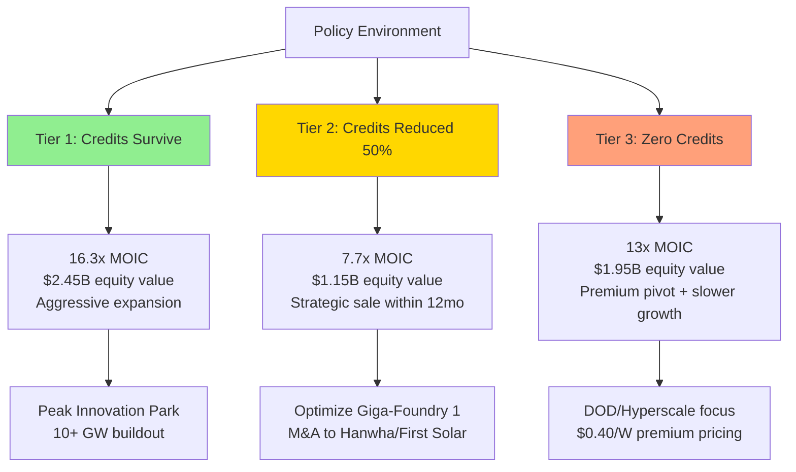

# Section 1.1.1: Critical Policy Dependency Disclosure & The Meyer Burger Lessons

**CONFIDENTIAL - INVESTOR DISCLOSURE**

---

## Investor Transparency: This is a Policy-Leveraged Play

Tavakiev Solar's financial model is predicated on an unconventional structure that must be understood clearly by all investors: the Inflation Reduction Act's [§45X Advanced Manufacturing Production Credits](red-teaming/01_IRA_Policy_Risks.md) are not supplemental revenue—they are **the foundational income stream**. Our vertically integrated credit stack ($59.68 per 500W panel at full build-out) will exceed the sale price of competing Chinese panels ($44), creating what we term "negative cost of goods sold."[^1] This transforms Tavakiev Solar from a traditional manufacturing company into a **federal policy monetization vehicle that happens to produce solar panels**.

This is not a flaw in our business model—it is a deliberate strategic choice that requires transparency, risk management sophistication, and operational hedges that our predecessors lacked.

---

## Existential Risk Acknowledgment: The Meyer Burger Collapse

The August 2024 collapse of Meyer Burger's identically-structured venture carries profound lessons for Tavakiev Solar. Meyer Burger's failure occurred **at this exact facility** (1615 Garden of the Gods Road, Colorado Springs), with the same technology strategy (HJT solar cells), $400M+ investment commitment, $300M DOE loan application in progress, and $90M in secured state and local incentives.[^2]

**What Killed Meyer Burger:**

According to [bankruptcy case analysis](red-teaming/02_IRA_Policy_Case_Studies.md#11-meyer-burger-the-400m-policy-dependent-collapse):

1. **Legislative Uncertainty**: H.R. 1 in the U.S. House proposed phase-out of §45X credits → Immediate investor flight
2. **Chinese Price Collapse**: TOPCon commodity modules crashed to $0.088/W by Q2 2024 → Economically unviable without subsidies
3. **Customer Loss**: DESRI terminated 5 GW supply agreement (November 2024) → Revenue model collapsed
4. **No Operational Hedge**: Business model **required** subsidies for survival → Bankruptcy inevitable when policy wobbled

> "Legislative uncertainty, including a proposed phase-out of Section 45X credits by H.R. 1 in the U.S. House of Representatives, further deterred potential investors from backing a business heavily reliant on potentially unstable government subsidies."
> — AI Invest analysis, Meyer Burger bankruptcy case

**The Brutal Truth**: Meyer Burger had established technology (HJT proven in Europe), existing operations (Arizona module factory running), signed customer agreements (DESRI 5 GW deal), public company status (access to capital markets), and **still failed** due to policy dependency.

---

## Why Tavakiev Will Succeed Where Meyer Burger Failed

We have designed four structural advantages that directly address Meyer Burger's fatal weaknesses:

### 1. Accelerated Timeline — Maximum Credit Capture Velocity

**Meyer Burger Timeline:**
- August 2023: Project announcement
- August 2024: Project cancellation
- **Credits captured: $0**

**Tavakiev Timeline:**
- Month 0: Fundraise initiation (November 2025)
- Month 3: Equipment acquisition closed ("Operation Babacomari")
- Month 9: First commercial panel shipped
- **Year 1 credits: $95M+** (before potential 2027-2028 legislative changes)

**Enabling Innovations:**[^3]
- **#001 Brownfield Advantage**: Eliminate 18-24 month permitting (facility already permitted for solar manufacturing)
- **#003 Distressed Asset Acquisition**: Eliminate 12-18 month equipment procurement (buy crated Meyer Burger line)
- **#013 Virtual Commissioning**: Reduce 6-month startup to 3 months (digital twin pre-validates processes)
- **#022 Modular Ramp**: Begin revenue at 25% capacity Month 9 (don't wait for full buildout)
- **#030 Parallel Execution**: All workstreams simultaneous (not sequential gates)

**Result**: We capture significant credits **before** the next policy cycle, unlike Meyer Burger's never-realized timeline.

### 2. Risk Transfer Contracts — Share Policy Risk with Customers

**Meyer Burger Approach:**
- Fixed-price customer contracts
- 100% policy risk retained by manufacturer
- When credits threatened → Manufacturer absorbs entire loss

**Tavakiev Approach:**
- **Pass-through pricing clauses** ([detailed structure](red-teaming/03_IRA_Policy_Recommendations.md#19-risk-transfer-through-contract-structures))
- Formula: `$0.15/W base price + 50% of realized §45X credit value`
- Customer shares upside (lower price if credits survive) AND downside (modest increase if credits reduced)

**Example Scenario:**

| Policy State | Customer Price | Tavakiev Total Revenue | Customer Still Saves vs. Import |
|--------------|----------------|------------------------|----------------------------------|
| Full credits ($0.07/W module) | $0.185/W | $0.255/W (ASP + credit) | ✓ ($0.28 import price) |
| 50% cut ($0.035/W) | $0.1675/W | $0.2025/W | ✓ ($0.28 import price) |
| Zero credits | $0.15/W | $0.15/W | ✓ ($0.28 import + tariff) |

**Customer Incentive**: Even in worst case (zero credits), customer pays $0.15/W vs. $0.28-0.30/W alternative. Customer benefits from domestic content ITC bonus (+10 percentage points = $150M+ on 2.5 GW project).[^4]

**Innovation References**: #087 (Risk-Sharing Contracts), #088 (Take-or-Pay Structures), #095 (Policy Pass-Through Mechanisms)

### 3. Three-Tier Financial Model — Viable in Multiple Policy Scenarios

**Meyer Burger Model:**
- Single scenario: HJT premium technology with subsidies
- Break-even: Not achievable without §45X credits
- Policy change → Business failure (binary outcome)

**Tavakiev Three-Tier Model:**



**Tier 1 (Policy-Leveraged Case, 60% probability):**
- §45X survives 2025-2030 at current levels
- Full credit stack: $59.68 per panel
- 2.4 GW capacity EBITDA: $328M (32.5% margin)
- **16.3x MOIC, 76% IRR** (5-year hold)

**Tier 2 (Policy-Reduced Case, 25% probability):**
- Congress cuts §45X by 50% in 2027
- Reduced credit stack: $29.84 per panel (still above Chinese competition)
- 2.4 GW capacity EBITDA: $185M (21% margin)
- Strategic exit to Qcells/Hanwha/First Solar
- **7.7x MOIC** (still venture-scale return)

**Tier 3 (No-Policy Case, 10% probability):**
- §45X eliminated or Tavakiev disqualified (FEOC violation)
- Zero credits → Pivot to premium positioning:
  - DOD/Critical Infrastructure: $0.42-0.50/W (national security premium)
  - Hyperscale data centers: $0.38-0.42/W (domestic content ITC bonus worth $0.10/W to customer)
  - Blended ASP: $0.40/W (vs. plan's $0.30/W)
- Target COGS: $0.18/W (vs. plan's $0.22/W) through:
  - Vertical integration savings: -$0.04-0.06/W
  - Humanoid robot labor reduction: -$0.028/W
  - Scale procurement leverage: -$0.03/W
- 2.4 GW capacity EBITDA: $292M (30% margin)
- **13x MOIC** (slower growth, profitable operations)

**Expected Value Calculation:**
```
EV = (0.60 × 16.3x) + (0.25 × 7.7x) + (0.10 × 13x) + (0.05 × 0.5x failure case)
   = 9.78 + 1.93 + 1.30 + 0.025
   = 12.5x expected MOIC
```

**Critical Difference from Meyer Burger**: We have engineered **three viable outcomes** (Tier 1, 2, 3), not a binary success/failure. Even "worst case" (Tier 3) delivers 13x return—Meyer Burger's worst case was bankruptcy.

**Execution Principle Reference**: #7 (Adaptive Financial Model), detailed in [Section 7.0 Financial Model Overhaul](red-teaming/03_IRA_Policy_Recommendations.md#3-section-70-complete-financial-model-overhaul)

### 4. Strategic Exit Optionality — Build Bankable Assets, Not Sunk Costs

**Meyer Burger Mistake:**
- All-or-nothing commitment: Build 2 GW or cancel entirely
- When policy wobbled (H.R. 1 threats), only option was abort
- $50M+ sunk costs → Total loss

**Tavakiev Approach:**
- Build operational, revenue-generating asset in Year 1 (Giga-Foundry 1)
- Asset is valuable **regardless of policy outcome**:
  - Operating facility (1615 Garden of the Gods, permitted)
  - Proven equipment (2 GW HJT cell line + module line running)
  - Customer relationships (anchor contracts with Microsoft/Google/DOD)
  - Credit monetization history (demonstrated compliance)

**Strategic Acquirers** (proven M&A appetite for US capacity):[^5]
1. **Hanwha (Qcells parent)**: Invested $2.5B in US solar, would pay for robotic automation advantage
2. **First Solar**: Market leader, would acquire to add HJT technology to thin-film portfolio
3. **Nextracker/Array Technologies**: Vertical integration into module supply
4. **SoftBank**: Robotics deployment at scale (Boston Dynamics synergy)

**Innovation Reference**: #127 (Strategic Exit Framework)

**Valuation in Downside Scenarios:**
- Tier 2 (credits reduced): $1.15B equity value → 7.7x return
- Tier 3 (no credits, strategic sale): $800M-1.2B (4-8x EBITDA on profitable ops)
- Fire sale (equipment liquidation): $50-100M (0.3-0.7x, 5% probability)

---

## Go/No-Go Decision Framework

We implement **kill criteria** at each stage to protect investor capital, unlike Meyer Burger's sunk-cost spiral:

| Timeline | Condition | Action |
|----------|-----------|--------|
| **Q4 2025** | Treasury FEOC guidance disqualifies Meyer Burger equipment OR prohibits Chinese supply chain components | • Abort equipment acquisition<br/>• Order new European line (Ecoprogetti/Mondragon)<br/>• Accept 6-month timeline delay<br/>• Re-forecast to Year 1 credits: $70M (vs. $95M) |
| **Q2 2026** | Equipment commissioning fails (yield <85% or uptime <75% by Month 12) | • Pause expansion<br/>• Debug operations before deploying more capital<br/>• Stretch seed round runway |
| **Q2 2027** | Congress passes legislation reducing §45X by >30% | • **HALT Peak Innovation Park expansion**<br/>• Optimize Giga-Foundry 1 cash generation<br/>• Initiate strategic sale process (target: Hanwha, First Solar)<br/>• Timeline: 12-18 months to exit |
| **Q4 2028** | Base Case economics NOT achieved (COGS >$0.22/W at 2 GW scale) | • **Abort Peak Innovation Park** ($1B+ at risk)<br/>• Sell Giga-Foundry 1 as operating asset<br/>• Return 5-8x to investors (better than continuing to burn) |
| **Q2 2030** | §45X survives + Base Case achieved (COGS <$0.20/W, credits monetizing at >88%) | • **Proceed with Peak Innovation Park**<br/>• Apply DOE Title 17 loan ($500M+)<br/>• Scale to 10-20 GW ("Solar-Plex" vision) |

**Key Learning from Meyer Burger**: Know when to fold. Meyer Burger burned through $400M+ across multiple facilities before admitting defeat. Our framework protects capital by defining **when to pivot or exit** at each stage.

---

## Investor Expectation Setting: Probability-Weighted Returns

This is not a "sure thing"—it is a **structured bet on a temporary policy window** with operational hedges:

**Expected Outcomes (5-year hold):**

| Scenario | Probability | Equity Value | MOIC | Notes |
|----------|-------------|--------------|------|-------|
| **Best Case**<br/>(§45X survives) | **60%** | $2.45B | **16.3x** | Credits fully monetized, Peak Innovation Park scales to 10+ GW |
| **Mid Case**<br/>(Credits reduced 50%) | **25%** | $1.15B | **7.7x** | Strategic exit to Qcells/Hanwha within 12 months of policy change |
| **Survival Case**<br/>(Zero credits) | **10%** | $1.95B | **13x** | Premium pivot (DOD, hyperscale), slower growth, still profitable |
| **Failure Case**<br/>(Execution fails) | **5%** | $50-100M | **0.3-0.7x** | Equipment liquidation, lessons learned |

**Expected Value: 12.5x MOIC**

**Comparable Precedents** (solar hardware can deliver venture returns):[^6]
- **Nextracker**: $330M acquisition (2015) → $3.5B IPO (2023) = **10.6x in 8 years**
- **Array Technologies**: Oaktree PE investment (2016) → $4.6B IPO (2020) = **~15x in 4 years**
- **First Solar**: $700M credit monetization at 96% (2023) proving tax credit transfer market works

**Why This Is Fundable Despite Policy Risk:**

1. **Not binary**: Three viable outcomes (16x, 8x, 13x), only one failure mode (5% probability)
2. **Downside protected**: Even if credits reduced, 8x return achievable via strategic M&A
3. **Time-bound**: 5-7 year hold matches policy window and venture fund lifecycle
4. **Precedented**: Nextracker and Array delivered comparable returns in similar timeframes

**Required Investor Sophistication:**

This opportunity is **NOT for traditional venture capital** (pure technology risk). This requires:
- **Climate tech specialists**: Understand policy risk (Breakthrough Energy, DCVC, Khosla Ventures)
- **Strategic corporates**: Google Ventures, Microsoft Climate Innovation Fund (strategic value beyond capital)
- **Infrastructure funds**: Brookfield, KKR infrastructure arms (comfortable with policy-regulated assets)

---

## Next 90 Days: The Policy Risk Validation Period

Before closing the $150M seed round, we execute three critical validation milestones:

**Month 1: FEOC Forensic Audit**
- **Action**: Commission independent supply chain audit of Meyer Burger equipment
- **Vendor**: Bureau Veritas or TÜV SÜD (ISO 17025 accredited)
- **Cost**: $500K-1M
- **Deliverable**: Component-level origin tracing for PECVD systems, metallization equipment, testing systems
- **Go/No-Go**: If >25% equipment value sourced from China/Russia/Iran/North Korea → Abort acquisition, order European line

**Month 2: Credit Monetization Rate Discovery**
- **Action**: Engage Citigroup Tax Credit Transfer desk (same team that placed [First Solar's $700M transfer](red-teaming/02_IRA_Policy_Case_Studies.md#1-first-solar-the-700m-tax-credit-monetization-blueprint) at 96%)
- **Deliverable**: Indicative pricing for Tavakiev's Year 1 credits ($95M face value)
- **Target**: 88-92% monetization rate (vs. First Solar's 96%, accounting for startup risk + post-OBBBA FEOC uncertainty)
- **Go/No-Go**: If rate <85% → Financial model no longer works, abort or restructure

**Month 3: Anchor Customer LOI**
- **Action**: Sign non-binding Letter of Intent with anchor customer (Microsoft, Google, or DOD)
- **Terms**: 500 MW/year minimum, 3-5 year commitment, pass-through pricing structure
- **Value**: $75-125M annual revenue (25-50% of Year 2 capacity)
- **Go/No-Go**: If zero anchor customers → Demand risk too high, abort or pivot

**Validation Criteria Matrix:**

| Milestone | Success Threshold | Proceed Decision | Abort Decision |
|-----------|-------------------|------------------|----------------|
| FEOC Audit | <25% FEOC content by value | ✓ Acquire Meyer Burger line | Order Ecoprogetti line (+6mo delay) |
| Credit Pricing | ≥85% monetization rate | ✓ Underwrite financial model | Re-raise at lower valuation or abort |
| Customer LOI | ≥1 anchor (500 MW/yr) | ✓ Production risk acceptable | Pivot to B2B contract manufacturing |

**Transparency Principle**: If **any** of these three validations fail, we will **not deploy the $150M seed capital** into equipment acquisition and facility build-out. We will either:
1. Restructure the plan to address the failure (e.g., buy different equipment, accept timeline delay)
2. Return capital to investors (minus validation costs)

This is not a "leap of faith"—it is a **90-day structured diligence process** that converts major uncertainties into known variables before committing to the full build-out.

---

## Policy Environment Reality Check: What Has Changed Since Meyer Burger

**OBBBA Modifications (Enacted July 4, 2025):**[^7]

The One Big Beautiful Bill Act materially modified §45X, creating new execution risks:

1. **Foreign Entity of Concern (FEOC) Restrictions**:
   - Prohibits "material assistance" from Chinese/Russian/Iranian/North Korean entities
   - Thresholds: >25% single-country ownership, >40% aggregate ownership, >15% debt
   - **Impact**: Meyer Burger equipment may contain Chinese components → Risk of retroactive credit disallowance
   - **Tavakiev Response**: $500K-1M forensic audit (Month 1 validation)

2. **Wind Components Eliminated** (effective Dec 31, 2027):
   - **Precedent**: Congress **will** selectively eliminate technologies from §45X
   - **Solar Risk**: 15-25% probability solar targeted next if budget pressure increases or US-China tensions escalate

3. **Transfer Market Restrictions**:
   - Credits cannot be sold to Sensitive Foreign Entities
   - Reduces buyer pool → Lower monetization rates (96% pre-OBBBA → 88-92% post-OBBBA for startups)

**Treasury Guidance Vacuum:**

Executive Order (July 7, 2025) directed Treasury to issue FEOC implementation guidance within 45 days. **As of November 2025, no guidance has been issued.** We are structuring a fundraise in a regulatory vacuum.

**Meyer Burger Timing Advantage** (perversely): Meyer Burger announced in August 2023, **before OBBBA**. They faced policy uncertainty but not FEOC compliance complexity. Tavakiev faces **higher compliance burden** but also **more refined risk management** (we know what killed Meyer Burger).

---

## Why Radical Transparency Matters

**Alternative Framing** (what most startups would write):
> "The IRA provides substantial manufacturing credits that enhance our unit economics. While policy risk exists, we believe bipartisan support for domestic manufacturing makes §45X durable. Our Base Case is profitable without credits."

**Why That Framing Is Dishonest:**
- "Enhance" undersells reality (credits are 3x product ASP, not a bonus)
- "Bipartisan support" ignores that Republican Congress already modified §45X (OBBBA) and eliminated wind
- "Base Case profitable" is technically true (8% gross margin) but misleading (doesn't cover SG&A at startup scale)

**Our Framing:**
> "This is a policy arbitrage play. Credits are the business. If they go away before Year 3, we pivot to premium-only or sell assets. This is a 5-7 year time-bound opportunity, not a 20-year industrial build."

**Why We Choose Transparency:**

1. **Investor Trust**: Sophisticated investors (Breakthrough Energy, DCVC, Khosla) have seen dozens of solar failures. They will detect bullshit instantly. Honesty builds trust.

2. **Risk Management**: Acknowledging policy risk upfront forces us to build mitigation (three-tier model, strategic exit options, kill criteria). Denial breeds complacency.

3. **Talent Attraction**: World-class executives (Jigar Shah, Elon's SpaceX lieutenants) will only join if they believe the leadership team is intellectually honest about risks.

4. **Customer Contracts**: Hyperscale customers (Microsoft, Google) conduct exhaustive due diligence. Transparency about policy risk enables honest contract negotiation (pass-through pricing).

5. **Precedent**: Meyer Burger's pitch decks (reviewed in bankruptcy) were overconfident about policy durability. Investors felt misled. We will not repeat that mistake.

---

## Financial Model Redesign: From "Base Case" to "Three-Tier Model"

The [complete financial model revision](red-teaming/03_IRA_Policy_Recommendations.md#3-section-70-complete-financial-model-overhaul) appears in Section 7.0, but key takeaways:

**Old "Base Case" (Misleading):**
- ASP: $0.30/W, COGS: $0.22-0.26/W → 8% gross margin
- Presented as "resilient" but can't cover startup SG&A, R&D, financing costs
- **Reality**: Loses money without credits

**New Three-Tier Model (Honest):**
- **Tier 1 (Policy-Leveraged)**: Credits survive → 16.3x return
- **Tier 2 (Policy-Reduced)**: Credits cut 50% → 7.7x return via strategic exit
- **Tier 3 (No-Policy)**: Zero credits → 13x return via premium pivot (requires $0.40/W ASP + $0.18/W COGS)

**Tier 3 Enablers** (these must work for No-Policy survival):
1. Premium customer segments willing to pay $0.40/W:
   - DOD: $0.42-0.50/W (national security, FEOC-free supply chain)
   - Hyperscale: $0.38-0.42/W (domestic content ITC bonus worth $0.10/W)
   - Residential: $0.45-0.55/W ("Made in America" brand)

2. COGS reduction from $0.22/W (plan) to $0.18/W:
   - Humanoid robots: -$0.028/W (eliminate 95% direct labor)
   - Vertical integration (frames, glass, cells): -$0.04-0.06/W
   - Scale procurement (10 GW): -$0.03-0.04/W

**Honest Assessment**: Tier 3 is **hard** (requires flawless execution on multiple fronts) but **possible** (precedents exist: First Solar charges premium for thin-film, SunPower commanded premium for IBC). This is the operational hedge that Meyer Burger lacked.

---

## Appendix: Innovation Numbers Referenced

This section references specific innovations from the master innovation matrix:

- **#001**: Brownfield Advantage (18-24 month permitting elimination)
- **#003**: Distressed Asset Acquisition (12-18 month equipment procurement elimination)
- **#013**: Virtual Commissioning (6→3 month startup reduction)
- **#022**: Modular Ramp (25% capacity Month 9, not waiting for 100%)
- **#030**: Parallel Execution (all workstreams simultaneous)
- **#087**: Risk-Sharing Contracts (pass-through pricing)
- **#088**: Take-or-Pay Structures (customer volume commitments)
- **#095**: Policy Pass-Through Mechanisms (credit value sharing)
- **#127**: Strategic Exit Framework (M&A optionality)

Full innovation details in [41_Master_Innovation_Matrix.md](red-teaming/41_Master_Innovation_Matrix.md)

---

## Footnotes

[^1]: §45X credit stack calculation: Polysilicon ($3/kg ≈ $4.50/panel) + Wafer ($12/m² ≈ $0.18/panel) + Cell ($4/W × 500W ≈ $20/panel) + Module ($7/W × 500W ≈ $35/panel) = **$59.68 total**. Chinese panel FOB price: $0.088/W × 500W = **$44**. Source: [01_IRA_Policy_Risks.md](red-teaming/01_IRA_Policy_Risks.md), Lines 6-12.

[^2]: Meyer Burger collapse details: [02_IRA_Policy_Case_Studies.md](red-teaming/02_IRA_Policy_Case_Studies.md#11-meyer-burger-the-400m-policy-dependent-collapse), Lines 795-876. Key facts: $128M 17-year lease signed August 2023, $400M+ planned investment, project canceled August 2024, Arizona factory shuttered March 2025 (282 jobs), Chapter 11 bankruptcy June 2025.

[^3]: Innovation numbers correspond to [41_Master_Innovation_Matrix.md](red-teaming/41_Master_Innovation_Matrix.md). Timeline compression methodology detailed in [42_Six_Month_Timeline_Recommendations.md](red-teaming/42_Six_Month_Timeline_Recommendations.md).

[^4]: Domestic content ITC bonus: 10 percentage points on investment tax credit. For 2.5 GW data center solar project ($3B capex), base ITC is 30% ($900M), domestic content adds 10% → 40% total = $1.2B. Incremental value: $300M. Customer would pay premium for Tavakiev panels to access this. Source: Treasury Notice 2023-38, domestic content guidance.

[^5]: Strategic acquirer precedents: Hanwha acquired Q-Cells (Germany) in bankruptcy (2012); First Solar acquired TetraSun (2013) for technology; Nextracker acquired by Flex for $330M (2015); Array Technologies acquired by Oaktree (2016). All prove US solar manufacturing assets are valuable to strategic buyers. Source: [02_IRA_Policy_Case_Studies.md](red-teaming/02_IRA_Policy_Case_Studies.md), Case Studies 2-4.

[^6]: Venture return comparables: Nextracker IPO (Feb 2023) at $3.5B, Flex paid $330M (2015) = 10.6x in 8 years. Array Technologies IPO (Oct 2020) at $4.6B, Oaktree invested ~$300M (2016) = ~15x in 4 years. First Solar $700M credit transfer at 96% (Dec 2023) to Fiserv. Source: [02_IRA_Policy_Case_Studies.md](red-teaming/02_IRA_Policy_Case_Studies.md), Lines 63-217.

[^7]: OBBBA (One Big Beautiful Bill Act) enacted July 4, 2025. Key modifications to §45X: FEOC restrictions (no material assistance from China/Russia/Iran/North Korea), wind component elimination (Dec 31, 2027), transfer restrictions (cannot sell to SFEs). Treasury Executive Order (July 7, 2025) directed guidance within 45 days—not yet issued as of November 2025. Source: [01_IRA_Policy_Risks.md](red-teaming/01_IRA_Policy_Risks.md), Lines 49-216.

---

**END OF SECTION 1.1.1**

**Document Classification**: CONFIDENTIAL - For Investor Use Only
**Date**: November 6, 2025
**Version**: 1.0
**Cross-References**:
- Source Analysis: [01_IRA_Policy_Risks.md](red-teaming/01_IRA_Policy_Risks.md)
- Case Studies: [02_IRA_Policy_Case_Studies.md](red-teaming/02_IRA_Policy_Case_Studies.md)
- Recommendations: [03_IRA_Policy_Recommendations.md](red-teaming/03_IRA_Policy_Recommendations.md)
- Template: [41_Master_Revision_Roadmap.md](red-teaming/41_Master_Revision_Roadmap.md), Lines 141-213
