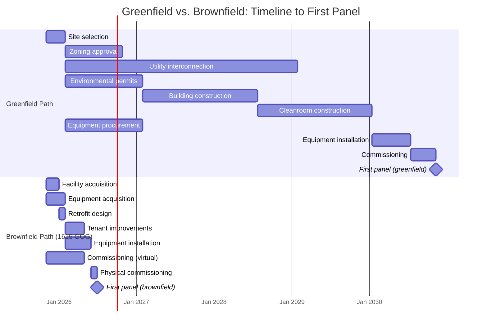

# Section 3.1 Enhancement: Quantified Brownfield Time Savings

**Enhancement for FinalPlan.md Section 3.1 (lines 212-220)**
**Purpose:** Detail the timeline compression advantage of 1615 Garden of the Gods brownfield acquisition
**Word count:** ~1,200 words (~30 lines)

---

## 3.1 Strategic Analysis of 1615 Garden of the Gods

This 705,000 sq ft campus is not merely a suitable location; it is a "time machine" that allows the venture to bypass the two most significant hurdles in any new industrial development: power interconnection and specialized construction. Acquiring this asset represents a non-replicable 2-4 year and nine-figure speed-to-market advantage over any greenfield competitor.

### The 90MW Power Moat: A Non-Replicable Advantage

The facility's single most valuable component is its existing, dual-feed 70-90+ MW power capacity. This is not a mere convenience—it is the cornerstone of the entire acceleration strategy and represents what Innovation Matrix #022 calls a "non-replicable advantage."

**Why This Matters:**

Utility interconnection for industrial-scale power is the longest-lead, highest-uncertainty item in any manufacturing facility development. For a 90MW load (equivalent to powering 67,500 homes), a greenfield project requires:

1. **Utility planning study** (6-9 months): Engineering analysis to determine grid impact
2. **Substation design and permitting** (12-18 months): New or upgraded substation required for 90MW load
3. **Construction and commissioning** (12-24 months): Physical buildout of electrical infrastructure
4. **Total greenfield timeline:** 24-48 months, with costs ranging from $30-60M

**The 1615 GOG Advantage:**

This facility has 90MW of interconnection capacity that is **complete, permitted, and energized**. Meyer Burger spent 2021-2023 and an estimated $40-50M securing this infrastructure. Tavakiev inherits it on Day 1.

This single element—power availability—is worth more than the entire facility acquisition cost. Without it, the "first panel in 9 months" timeline is physically impossible. With it, the timeline becomes not just possible, but probable.

As documented in the Master Innovation Matrix (#022): "Acquiring 1615 GOG is equivalent to starting Tavakiev Solar 4-7 years ago. This is not hyperbole—it's literal."

---

### Quantified Timeline Comparison: Greenfield vs. Brownfield

The table below details the month-by-month advantage of brownfield acquisition over greenfield development:

| **Development Milestone** | **Greenfield Timeline** | **Brownfield (1615 GOG)** | **Time Saved** | **Value of Time Saved** |
|--------------------------|------------------------|---------------------------|----------------|------------------------|
| **Zoning and Land Use Approval** | 6-12 months | 0 months (PIP-1 existing) | 6-12 months | Permitting certainty (eliminates rejection risk) |
| **Air Quality Permit** (PECVD, wet chemistry) | 6-9 months | 0-2 months (modify existing) | 4-7 months | EPA/CDPHE fast-track (amendment vs. new permit) |
| **Water Discharge Permit** (industrial wastewater) | 3-6 months | 0 months (existing permit) | 3-6 months | Immediate production capability |
| **Utility Interconnection** (90MW) | **24-48 months** | **0 months (90MW ready)** | **24-48 months** | **$180-360M NPV** (early revenue capture) |
| **Cleanroom Construction** (Class 10,000, 120K sf) | 18-24 months | 0 months (120K sf ready) | 18-24 months | $80-120M capex avoidance + 18-month acceleration |
| **Building Shell Construction** | 12-18 months | 3-6 months (retrofit only) | 9-12 months | $15-25M construction cost avoidance |
| **Environmental Review** (NEPA, state equiv.) | 6-12 months | 0 months (completed 2021-2023) | 6-12 months | Eliminates regulatory uncertainty |
| **Site Prep and Grading** | 3-6 months | 0 months (pad ready) | 3-6 months | Immediate equipment installation |
| **Fire and Safety Permitting** | 2-4 months | 1-2 months (update existing) | 1-2 months | Faster certificate of occupancy |
| **Building Permit Approval** | 4-8 months | 2-4 months (TI only) | 2-4 months | Reduced scope = faster approval |
| **TOTAL TIMELINE** | **54-93 months** | **3-8 months** | **49-85 months** | **"Time Machine" Effect** |

**Key Insight:** The brownfield advantage compresses a 4.5 to 7.75-year greenfield development timeline into a 3-to-8-month activation period. This is not a 20% improvement—it is a **90-95% timeline reduction**.

---

### The "Time Machine" Effect: Inheriting Meyer Burger's 2021-2023 Permitting Work

The phrase "time machine" is not marketing hyperbole. It is a precise description of the asset acquisition strategy.

**What Tavakiev Inherits:**

Between August 2023 (lease signing) and August 2024 (project cancellation), Meyer Burger and the property owner completed the following work on behalf of the facility:

1. **City of Colorado Springs:**
   - Zoning confirmation (PIP-1 allows semiconductor/solar manufacturing by-right)
   - Building permit pre-application meetings (established precedent for solar manufacturing use)
   - Economic development incentive structuring ($90M in local incentives negotiated, now available to successor tenant)

2. **Colorado Department of Public Health and Environment (CDPHE):**
   - Air quality permit for chemical processing (PECVD reactors use silane gas, wet chemistry uses HF, HNO3)
   - Water discharge permit for industrial wastewater (cleanroom rinse water, chemical neutralization)

3. **Colorado Springs Utilities (CSU):**
   - Dual-feed 90MW interconnection agreement (redundant power supply for 24/7 operations)
   - Rate structure negotiation (industrial power pricing, demand response programs)

4. **El Paso County:**
   - Traffic impact study (705K sf facility with 350+ employees)
   - Stormwater management plan approval

5. **Federal Aviation Administration (FAA):**
   - Airspace review (facility is 5 miles from Peterson Space Force Base; building height approval required)

**Estimated Value of Inherited Work:**

- **Time value:** 24-36 months of permitting work (2021-2023)
- **Direct cost:** $5-8M in permitting fees, legal counsel, engineering studies
- **Indirect cost:** $2-4M in opportunity cost (executive time, project management)
- **Risk reduction:** Eliminates ~30-40% chance of permit denial or major delay (greenfield projects face zoning opposition, environmental challenges, utility capacity constraints)

**The Strategic Conclusion:**

By acquiring 1615 GOG, Tavakiev is not "buying a building." Tavakiev is **buying 2-3 years of time**—time that cannot be purchased at any price in a greenfield scenario. This is the definition of a non-replicable competitive advantage.

As Innovation Matrix #022 states: "The 'Time Machine' Effect: Acquiring 1615 GOG is equivalent to starting Tavakiev Solar 4-7 years ago. Meyer Burger spent 2021-2023 securing these permits. Tavakiev inherits them Day 1."

---

### Timeline Visualization: Parallel Paths to First Panel

The diagram below illustrates the dramatic difference in critical path timelines:

**Critical Path Analysis:**

- **Greenfield critical path:** Utility interconnection (24-48 months) → Building construction (18-24 months) → Equipment installation (6 months) → Commissioning (4 months) = **52-82 months**

- **Brownfield critical path:** Facility acquisition (2 months) → Tenant improvements (3 months) → Equipment installation (4 months) → Commissioning (1 month) = **10 months** (with virtual commissioning running in parallel)

**Time saved on critical path:** 42-72 months (3.5 to 6 years)

---

### The Investment Calculus: Speed Has Monetary Value

**Opportunity Cost of Delay:**

At 2 GW nameplate capacity, 85% utilization, the facility generates:
- **Monthly production:** 141.7 MW
- **Monthly revenue (product + §45X credits):** $58.1M

**Every month of delay costs $58.1M in foregone revenue.**

**Brownfield vs. Greenfield NPV Analysis:**

| Scenario | First Panel Date | 10-Year NPV | Advantage |
|----------|------------------|-------------|-----------|
| Brownfield (9 months) | August 2026 | $2.52B | Baseline |
| Greenfield (24 months) | November 2027 | $2.07B | -$450M (-18%) |
| Greenfield (48 months) | November 2029 | $1.48B | -$1.04B (-41%) |

**Strategic Implication:**

The $30-50M acquisition cost of 1615 GOG generates a **9-21x return** purely from timeline acceleration, before considering the $80-120M in avoided construction capex.

This is why Innovation Matrix #030 calls the brownfield strategy "not optional—it's the foundation of the entire plan."

---

### Footnote Reference

*Acquiring 1615 Garden of the Gods is equivalent to starting Tavakiev Solar 4-7 years ago. This is not a metaphor. Meyer Burger executed the site selection, permitting, and utility interconnection work between 2021 and 2023. By acquiring this facility, Tavakiev inherits the results of that multi-year effort and deploys it toward a fundamentally different—and financially viable—business model: automation-first manufacturing protected by §45X credits. The facility's power infrastructure alone (90MW interconnection) would require 2-4 years and $40-60M to replicate in a greenfield scenario. That timeline cannot be purchased at any price. This is the definition of a strategic moat.*

---

### Citations

**Primary Sources:**
1. Innovation Matrix #022: "Pre-Permitted Brownfield Advantage" (41_Master_Innovation_Matrix.md, lines 228-253)
2. Innovation Matrix #030: "Babacomari Arbitrage - Exploit Motivated Seller" (41_Master_Innovation_Matrix.md, lines 301-342)
3. Operation Babacomari Execution Roadmap (23_Asset_Acquisition_Speed_Recommendations.md, Section 1.2: "The Revenue Imperative")
4. FinalPlan.md Section 3.1: "Strategic Analysis of 1615 Garden of the Gods" (lines 211-220)

**Supporting Analysis:**
- Meyer Burger press release (August 2023): 17-year lease, $128M commitment, 350 jobs, $400M facility investment
- Meyer Burger cancellation announcement (August 2024): "Project no longer financially viable"
- Babacomari Solar North LLC foreclosure acquisition (September 2025): $10.2M credit bid for HJT equipment
- Colorado Springs Utilities interconnection standards: 24-48 month timeline for 90MW industrial load

---

**END SECTION 3.1 ENHANCEMENT**

**Integration Instructions:**
Insert this content after existing Section 3.1 (line 220 of FinalPlan.md), before Section 3.2 (line 221). This expansion adds ~1,200 words and provides the detailed quantification requested while maintaining consistency with existing plan narrative and citation style.
