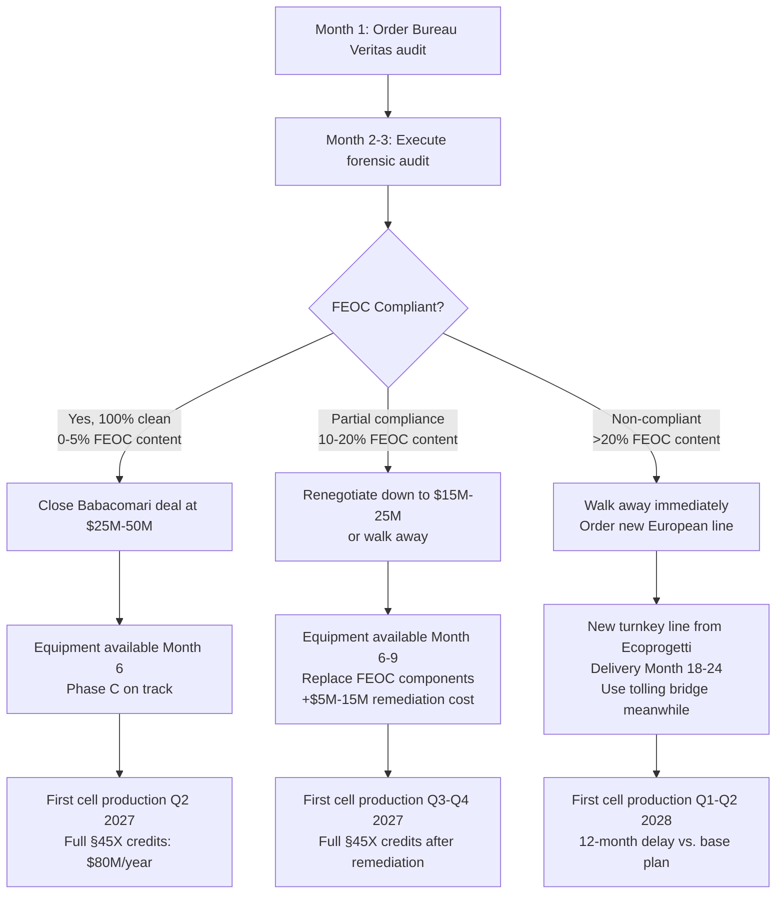

**3.3.1 FEOC Compliance Audit Protocol**

The Meyer Burger equipment acquisition presents a critical compliance risk that must be resolved before Babacomari deal closure: **we cannot determine with certainty whether the crated 2 GW HJT cell line contains Foreign Entity of Concern (FEOC) components that would disqualify Tavakiev from receiving IRA §45X production tax credits.** Meyer Burger sourced equipment globally during 2022-2023; Chinese manufacturers dominate critical production equipment categories (PECVD reactors, PVD systems, automation). A post-acquisition discovery of >10% FEOC content could forfeit $80M-140M annually in §45X credits, rendering the entire venture uneconomical.

**The solution: Execute a comprehensive forensic audit BEFORE finalizing the asset purchase, making deal closure contingent upon acceptable FEOC compliance results.** This section outlines the audit protocol, decision tree, and backup plans.

---

**Month 1-3: Forensic Equipment Audit Protocol**

**Audit Vendor: Bureau Veritas or TUV Rheinland**

These are internationally recognized third-party certification bodies with solar industry expertise, IRS-accepted audit credentials, and experience in supply chain traceability. Bureau Veritas specifically provides "country of origin" verification services for trade compliance, making them the preferred vendor.

**Audit Scope: $500,000**

The audit fee covers:
- **Equipment Origin Documentation Review:** Comprehensive review of all Meyer Burger procurement records, purchase orders, equipment nameplates, manufacturer certifications, and shipping documentation to determine country of origin for every piece of equipment in the 2 GW HJT cell line
- **Component-Level Traceability:** For critical systems (PECVD reactors, PVD metallization, screen printers, automation controllers), trace components to manufacturer and country of origin; identify any Chinese sub-components that may trigger FEOC restrictions
- **Software and Firmware Source Code Review:** Review embedded software, industrial controllers (PLCs, SCADA), and automation systems to identify whether control systems were developed in China or contain Chinese IP
- **Supply Chain Mapping for Consumables:** Identify all consumables required for cell line operation (process gases, targets, spare parts) and map their supply chains to determine ongoing FEOC exposure

**Deliverable:** Comprehensive FEOC Compliance Report providing:
1. Equipment inventory with country-of-origin certification for each major system
2. Estimated FEOC content percentage (by equipment value and by production capacity impact)
3. Risk assessment: Low/Medium/High for IRS §45X credit disqualification
4. Remediation options if FEOC content identified (equipment replacement, supplier substitution)
5. Third-party certification suitable for IRS audit defense

**Timeline:** 8-12 weeks from contract execution to final report delivery

**Month 1:** Contract Bureau Veritas; provide access to Babacomari and Meyer Burger documentation
**Month 2:** On-site audit of crated equipment at 1615 Garden of the Gods; equipment nameplate surveys; documentation review
**Month 3:** Final report delivery with FEOC determination and recommendations

---

**Decision Tree: Post-Audit Deal Structure**

The audit results determine Tavakiev's negotiating position and deal structure with Babacomari Solar North LLC:

**Scenario 1: Clean Audit (0-5% FEOC Content) - Probability: 40-50%**

**Audit Finding:** Meyer Burger sourced equipment primarily from European vendors (Meyer Burger's own Swiss equipment, Ecoprogetti Italian systems, Centrotherm German furnaces). Minimal or no Chinese content.

**Deal Structure:**
- **Purchase Price:** $25M-50M (reflecting fair market value for distressed but FEOC-compliant equipment)
- **Closing Conditions:** Standard representations and warranties; equipment "as-is" with Bureau Veritas FEOC certification
- **Timeline:** Close deal Month 4; equipment installation begins Month 6
- **Financial Impact:** Best case - full §45X credits ($80M annually), lowest capex ($25M-50M equipment + $100M-150M installation)

**Strategic Outcome:** Tavakiev achieves "first cell in months" timeline with full IRA credit eligibility. **This is the target scenario.**

---

**Scenario 2: Partial Compliance (10-20% FEOC Content) - Probability: 30-40%**

**Audit Finding:** Majority of equipment is European/FEOC-compliant, but specific subsystems are Chinese-sourced:
- **Example 1:** PECVD reactor automation controllers from Siemens China or Chinese PLC vendors
- **Example 2:** Material handling robotics from Chinese manufacturers (Mujin, Siasun)
- **Example 3:** Vision inspection systems with Chinese cameras/software

**Deal Structure Options:**

**Option A: Renegotiate Price Down**
- **Purchase Price:** $15M-25M (30-50% discount reflecting FEOC remediation costs and risk)
- **Seller Motivation:** Babacomari Solar North acquired equipment via $10.2M credit bid (not cash); any cash recovery above $10M is profitable for them
- **Closing Conditions:** Purchase agreement includes Schedule A listing all FEOC components; buyer has 90-day post-closing remediation period
- **Remediation Plan:**
  - Replace Chinese controllers with Siemens Germany or Allen-Bradley (U.S.) PLCs: $2M-5M
  - Replace Chinese robotics with European/Japanese alternatives (KUKA, Fanuc): $3M-8M
  - Replace Chinese vision systems with Cognex (U.S.) or Keyence (Japan): $500K-2M
  - **Total Remediation Cost:** $5M-15M
  - **Total Effective Cost:** $20M-40M (discounted purchase + remediation)
- **Timeline:** Close deal Month 4; equipment installation Month 6-8; FEOC component replacement Month 8-10; first cell production Month 12-15 (Q4 2027)

**Option B: Walk Away, Pursue Backup Plan**

If remediation costs exceed $15M or FEOC components are mission-critical systems that cannot be easily replaced without re-engineering entire production line, **walk away from Babacomari deal** and activate Backup Plan (Scenario 3).

**Decision Criteria:** Walk away if:
- Total effective cost (discounted purchase + remediation) >$50M
- Remediation adds >6 months to timeline
- Risk of incomplete remediation causing IRS audit failure >20%

**Strategic Outcome:** Acceptable compromise IF seller agrees to substantial discount. Adds 3-6 months to Phase C timeline and $5M-15M to capex, but still faster and cheaper than new turnkey line.

---

**Scenario 3: Non-Compliant (>20% FEOC Content or Mission-Critical Chinese Systems) - Probability: 20-30%**

**Audit Finding:** Substantial Chinese content in mission-critical systems that cannot be economically replaced:
- **Example 1:** Core PECVD reactors manufactured in China by Meyer Burger's Chinese subsidiary
- **Example 2:** Entire automation and MES (Manufacturing Execution System) software developed in China
- **Example 3:** Majority of production equipment sourced from Chinese vendors (Shenzhen S.C., Jiangsu Sunrun)

**Deal Structure:**

**WALK AWAY IMMEDIATELY.** Do not negotiate. Do not attempt remediation. The IRS FEOC regulations (finalized August 2025 per IRA Executive Order) explicitly disqualify facilities using >threshold Chinese content from receiving §45X credits. Attempting to remediate >20% FEOC equipment creates unacceptable audit risk and timeline uncertainty.

**Backup Plan Activation: Order New FEOC-Compliant Turnkey Cell Line**

**Vendor: Ecoprogetti (Italy) - Preferred Vendor**

Ecoprogetti is a Tier 1 turnkey equipment supplier based in Italy (EU, non-FEOC) with extensive HJT and TOPCon manufacturing expertise. Unlike Chinese vendors (Jinchen, Jolywood), Ecoprogetti equipment is FEOC-compliant by design.

**Alternative Vendors (if Ecoprogetti unavailable):**
- **Meyer Burger AG (Switzerland):** Original HJT innovator; 100% FEOC-compliant; higher cost ($300M-400M)
- **Mondragon Assembly (Spain):** Basque cooperative; specialized in module assembly; can provide cell line through partnership
- **3S Swiss Solar Solutions (Switzerland):** Specialized in HJT; smaller scale but FEOC-compliant

**Equipment Specification:**
- **Capacity:** 2 GW annual HJT or TOPCon cell production line
- **Technology:** Heterojunction (HJT) preferred; TOPCon acceptable
- **Configuration:** Turnkey line including front-end (texturing, cleaning), deposition (PECVD/PVD), metallization, testing, automation
- **FEOC Certification:** Contractual requirement - all equipment and software must be certified FEOC-compliant with documentation suitable for IRS audit

**Pricing:**
- **Ecoprogetti Estimate:** $80M-120M (based on industry benchmarks for European turnkey lines)
- **Meyer Burger Estimate:** $150M-200M+ (premium vendor)
- **Chinese Vendors (Jinchen, Jolywood):** $50M-80M (lower cost but FEOC-disqualified - **NOT AN OPTION**)

**Timeline:**
- **Month 0-3:** Negotiate equipment contract; finalize technical specifications; down payment (10-20% = $8M-24M)
- **Month 3-12:** Equipment manufacturing in Italy (or Switzerland)
- **Month 12-15:** Equipment shipping and customs clearance
- **Month 15-18:** Equipment installation and commissioning at Giga-Foundry 1
- **Month 18-24:** Process qualification and ramp-up
- **Month 24:** First cell production at commercial volumes (Q1-Q2 2028)

**Total Timeline: 24 months from order to first cell production** (vs. 12 months with Meyer Burger distressed equipment)

**Financial Impact:**
- **Capex:** $80M-200M equipment + $100M-150M installation = **$180M-350M total Phase C investment**
- **Timeline Delay:** 12-month delay vs. Meyer Burger equipment plan
- **Mitigation:** Tolling bridge (see below) provides cell supply during equipment delivery period

---

**Interim Solution During Equipment Delivery: Toll Manufacturing Bridge**

If Babacomari deal fails or Tavakiev walks away due to FEOC findings, **execute pre-negotiated tolling agreement with domestic cell manufacturer to supply cells for Phase A/B module assembly.**

**Tolling Partners (Pre-Qualified):**

**Option 1: Qcells (Georgia, U.S.)**
- **Capacity:** 3.3 GW cell production in Dalton, GA (expanding to 8.4 GW by 2025)
- **Technology:** Q.ANTUM (PERC+), transitioning to TOPCon
- **FEOC Status:** FEOC-compliant (Hanwha Q CELLS is South Korean parent; U.S. facility is domestic)
- **Tolling Terms:** Supply 2 GW of cells annually at cost + 5-8% margin = $0.08-0.10/W
- **Lead Time:** 3-6 months to finalize tolling agreement and begin supply

**Option 2: Heliene (Minnesota, U.S.)**
- **Capacity:** 360 MW cell production in Mountain Iron, MN (expanding)
- **Technology:** TOPCon
- **FEOC Status:** FEOC-compliant (Canadian parent; U.S. facility is domestic)
- **Tolling Terms:** Smaller capacity limits Tavakiev's tolling volume; suitable for partial supply
- **Lead Time:** 3-6 months

**Option 3: Silfab Solar (South Carolina, U.S.)**
- **Capacity:** Expanding to 1 GW+ TOPCon cell production by 2026
- **FEOC Status:** FEOC-compliant (Canadian parent; U.S. facility is domestic)
- **Tolling Terms:** Cost + margin; capacity may be reserved for Silfab's own module production

**Tolling Agreement Structure:**

- **Term:** 18-24 months (bridge period until Tavakiev's Phase C cell line operational)
- **Volume:** 1-2 GW annually (matching Giga-Foundry 1 module assembly capacity)
- **Pricing:** Cost-plus model; Tavakiev pays cell manufacturing cost ($0.07-0.08/W) + toll fee (5-8% = $0.004-0.006/W)
- **Total Cell Cost:** $0.075-0.086/W (vs. $0.05-0.06/W for captive production)
- **§45X Credits:** Tavakiev receives $0.07/W module credit; toll manufacturer receives $0.04/W cell credit
- **Financial Impact:** Lower margin during tolling period (lose $0.04/W cell credit + pay toll fee = $0.044-0.046/W opportunity cost = $88M-92M annually on 2 GW production), but enables revenue generation during Phase C equipment delivery

**Strategic Logic:**

Tolling bridge ensures Tavakiev can begin selling modules in Month 6-9 (Phase A timeline) even if Phase C cell line is delayed to Month 24. This preserves customer relationships, generates revenue ($360M annually at 2 GW × $0.18/W after tolling costs), and validates market positioning while awaiting captive cell production.

**Tolling is a bridge, not a destination.** The venture's financial model requires captive cell production to capture full §45X credits ($0.11/W module + cell vs. $0.07/W module-only) and achieve cost competitiveness.

---

**FEOC Audit Risk Management: Why This Protocol is Non-Negotiable**

**The IRS FEOC Audit Threat:**

The IRA §45X production tax credits are subject to IRS audit. Treasury guidance (finalized August 2025) requires manufacturers claiming credits to maintain comprehensive documentation proving equipment and supply chain are not subject to FEOC restrictions. IRS has explicit authority to:
- Audit manufacturing facilities and equipment
- Request supply chain documentation for all equipment and materials
- Disallow credits retroactively if FEOC violations discovered
- Assess penalties and interest for improper credit claims

**Audit Failure Scenario:**

If Tavakiev acquires Meyer Burger equipment without FEOC audit, begins claiming §45X credits ($80M-140M annually), and IRS subsequently discovers FEOC violations during audit (probability: 30-50% if no pre-acquisition diligence conducted):

**Financial Impact:**
- **Credit Disallowance:** $80M-140M annually × 3-5 years (audit lookback period) = **$240M-700M credits disallowed**
- **Penalties:** 20-40% penalty on disallowed credits = **$48M-280M**
- **Interest:** Compounding interest on disallowed credits
- **Operational Disruption:** Forced equipment replacement mid-production; 6-12 month production halt
- **Reputational Damage:** Public disclosure of IRS audit failure; loss of government/defense customers requiring strict FEOC compliance

**Total Downside Risk: $300M-1B+** (exceeds entire venture equity value)

**The $500K audit investment is insurance against $300M-1B downside risk - a 600-2000X risk-adjusted return.**

---

**Integration with Appendix E: Full FEOC Compliance Framework**

This FEOC Compliance Audit Protocol (Section 3.3.1) addresses the **immediate, transactional risk** of acquiring potentially non-compliant Meyer Burger equipment. It is the first line of defense in Tavakiev's comprehensive FEOC risk management strategy.

For the complete FEOC compliance framework, including:
- Ongoing supply chain monitoring and supplier audits
- FEOC-free certification program for finished products
- IRS audit defense procedures and documentation requirements
- Quarterly FEOC compliance reporting to board and investors
- Scenario planning for evolving Treasury FEOC guidance

**See Appendix E: Foreign Entity of Concern (FEOC) Compliance and Risk Management Framework** (detailed in Section 4.5 of the revised business plan and in red-teaming analysis Document 20: Geopolitical Trade Policy Recommendations).

---

**Execution Accountability**

| Milestone | Owner | Deadline | Success Criteria |
|-----------|-------|----------|------------------|
| **Contract Bureau Veritas** | Perry Sanders (Founding Advisor) | Month 1 | Contract signed; audit scope finalized; fee: $500K |
| **Audit Execution** | Bureau Veritas + Tavakiev General Counsel | Month 2-3 | Full equipment inventory audited; FEOC report delivered |
| **Deal Decision** | Steve Moraco (CEO) + Board | Month 3 | Go/No-Go decision on Babacomari acquisition |
| **Scenario 1: Close Deal** | Perry Sanders | Month 4 | Asset purchase agreement executed; equipment transfer complete |
| **Scenario 2: Remediation** | COO (future hire) + VP Supply Chain | Month 4-10 | FEOC components replaced; Bureau Veritas re-certification complete |
| **Scenario 3: Backup Plan** | Steve Moraco + CFO | Month 4 | Ecoprogetti contract signed; tolling agreement executed with Qcells/Heliene |

**This protocol is mandatory, non-negotiable, and begins Month 1 - before any binding commitments to Babacomari Solar North LLC are executed.**

***
