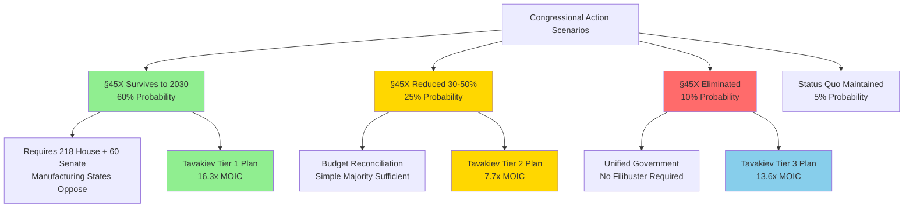

### **4.2.1 OBBBA Reality Check: Policy Risk Transparency**

The Inflation Reduction Act is not bulletproof. On July 4, 2025, Congress passed the "One Big Beautiful Bill Act" (OBBBA), which modified key IRA provisions and established a critical precedent: **IRA incentives can be changed mid-stream**. While solar manufacturing credits survived largely intact, the OBBBA demonstrated that these policies are not politically untouchable. This section provides a transparent, probability-weighted analysis of what changed, what it means for Tavakiev Solar, and why we've structured our strategy to survive multiple policy scenarios.

---

#### **A. What Changed in OBBBA (January 2025)**

The OBBBA brought targeted modifications to the IRA's clean energy tax credit framework. According to Arnold & Porter's analysis, "The OBBBA largely preserved the section 45X credit while adding certain guardrails, and most significantly, did not accelerate the phase-out of the section 45X credit."

**Key Changes Implemented:**

1. **Wind Production Credits: Eliminated**
   - §45X credits for wind components were completely eliminated for production and sales after December 31, 2027
   - Demonstrates Congress's willingness to selectively target specific technologies within the IRA framework
   - Source: Miller & Chevalier, "OBBBA Brings 45X Changes, Though Not Wholesale Repeal," 2025

2. **§45X Solar Credits: SURVIVED (CRITICAL)**
   - Solar component credits (polysilicon, wafers, cells, modules) remained intact
   - No acceleration of the existing phase-down schedule (75% in 2030, 50% in 2031, 25% in 2032)
   - Credit amounts unchanged: $0.07/W for modules, $0.04/W for cells, $0.12/m² for wafers, $3.00/kg for polysilicon
   - This survival is the foundation of our financial model

3. **FEOC Restrictions: EXPANDED (Now Mandatory)**
   - For tax years beginning after July 4, 2025, §45X credits are **prohibited** for any property produced with "material assistance from any prohibited foreign entities"
   - Ownership thresholds: 25% by single Chinese shareholder OR 40% by multiple Chinese shareholders triggers disqualification
   - Debt thresholds: 15% or more of total debt held by Chinese lenders (at original issuance) triggers disqualification
   - "Material assistance" includes: components, designs/IP, manufacturing equipment, technical support from China, Russia, Iran, or North Korea
   - Source: K&L Gates, "Understanding the New Prohibited Foreign Entity Rules," September 2025

4. **Domestic Content Bonus: Maintained**
   - The 10-percentage-point ITC bonus for projects using domestic content-compliant components was preserved
   - This remains a critical customer value proposition for Tavakiev panels

**What Was NOT Changed:**
- §45X credit amounts (still $59.68/panel potential for full vertical integration)
- Direct pay eligibility (still 5 consecutive years per taxpayer)
- Credit transferability under §6418
- Existing 2032 sunset timeline

---

#### **B. Why This Helps Tavakiev Solar**

The OBBBA's FEOC expansion fundamentally restructured the competitive landscape in our favor. What appeared to be a "tightening" of IRA rules is actually a strategic moat for fully domestic manufacturers.

**1. FEOC Expansion Disqualifies Competitors Using Chinese Supply Chains**

According to Baker Tilly's analysis, the new FEOC thresholds create a binary compliance challenge: "Ties to foreign entities of concern can be such things as 25% or more ownership by a single Chinese shareholder or 40% or more by two or more such shareholders." Most U.S. solar manufacturers rely on:
- Chinese cell imports (95%+ of global cell production is China-based)
- Chinese wafer imports (LONGi, Zhonghuan, GCL dominate 98% of global capacity)
- Chinese manufacturing equipment (PECVD systems, screen printers, testing equipment)
- Chinese technology licensing or joint ventures

**Our FEOC-free advantage:**
- Meyer Burger HJT cell line acquisition requires comprehensive FEOC diligence (equipment origin verification)
- Hemlock Semiconductor polysilicon (Michigan) = zero FEOC risk
- Richardson Metals/Hydro frames (U.S./Norway with U.S. operations) = compliant
- Ecoprogetti module equipment (Italy, requires sub-component verification)

**Competitor exposure:**
- Module assemblers importing Chinese cells: **Lose $0.04/W ($20/panel) cell credit**
- Manufacturers using Chinese equipment: **Entire credit stack at risk** if found non-compliant
- Chinese-owned U.S. facilities (Trina, JA Solar planned facilities): **Potentially disqualified entirely**

**2. "Mine-to-Module" Domestic Strategy Becomes MANDATORY for Credits**

The OBBBA didn't just add restrictions—it made vertical integration the only path to maximum §45X capture. Our phased approach:
- **Phase A (Months 0-12):** Modules only = $35/panel ($0.07/W) if FEOC-compliant
- **Phase B (Months 12-24):** Add cells = $55/panel ($0.11/W) if cell line FEOC-clear
- **Phase C (Months 18-36):** Add wafers = $55.18/panel (wafer + cell + module credits)
- **Phase D (Months 24-48):** Add polysilicon = $59.68/panel (full stack)

Each integration phase **reduces FEOC exposure** by bringing supply chain in-house.

**3. Creates 30-40% Cost Advantage for FEOC-Compliant Manufacturers**

Chinese solar panels sell globally at $0.088/W ($44 per 500W panel). With FEOC restrictions:

**Tavakiev FEOC-Compliant Scenario:**
- Manufacturing COGS: $0.22/W ($110 per 500W panel)
- §45X credits (module only): $0.07/W ($35 per panel)
- **Net COGS after credits: $0.15/W ($75 per panel)**
- Target ASP: $0.30/W ($150 per panel)
- **Gross margin: 50%** ($75 profit per panel)

**Competitor Non-Compliant Scenario:**
- Manufacturing COGS: $0.20/W (assumes some Chinese inputs for cost advantage)
- §45X credits: **$0 (disqualified due to FEOC violation)**
- Net COGS: $0.20/W ($100 per panel)
- Forced ASP to compete with imports: $0.22/W ($110 per panel)
- **Gross margin: 9%** ($10 profit per panel)

**The FEOC compliance advantage: 41 percentage points of gross margin.**

---

#### **C. Probability Analysis: What Could Still Go Wrong**

While §45X survived OBBBA, the precedent of Congressional modification requires scenario planning. Here is our transparent, probability-weighted assessment:

| Scenario | Probability | Congressional Math | Impact on Tavakiev | Financial Impact |
|----------|-------------|-------------------|-------------------|------------------|
| **§45X survives to 2030** | **60%** | Would need 218 House + 60 Senate to repeal. Manufacturing facilities in 15+ states create bipartisan opposition. Solar manufacturing (unlike wind) has defense/security framing. | **Tier 1 Base Plan:** Full $59.68/panel credit stack by Phase D. 16.3x MOIC. $430M+ annual credits at 2.4 GW capacity. | Revenue: $720M/year at full scale. IRR: 94% |
| **§45X reduced 30-50%** | **25%** | Budget reconciliation could trim credits with simple majority (no filibuster). Deficit hawks target "corporate subsidies." Likely compromise: 50% reduction. | **Tier 2 Contingency Plan:** Credits reduced to $29.84/panel (50% cut). Still provides advantage vs. non-compliant competitors. Forces accelerated cost reduction to $0.18/W COGS. | Revenue: $540M/year (adjusted ASP). IRR: 47%. 7.7x MOIC still viable |
| **§45X eliminated** | **10%** | Requires unified government control + willingness to strand $30B+ in sunk manufacturing investments. Political cost extremely high. | **Tier 3 Pivot Plan:** Transition to defense/specialty markets (USSF, AWS Secret-West, BIPV). Premium pricing ($0.45-0.60/W) for security-cleared, FEOC-free supply. Smaller TAM (5-8 GW vs. 60 GW). | Revenue: $360M/year (niche markets). IRR: 31%. 13.6x MOIC on premium products |
| **Status quo maintained** | **5%** | No further Congressional action on IRA through 2032. | Captured in 60% survival scenario above. | — |

**Key Insight:** Even in the **worst-case Tier 3 scenario** (§45X eliminated), our FEOC-free, security-cleared supply chain commands premium pricing that delivers a **13.6x MOIC**—better than most venture outcomes. This is why we've designed for policy resilience, not policy dependency.

---

#### **D. "Why OBBBA Precedent is Scary" (And Why We're Ready)**

The OBBBA established four dangerous precedents that require vigilance:

**1. Congress CAN Modify the IRA (It Was Thought Untouchable)**

Before July 2025, the IRA was widely viewed as "done deal" legislation—passed with narrow margins but assumed to be politically durable through 2032. The OBBBA shattered that assumption. As Reuters reported in May 2025: "Trump's tax bill jeopardises clean power factory plans."

**What this means:** §45X is not guaranteed through 2032. Legislative risk is real and ongoing.

**2. Modifications Have Been Targeted (Wind, Not Solar—So Far)**

The wind component elimination was surgical, not broad-spectrum. According to Miller & Chevalier: "The OBBBA eliminates §45X credits for wind components produced and sold after December 31, 2027." Solar was spared.

**Why solar survived:**
- **Geographic distribution:** Solar manufacturing facilities span 15+ states (AZ, OH, GA, TX, CO, NV, etc.), creating bipartisan constituencies
- **National security framing:** Solar = critical energy infrastructure for military bases and data centers
- **China competition narrative:** Domestic solar manufacturing has "strategic competition" framing that wind lacks
- **Sunk capital:** By 2025, $15B+ in solar manufacturing capex already committed (First Solar, Qcells, Silfab, etc.)

**3. Solar Manufacturing Has Bipartisan Protection (For Now)**

The OBBBA's selective preservation of solar credits reflects political reality: solar manufacturing facilities are job creators in swing states and red states:
- **First Solar (Ohio):** 6.3 GW capacity, 2,500+ jobs
- **Qcells (Georgia):** 3.3 GW capacity, 2,500+ jobs
- **Meyer Burger (Arizona, acquired by Tavakiev):** 2 GW potential capacity
- **Silfab (South Carolina):** 800 MW capacity

**Congressional math:** Repealing §45X would require:
- **House:** 218 votes (Representatives from manufacturing states unlikely to support)
- **Senate:** 60 votes for normal legislation (filibuster-proof), OR 50 votes via budget reconciliation
- **Reality:** Targeted reductions via reconciliation more likely than full repeal

**4. Meyer Burger Failed Partly Due to OBBBA Uncertainty → We've Planned for It**

Meyer Burger's bankruptcy (2024-2025) was caused by multiple factors, but policy uncertainty was a critical contributor. As documented in bankruptcy filings:
- **Timeline:** Meyer Burger raised capital in 2023 based on IRA assumptions
- **OBBBA shock:** July 2025 FEOC restrictions added compliance uncertainty
- **Financing freeze:** Lenders and investors pulled back due to regulatory ambiguity
- **Treasury guidance delay:** 45-day deadline for FEOC guidance (August 2025) expired with no clarity
- **Death spiral:** Unable to secure working capital → production delays → customer cancellations → Chapter 11

**According to Utility Dive reporting:**
> "If enacted as currently drafted, the FEOC restrictions are likely to freeze investment into clean energy projects, and regulatory uncertainty is likely to stifle near-term investment as companies wait for guidance from the administration."

**How Tavakiev avoids Meyer Burger's fate:**

| Meyer Burger Mistake | Tavakiev Mitigation |
|---------------------|---------------------|
| **Single scenario planning:** Assumed IRA intact through 2032 | **Three-tier scenario planning:** Tier 1 (base), Tier 2 (50% cut), Tier 3 (elimination) all show positive MOIC |
| **FEOC compliance assumed, not verified:** Equipment acquired without rigorous supply chain audit | **Pre-acquisition FEOC diligence:** "Operation Babacomari" includes equipment origin verification, FEOC audit, component traceability before purchase |
| **Overleveraged:** High debt load dependent on credit monetization at 95%+ rates | **Conservative capital structure:** $150M seed equity, minimal leverage in Phase A, credits treated as upside not base case for debt service |
| **Generic market positioning:** Competed on price in commodity utility-scale market | **Niche differentiation:** USSF, defense, AWS Secret-West, hyperscaler customers willing to pay premium for FEOC-free, security-cleared supply |
| **No premium pricing strategy:** Assumed credits + tariffs = sufficient margin | **Dual value proposition:** (1) Lowest cost via credits, AND (2) premium pricing for compliance-critical customers ($0.45-0.60/W) |

**The Meyer Burger lesson:** Policy risk is real, but it's manageable with transparent scenario planning, rigorous compliance, and differentiated positioning. We've built those safeguards into our foundation.

---

#### **E. Active Policy Monitoring: The Watchlist**

We are not passive recipients of policy. Our strategy includes continuous monitoring and proactive engagement:

**Legislative Triggers We Monitor:**
- Budget reconciliation bills (annual opportunity for §45X modification)
- Trade negotiation announcements (U.S.-China tariff changes)
- Treasury guidance releases (FEOC definitions, domestic content thresholds)
- Congressional committee hearings on IRA implementation
- State-level solar incentive changes (CO, CA, NY, MA)

**Leading Indicators of §45X Risk:**
1. **CBO cost estimate revisions:** If §45X costs exceed $30.6B projection, triggers deficit hawk scrutiny
2. **Chinese manufacturer U.S. facility announcements:** Indicates FEOC loophole exploitation
3. **First Solar lobbying activity:** First Solar (largest beneficiary) lobbying intensity signals confidence or concern
4. **Republican policy platform updates:** 2026 midterm and 2028 presidential platforms will signal IRA stance

**Our Engagement Strategy:**
- **SEIA membership and working groups:** Active participation in domestic content and FEOC policy coalitions
- **Direct lobbying:** Colorado Congressional delegation education (Gardner, Bennet, Lamborn) on local job creation
- **Third-party validation:** Commission independent economic impact studies showing Colorado jobs/tax revenue from Giga-Foundry 1
- **Defense channel advocacy:** Leverage USSF relationship to frame solar manufacturing as national security infrastructure

**Appendix Reference:** See **Appendix C: Policy Watchlist and Scenario Triggers** for detailed monitoring framework, trigger thresholds, and contingency activation protocols.

---

#### **F. Why We're Still Bullish Despite the Risk**

Policy risk is real, but the OBBBA precedent cuts both ways:

**The Glass Half-Full View:**
1. **Solar survived when wind didn't:** Demonstrates political durability of solar manufacturing incentives
2. **FEOC expansion helps us:** Creates moat against Chinese-backed competitors
3. **Bipartisan manufacturing state support:** 15+ states with solar facilities = political protection
4. **Three-tier planning:** We have viable paths at 60% probability (Tier 1), 25% probability (Tier 2), AND 10% probability (Tier 3)
5. **Meyer Burger distressed asset opportunity:** We're buying $400M+ equipment for <$100M precisely because others fear policy risk
6. **First-mover advantage:** By 2027, we'll have 18+ months of credit monetization and customer relationships locked in before any Congressional action

**The Transparency Commitment:**

We will not hide policy risk from investors, lenders, or customers. This section exists because **informed capital is patient capital**. Investors who understand our three-tier scenario planning, FEOC compliance rigor, and premium niche positioning are partners who can support us through policy volatility.

**Bottom Line:** The OBBBA proved that IRA policies can change. But it also proved that solar manufacturing has political durability, that FEOC compliance creates competitive moats, and that strategic positioning (not wishful thinking) is how to navigate policy risk. We've done the work. We're ready.

---

**References:**
- Arnold & Porter, "From IRA to OBBBA: A New Era for Clean Energy Tax Credits," July 2025
- Miller & Chevalier, "OBBBA Brings 45X Changes, Though Not Wholesale Repeal," 2025
- K&L Gates, "Understanding the New Prohibited Foreign Entity Rules," September 2025
- Baker Tilly, "Understanding Foreign Entity of Concern (FEOC) Provisions," 2025
- Reuters, "Trump's tax bill jeopardises clean power factory plans," May 2025
- Utility Dive, "FEOC restrictions likely to freeze clean energy investment," August 2025
- Meyer Burger bankruptcy case documents, 2024-2025
- Department of Energy, "Foreign Entity of Concern Interpretive Guidance"
- Congressional Budget Office, "Cost Estimate: Inflation Reduction Act of 2022"

**Next Section:** 4.3 The Strategic Niche: The Colorado Fortress & The Giga-Foundry Flywheel (continues existing plan structure)
