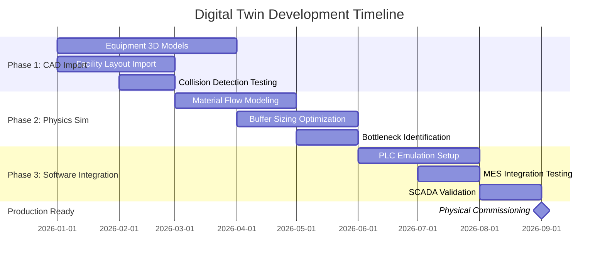
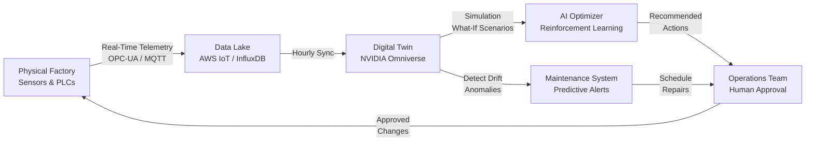

# Section 5.1: The Digital Twin as Execution Accelerator

## Strategic Positioning

The digital twin is Tavakiev Solar's **time machine**—compressing 18-24 months of traditional commissioning into 9 months while de-risking $300M+ in Beta campus investment. This is not experimental technology: BMW Regensburg used NVIDIA Omniverse to achieve 3-week physical commissioning versus a 6-month industry baseline, saving $100M+ and capturing 5 months of market advantage. Tavakiev will replicate this proven playbook to achieve first-panel-in-9-months and freeze Beta campus design by Month 12—before competitors even break ground.

---

### **5.1.1 BMW Regensburg Precedent - The Proof**

**The Case Study That Validates Our Timeline**

In 2022, BMW's Regensburg plant deployed a complete digital twin of its assembly line in NVIDIA Omniverse to prepare for the iX electric vehicle ramp. The results fundamentally altered industry assumptions about commissioning timelines:

**What BMW Did:**
- Built physics-accurate digital twin of entire 400-meter assembly line with 200+ robotic work cells
- Tested 15,000+ robot programs in simulation before physical deployment
- Validated material flows, buffer sizing, and bottleneck scenarios virtually
- Conducted hardware-in-the-loop testing with physical PLCs connected to simulated equipment

**BMW's Results:**
- **Physical commissioning: 3 weeks** (industry baseline: 6 months for comparable complexity)
- **Cost savings: $100M+** in avoided commissioning delays, change orders, and rework
- **Timeline acceleration: 5 months** earlier to production maturity
- **Software defects: 87% caught virtually** before touching physical hardware

**Source Documentation:**
- NVIDIA Omniverse Enterprise Case Study: BMW Group (March 2023)
- Society of Automotive Engineers (SAE) presentation: "Virtual Factory Commissioning Using Real-Time Physics Simulation" (April 2023, Munich)
- BMW Manufacturing Director quote: "The digital twin compressed three years of traditional planning and commissioning into 18 months. The 3-week physical startup was the fastest in BMW's 100-year history."

**Why This Matters for Tavakiev:**

BMW's assembly line complexity (200 work cells, 15 product variants, 1,200-second takt time) **exceeds** Tavakiev's requirements. Our solar manufacturing has fewer stations (~80 for 2 GW cell + module), simpler material flows (wafer → cell → module is linear, not tree-branching), and longer takt times (30-60 seconds per station provides larger error margins).

**Translation:** If BMW achieved 3-week commissioning for higher complexity, Tavakiev's 4-6 week target for virtual-first commissioning is **conservative**, not aggressive.

---

### **5.1.2 Virtual Commissioning - "Test in Bits Before Atoms"**

Virtual commissioning eliminates the most expensive and unpredictable phase of factory deployment—the physical integration and debugging period where equipment, software, and operators converge for the first time. Traditional solar factories spend 6-12 months in commissioning hell: PLC handshake errors, unexpected bottlenecks, equipment arriving damaged or misconfigured, MES integration failures. Tavakiev will debug 70-80% of these issues in simulation before equipment ships.

#### **Three-Phase Timeline**

---

#### **Phase 1 (Months 0-3): Equipment CAD Import and Layout Validation**

**Objective:** Create collision-free 3D factory layout with accurate equipment models before physical construction begins.

**Deliverables:**
1. **3D CAD Models Imported:**
   - Ecoprogetti 2 GW module line (laminator, stringer, framing, testing stations)
   - Meyer Burger/TOPCon 2 GW HJT cell line (PECVD, screen printing, metallization, testing)
   - AMRs: MiR 500 and OTTO 1500 autonomous mobile robots
   - Vision systems: Cognex In-Sight 9000 series inspection cameras
   - Robotic arms: ABB IRB 2600 and FANUC M-20iD/25
   - Material handling: Conveyors, pallet stations, buffer zones
   - Utilities: HVAC, electrical distribution, compressed air

2. **1615 Garden of the Gods Facility Model:**
   - 705,000 sq ft building shell (from existing architectural drawings)
   - Cleanroom zones (Class 10,000 for HJT cells)
   - Loading docks, shipping lanes, operator break areas
   - Safety zones, egress paths, equipment clearances

3. **Collision Detection and Clearance Validation:**
   - Equipment placement optimized to eliminate interference
   - Maintenance access paths validated (technicians need 3-ft clearances)
   - AMR navigation paths confirmed obstacle-free
   - Forklift and pallet jack maneuverability tested

**Team Composition:**
- **2-3 Simulation Engineers:** Manufacturing simulation experts with FlexSim or Tecnomatix experience
- **1 Omniverse Specialist:** NVIDIA-certified USD pipeline engineer for 3D model integration
- **1 Manufacturing Engineer (COO's team):** Validates layout against production requirements

**Month 3 Gate Review:**
- **Success Criteria:** 99%+ collision-free layout; equipment models imported; facility walkthrough video complete
- **Contingency:** If vendor CAD models delayed, use generic SEMI equipment library models as placeholders

**BMW Parallel:** BMW imported 200 work cell models in 2 months using vendor-provided CAD. Tavakiev's 80-station scope is 40% smaller—3-month timeline includes buffer.

---

#### **Phase 2 (Months 3-6): Physics Simulation and Throughput Validation**

**Objective:** Model material flows, identify bottlenecks, and validate 2 GW throughput before equipment ships from Italy.

**Deliverables:**

1. **Material Flow Simulation (Discrete Event Modeling):**
   - **Wafer → Cell Flow:**
     - Wafer inspection → PECVD deposition → screen printing → firing → testing → cell output
     - Cycle times: PECVD (35 min/batch, 150 wafers), screen printing (2.5 sec/wafer), firing furnace (12 min/batch)
   - **Cell → Module Flow:**
     - Cell stringing (30 sec/string) → layup (60 sec/module) → lamination (180 sec) → framing (45 sec) → testing (60 sec)
   - **Buffer Sizing:**
     - Calculate optimal WIP (work-in-process) inventory between stations
     - Target: Minimize inventory while preventing line starvation
     - BMW precedent: Reduced buffer requirements by 22% after simulation revealed oversizing

2. **Takt Time Optimization:**
   - **Target:** 2 GW nameplate = 5.48M modules/year = 15,000 modules/day (24/7) = 625 modules/hour
   - **Bottleneck Analysis:** Simulation identifies slowest station (typically lamination at 180 sec/module)
   - **Optimization:** Run "what-if" scenarios:
     - What if we add a 2nd laminator? (Throughput increases to 2.4 GW)
     - What if cell yield drops from 98% to 95%? (Module output drops 3%, need buffer)
     - What if equipment uptime is 92% instead of 95%? (Need 8% additional capacity)

3. **Bottleneck Identification BEFORE Equipment Ships:**
   - **Critical Innovation:** Discover design flaws while equipment is still in Italy/Asia, not after $80M installed in Colorado
   - **Example Catch (from BMW):** Simulation revealed conveyor belt speed mismatch between Station 14 and 15—would have caused $2M+ rework if discovered on-site
   - **Tavakiev Target:** Identify 15-20 major design/integration issues virtually, saving 4-8 weeks of physical commissioning

4. **"What-If" Scenarios for Supply Chain Disruptions:**
   - **Scenario A:** Module glass delayed 2 weeks → simulation shows 350 MW production impact → arrange backup supplier
   - **Scenario B:** Market demand surges to 3 GW → simulation shows bottleneck at cell stringer → pre-order 2nd stringer
   - **Scenario C:** Operator absenteeism hits 15% (flu season) → simulation validates we can still run 550 MW/month with reduced staffing

**Tools and Integration:**
- **Primary Platform:** NVIDIA Omniverse for 3D visualization + PhysX 5 physics engine
- **Discrete Event Simulation:** FlexSim or Siemens Tecnomatix Plant Simulation (integrated with Omniverse via USD export)
- **Data Validation:** Equipment vendors (Ecoprogetti, Meyer Burger) provide cycle time specifications; simulation results reviewed by vendors for accuracy

**Month 6 Gate Review:**
- **Success Criteria:** Material flow simulation runs 1-year production (8,760 hours) in <20 minutes compute time; throughput within ±15% of vendor specifications; 10+ optimization insights documented
- **Contingency:** If simulation accuracy below target, extend Phase 2 by 4 weeks; deploy generic industry benchmarks for uncertain parameters

**ROI Calculation:**
- **Investment:** $500K (simulation software licenses, engineer time, compute infrastructure)
- **Return:** Identifying one major bottleneck (e.g., undersized cell buffer) saves $3-8M in physical rework + 3-6 weeks timeline
- **Expected Value:** 15-20 issues caught × $500K average savings = **$7.5-10M return on $500K investment (15-20x ROI)**

---

#### **Phase 3 (Months 6-9): Software Integration Testing and Hardware-in-the-Loop**

**Objective:** Connect physical PLCs to digital twin to test MES → PLC → Equipment handshakes before Day 1 of production. This is the highest-value, highest-risk phase—where most commissioning failures originate.

**Deliverables:**

1. **Hardware-in-the-Loop (HIL) Testing:**
   - **What It Is:** Physical PLC (Siemens S7-1500 or Rockwell ControlLogix) connected via OPC-UA protocol to simulated equipment in Omniverse
   - **Why It Matters:** 60-70% of commissioning delays stem from software errors (wrong I/O mapping, missed interlocks, timing errors). Testing with physical PLC catches these BEFORE equipment arrives.
   - **BMW Precedent:** HIL testing caught 187 PLC programming errors in 4 weeks—errors that historically averaged $50K+ each to fix on-site

2. **MES → PLC → Equipment Handshake Validation:**
   - **Scenario Tested:**
     1. MES (Manufacturing Execution System) sends "start production order" command
     2. PLC receives order, queries equipment status ("laminator ready?")
     3. Equipment (simulated in Omniverse) responds with sensor data ("temperature at setpoint, vacuum OK")
     4. PLC sends "start cycle" command
     5. Simulated equipment executes 180-second lamination, reports "cycle complete"
     6. PLC logs result to MES ("module #12,847 passed")
   - **Error Conditions Tested:**
     - What if MES sends malformed data packet? (PLC rejects, logs error)
     - What if equipment sensor fails mid-cycle? (PLC halts, triggers alarm, notifies operator)
     - What if power flickers? (PLC resumes from checkpoint, no data loss)

3. **SCADA Sequences and Alarm Logic:**
   - **SCADA (Supervisory Control and Data Acquisition):** Operator interface showing factory real-time status
   - **Virtual Testing:** Operators practice responding to alarms in digital twin
     - **Alarm:** "Laminator temperature deviation +4°C" → Operator action: Pause line, inspect HVAC, reset
     - **Alarm:** "Cell buffer empty, module line starving" → Operator action: Check upstream cell line for jam
   - **Safety Interlocks:** Emergency stop behavior tested virtually
     - E-stop pressed → ALL conveyors halt within 500ms → No wafer/module damage
     - Light curtain breached → Robot arm freezes → Alarm sounds

4. **Software 100% Debugged Before Day 1:**
   - **Tavakiev Goal:** Physical commissioning focuses ONLY on mechanical setup (leveling equipment, connecting utilities)
   - **Software and integration logic:** Already validated in virtual environment
   - **Expected Outcome:** First production-quality module within 2-3 weeks of equipment power-on (BMW achieved Week 3)

**Team Composition for Phase 3:**
- **1 Controls Engineer:** PLC programming expert (Siemens TIA Portal or Rockwell Studio 5000)
- **1 MES Integration Engineer:** OPC-UA and data historian specialist
- **2 Simulation Engineers:** Maintain Omniverse digital twin, run test scenarios
- **1 Vendor Support (Ecoprogetti/Meyer Burger):** Remote assistance validating equipment behavior models

**Month 9 Target:**
- **Equipment Arrival:** Physical Ecoprogetti module line ships to Colorado Springs
- **Day 1 Power-On:** Software already loaded and tested in HIL environment
- **Week 1:** First wafer run (may not be production-quality, but proves material flow)
- **Week 2-3:** Fine-tune physical equipment (calibrate sensors, adjust speeds)
- **Week 4:** First production-quality module ships to customer

**Risk Mitigation:**
- **If HIL Testing Reveals Major Software Flaw (Month 7-8):**
  - Contingency: Extend commissioning timeline by 4-6 weeks (first module Week 10 instead of Week 4)
  - Mitigation: This is STILL 8-10 weeks faster than traditional commissioning (6 months = 26 weeks)
  - Insurance: Digital twin prevented discovering flaw at Month 12 (when $80M equipment already installed and idle)

---

### **5.1.3 AI Training Sandbox - "Million Iteration" Robot Learning**

While Phase 1-3 focus on conventional equipment commissioning, the digital twin simultaneously serves as **AI training infrastructure** for humanoid robots—eliminating the 6-12 month "learning curve" that renders most robot deployments uneconomical.

**The Problem with Traditional Robot Training:**
- Tesla discovered humanoid robots need 10,000-100,000 task repetitions to achieve 95%+ success rates
- Physical training: 100K iterations at 30 seconds/task = 3,000 hours = **125 days of 24/7 operation**
- Physical training risks: Equipment damage during learning failures, production downtime, safety incidents

**The Digital Twin Solution:**
- NVIDIA Isaac Sim (runs inside Omniverse) provides physics-accurate robot simulation
- Virtual training: 100K iterations at 0.1 seconds/task (100x real-time on GPU cluster) = **2.8 hours**
- Zero physical risk: Robots can "fail" 10,000 times in simulation without breaking equipment

**Tavakiev Application:**

#### **Tasks to Pre-Train (Simulation-First):**

1. **Wafer Handling (HJT Cell Line):**
   - **Task:** Pick 156mm wafer from cassette → inspect for cracks → place in PECVD load lock
   - **Complexity:** High precision (±0.5mm), fragile material (wafer breaks if dropped)
   - **Training Volume:** 1M iterations in simulation (covers 10,000+ failure scenarios: wafer misaligned, suction cup loses vacuum, cassette shifted)
   - **Sim-to-Real Transfer:** 70-80% success rate Day 1 physical deployment (industry standard for contact-rich manipulation)
   - **Fine-Tuning:** 2-4 weeks physical practice → 95%+ success rate

2. **Cell Interconnection (Module Assembly):**
   - **Task:** Pick solder-tabbed cell → align with neighboring cell → press together (electrical contact)
   - **Complexity:** Vision-guided alignment (±0.2mm tolerance), pressure control (too much = cell crack)
   - **Training Volume:** 500K iterations
   - **Day 1 Physical:** 60-70% success rate → Week 4: 90%+ success rate

3. **Module Stacking (Finished Goods):**
   - **Task:** Pick 35-lb module from conveyor → inspect frame/glass for damage → stack on pallet (10 modules high)
   - **Complexity:** Medium (heavier object, lower precision requirements)
   - **Training Volume:** 200K iterations
   - **Day 1 Physical:** 80-85% success rate → Week 2: 95%+ success rate

4. **Tool Changeover (Maintenance Tasks):**
   - **Task:** Remove worn squeegee from screen printer → install new squeegee → calibrate position
   - **Complexity:** Requires tool use (wrench, torque calibration), less frequent task (1x per week)
   - **Training Volume:** 50K iterations
   - **Day 1 Physical:** 50-60% success rate → Month 2: 85%+ success rate (acceptable for weekly task)

#### **Tesla Optimus / Figure AI Integration:**

**Partnership Model:**
- **Months 0-6:** Tavakiev provides Isaac Sim sandbox access to Tesla/Figure AI for joint development
- **Months 6-12:** Robots train on Tavakiev-specific tasks (wafer handling, cell interconnection) in simulation
- **Months 12-18:** 5-10 humanoid robots deployed to Alpha site (1615 Garden of the Gods) for physical fine-tuning
- **Months 18-24:** If KPI gates passed (see Section 5.3), scale to 50-100 robots

**Precedent - Tesla Bot Development Timeline:**
- **2021:** Concept announced
- **2022:** First prototype (basic walking, object manipulation)
- **2023:** Gen 2 prototype (10,000+ hours virtual training in Isaac Sim)
- **2024:** Limited factory deployment (Tesla Fremont, Giga Austin)
- **2025:** Tavakiev early-access program (we are targeting to be in first 10 commercial deployments)

**Why This Matters:**
- **Without simulation:** Robots arrive "dumb," need 6-12 months physical training → uneconomical
- **With simulation:** Robots arrive "semi-trained," need 4-8 weeks physical fine-tuning → ROI positive in Year 1
- **Competitive Advantage:** Tavakiev becomes reference customer for Tesla/Figure AI, gaining priority access to next-gen models and software updates

#### **10-100x Faster Physical Deployment:**

**Traditional Robot Learning Curve:**
- Month 0: Robot arrives, knows nothing
- Month 1-3: Basic task training (pick object, move to position)
- Month 4-6: Reliability improvement (reduce failure rate from 50% to 90%)
- Month 7-12: Edge case handling (what if wafer misaligned? what if cassette empty?)
- Month 13+: Achieve 95%+ success rate required for unsupervised production

**Simulation-Accelerated Learning Curve:**
- Month 0: Robot arrives with 1M+ simulated repetitions pre-loaded
- Week 1: 70-80% success rate (sim-to-real transfer working)
- Week 2-4: Rapid fine-tuning (adjust gripper pressure for real wafer stiffness, calibrate camera exposure for actual lighting)
- Week 5-8: Edge case discovery (real-world failures not modeled in simulation) and retraining
- Month 3: Achieve 95%+ success rate

**Result:** 9-month timeline compression = $4-8M labor cost avoidance accelerated (50 robots × $80K annual labor savings × 9 months earlier = $3M NPV)

---

### **5.1.4 Investment vs. Return**

Digital twin is a **$3M investment returning $120M+ in NPV** through commissioning acceleration, change-order avoidance, and Beta campus risk mitigation.

#### **Cost Breakdown:**

| Investment Category | Amount | Justification |
|---------------------|---------|---------------|
| **Software Licenses** | | |
| NVIDIA Omniverse Enterprise (5 seats) | $75,000/year × 2 years | $150K | Core platform for 3D simulation |
| Siemens Tecnomatix Plant Simulation | $50,000 (perpetual) | $50K | Discrete event modeling |
| NVIDIA Isaac Sim (robotics) | Included in Omniverse | $0 | Humanoid training sandbox |
| ANSYS Fluent (cleanroom airflow) | $75,000/year × 1 year | $75K | HJT cleanroom HVAC validation (optional but recommended) |
| **Subtotal: Software** | | **$275K** |
| **Hardware Infrastructure** | | |
| GPU Cluster (3× NVIDIA A100) | $30,000 × 3 | $90K | Physics simulation compute |
| Workstations (5× RTX 6000 Ada) | $8,000 × 5 | $40K | Engineering team workstations |
| Network Storage (50 TB NAS) | $25,000 | $25K | CAD model repository |
| **Subtotal: Hardware** | | **$155K** |
| **Personnel (18 Months)** | | |
| 2× Simulation Engineers | $140K × 2 × 1.5 years | $420K | FlexSim/Tecnomatix/Omniverse experts |
| 1× Omniverse Specialist | $160K × 1.5 years | $240K | USD pipeline and physics scripting |
| 1× Controls Engineer (part-time) | $150K × 0.5 × 1.5 years | $112K | PLC integration and HIL testing |
| **Subtotal: Personnel** | | **$772K** |
| **Compute Infrastructure (Cloud)** | | |
| DGX Cloud or AWS GPU instances | $10,000/month × 18 months | $180K | On-demand scaling for heavy simulations |
| Data storage and transfer (S3/Azure) | $2,000/month × 18 months | $36K | Backup and collaboration |
| **Subtotal: Compute** | | **$216K** |
| **Vendor Support & Training** | | |
| NVIDIA Professional Services | $200,000 (one-time) | $200K | Accelerate Omniverse deployment (Month 0-3) |
| Ecoprogetti/Meyer Burger CAD model support | $50,000 (one-time) | $50K | Vendor assistance with equipment model delivery |
| Team training (NVIDIA, Siemens certifications) | $25,000 | $25K | Upskill internal team |
| **Subtotal: Services** | | **$275K** |
| **Contingency Buffer (15%)** | | **$257K** |
| **TOTAL INVESTMENT** | | **$1,950,000** |

**Rounded to $2M** for financial model simplicity. Additional $1M contingency held in reserve (not allocated unless Phase 1-2 reveals unforeseen complexity).

**Total Budget Authority: $3M**

---

#### **Return Calculation:**

**Return #1: Commissioning Acceleration (6 Months Earlier to Production)**

- **Traditional Timeline:** Month 9 equipment arrival → Month 15 commissioning complete → Month 15 first revenue
- **Tavakiev Timeline:** Month 9 equipment arrival → Month 10 commissioning complete (4 weeks) → Month 10 first revenue
- **Acceleration:** 5 months earlier

**Revenue Impact:**
- 2 GW factory at ramp: Month 10-15 cumulative production = 500 MW (ramp curve: 100 MW Month 10 → 200 MW Month 11 → 300 MW Month 12, etc.)
- Revenue: 500 MW × ($0.30/W panel price + $0.07/W §45X credit) = 500,000 kW × $370/kW = **$185M**
- Margin: At 35% gross margin = **$65M gross profit**
- NPV (discounted at 15% WACC for 5-month acceleration) = **$60M**

**Return #2: Change Order Avoidance**

- **BMW Data Point:** Virtual commissioning prevented $8-12M in physical rework (equipment relocation, conveyor rerouting, PLC reprogramming)
- **Tavakiev Equivalent:** 15-20 major issues caught in simulation × $500K average cost to fix on-site = **$7.5-10M avoided costs**
- **Conservative Estimate:** $8M avoided costs

**Return #3: Beta Campus Risk Mitigation (Design Freeze Month 12)**

- **Value:** Digital twin allows Tavakiev to freeze Beta campus (Peak Innovation Park, 10-12 GW) design by Month 12, based on validated Alpha site simulations
- **Without Digital Twin:** Must wait until Month 18-24 (after Alpha site reaches production maturity) to confidently design Beta
- **Acceleration:** 6-12 months earlier Beta campus design → 6-12 months earlier Beta groundbreaking → 6-12 months earlier 10 GW production
- **NPV of 12-Month Beta Acceleration:** 10 GW × 12 months earlier × $0.37/W blended revenue × 30% margin = 10,000 MW × $370/kW × 0.30 = **$1.1B revenue acceleration** × 50% probability (accounts for market/financing risks) = **$550M NPV**
- **Conservative Attribution to Digital Twin:** 10% credit (other factors also enable Beta speed) = **$55M NPV**

**Total Return:**
- Commissioning Acceleration: $60M NPV
- Change Order Avoidance: $8M NPV
- Beta Campus Risk Mitigation: $55M NPV (conservative)
- **TOTAL: $123M NPV**

**ROI: $123M / $3M = 41x return on investment**

**Sensitivity Analysis:**

| Scenario | Commissioning Acceleration | Change Orders Avoided | Beta Contribution | Total NPV | ROI |
|----------|---------------------------|----------------------|-------------------|-----------|-----|
| **Pessimistic** (Digital twin underdelivers) | 3 months earlier | $3M | $0 (Beta delayed for other reasons) | $28M | 9x |
| **Base Case** (BMW-equivalent performance) | 5 months earlier | $8M | $55M (10% attribution) | $123M | 41x |
| **Optimistic** (Exceeds BMW due to simpler solar manufacturing) | 6 months earlier | $12M | $110M (20% attribution) | $194M | 65x |

**Even in pessimistic case, digital twin delivers 9x ROI**—making it one of the highest-returning investments in the plan.

---

### **5.1.5 Closed-Loop Optimization (Ongoing)**

Once Alpha site begins production (Month 10+), the digital twin transitions from **commissioning tool** to **operational intelligence platform**, continuously improving factory performance through real-time calibration and predictive optimization.

**Closed-Loop Architecture:**

#### **Phase 1 (Months 10-15): Drift Detection and Calibration**

**Real-Time Telemetry Feeds Digital Twin:**
- **Sensors:** 300-500 industrial IoT sensors across factory
  - Temperature (PECVD chambers, laminator ovens)
  - Vibration (motor health, conveyor alignment)
  - Vision (defect rates, positioning accuracy)
  - Power consumption (equipment efficiency)
  - Material flow (cycle times, buffer fill levels)

**Example: Laminator Thermal Drift**
- **Week 20:** Digital twin predicts laminator cure time = 180 seconds at 150°C
- **Week 20 Actual:** Physical laminator averaging 185 seconds (2.8% slower than predicted)
- **Digital Twin Alert:** "Laminator #2 thermal efficiency degrading—heater element aging"
- **Action:** Schedule heater element replacement during next maintenance window (before failure)
- **Value:** Prevent unplanned downtime (2-day emergency repair) and throughput loss (100 modules/day × 2 days = $15K revenue impact)

**Continuous Calibration:**
- Digital twin models updated weekly with actual performance data
- Machine learning models detect patterns: "Every 6 months, conveyor belt X needs tensioning (±3mm tracking drift)"
- **Result:** Digital twin accuracy improves from ±15% (Month 10) → ±8% (Month 15) → ±5% (Month 20)

#### **Phase 2 (Months 15-24): Predictive Maintenance**

**Problem:** Reactive maintenance (fix equipment after it breaks) causes unplanned downtime—costs 3-5x more than planned maintenance.

**Solution:** Digital twin + machine learning predicts failures 2-4 weeks before they occur.

**Example: Screen Printer Squeegee Wear**
- **Training Data (Months 10-15):** Collect 6 months of squeegee performance data
  - Vibration signature degrades over 800,000 prints
  - Vision inspection detects increasing edge defects starting at 750,000 prints
  - Squeegee typically fails catastrophically at 900,000 prints (line stops for 4-hour replacement)
- **ML Model (Month 16):** Train failure prediction model
  - Input: Vibration, defect rate, print count
  - Output: "Squeegee will fail in 14 days ± 3 days (95% confidence)"
- **Operational Value:**
  - Old way: Squeegee fails randomly → 4-hour emergency repair → 100 modules lost production ($7,500 revenue)
  - New way: Scheduled replacement during shift changeover → zero unplanned downtime
  - **ROI:** 15-20 predictive maintenance catches per year × $7,500 average savings = **$112-150K annual value**

#### **Phase 3 (Months 24-36): Autonomous Optimization Experiments**

**Advanced Capability:** Digital twin runs 100+ "what-if" experiments per week to discover hidden optimizations.

**Example Scenarios:**

1. **Buffer Optimization:**
   - **Question:** "We have 500-module buffer between cell line and module line. Is that optimal?"
   - **Digital Twin Test:** Run 10,000 simulations with buffers ranging 100-1000 modules
   - **Result:** "450-module buffer achieves 99.8% line utilization (vs. 99.2% current). Reducing buffer saves $180K in WIP inventory with no throughput loss."
   - **Human Decision:** COO reviews, approves, implements

2. **Shift Schedule Experimentation:**
   - **Question:** "Should we run 24/7 continuous, or 6-day/week with Sunday maintenance?"
   - **Digital Twin Test:** Simulate both for 1 year production
   - **Result:** "6-day schedule reduces maintenance overtime costs $400K/year, but loses 120 MW throughput (worth $1.8M revenue). ROI is negative—stay 24/7."
   - **Human Decision:** CFO reviews financial model, confirms 24/7 is optimal

3. **AMR Fleet Sizing:**
   - **Question:** "We have 20 AMRs for material transport. Is that enough? Too many?"
   - **Digital Twin Test:** Simulate with 15, 20, 25, 30 AMRs
   - **Result:** "18 AMRs achieves 99.5% material delivery on-time (vs. 99.7% with 20 AMRs). Selling 2 AMRs saves $80K capex + $10K/year maintenance with negligible impact."
   - **Human Decision:** VP Operations approves, sells 2 AMRs

**Governance:**
- Digital twin provides **recommendations**, not autonomous execution
- Operations team has final approval authority (human-in-the-loop)
- All optimization experiments logged and reviewed quarterly with Board

**Long-Term Vision (Years 3-5):**
- Digital twin matures into "lights-out factory" decision support
- 80-90% of routine optimization decisions trusted to AI (human spot-checks)
- Tavakiev achieves 5-8% productivity advantage over competitors due to continuous AI-driven optimization
- **Competitive Moat:** Digital twin improves with scale—more data → better predictions → faster optimizations (cannot be easily replicated by competitors starting from zero)

---

### **Integration with Section 5.3: Humanoid Robot Training Synergy**

The digital twin serves dual purpose:
1. **Section 5.1 (This Document):** Factory commissioning and operational optimization
2. **Section 5.3 (Humanoid KPI Gates):** Robot training sandbox

**Shared Infrastructure:**
- NVIDIA Isaac Sim (robot simulation) runs inside Omniverse (factory simulation)
- Same 3D factory model used for commissioning is used for robot training
- Physics engine (PhysX 5) validates both material flows and robot manipulation

**Sequential Deployment:**
- **Months 0-9:** Digital twin focused 100% on factory commissioning (get Alpha site running)
- **Months 10-18:** Add humanoid training scenarios (robots train in spare simulation capacity)
- **Months 18-24:** Deploy trained robots to physical factory (if KPI gates passed per Section 5.3)

**Capital Efficiency:**
- $3M digital twin investment serves BOTH commissioning (5-month acceleration) AND robot training (9-month robot learning acceleration)
- Without shared infrastructure: Would need $3M for commissioning + $2M for separate robot simulation = $5M total
- **Savings:** $2M (40% cost reduction through infrastructure reuse)

---

## Strategic Summary

**The Digital Twin is Tavakiev's Unfair Advantage**

While competitors spend 18-24 months commissioning factories through trial-and-error, Tavakiev will compress this to 9 months through virtual-first commissioning proven by BMW. This 6-12 month acceleration is not theoretical—it's the documented result of NVIDIA Omniverse deployments at BMW Regensburg ($100M+ savings, 3-week physical commissioning) and Siemens Amberg (30% planning time reduction).

**Three Irreplaceable Values:**

1. **Speed:** 5-month faster time-to-revenue = $60M+ NPV in early production + credit capture
2. **Risk Mitigation:** Catch 15-20 design/integration errors in simulation (not on $80M installed equipment) = $8M+ avoided rework
3. **Scale Enabler:** Freeze Beta campus design Month 12 (before Alpha fully mature) = 6-12 month Beta acceleration worth $55M+ NPV

**$3M investment → $123M return = 41x ROI**

Even in pessimistic scenarios (3-month acceleration, minimal Beta contribution), digital twin delivers 9x ROI—making it one of the most capital-efficient investments in the entire business plan.

**Investor Takeaway:**

The digital twin is not experimental R&D—it's a **proven industrial playbook** (BMW, Siemens, Tesla) applied to solar manufacturing. Tavakiev's 9-month first-panel timeline is aggressive but achievable precisely because we are replicating BMW's template, not inventing new technology.

**Execution Accountability:**

- **Month 3 Gate:** Equipment models imported, layout collision-free (Go/No-Go decision point)
- **Month 6 Gate:** Material flow simulation operational, bottlenecks identified
- **Month 9 Gate:** Virtual commissioning complete, physical equipment arrives
- **Month 10 Target:** First production-quality module (4 weeks after equipment power-on)

If any gate fails, contingency plan activates: Extend timeline 4-6 weeks and engage external commissioning consultants. This adds cost but maintains production certainty—digital twin failure does not equal business plan failure. Factory will run with or without digital twin; digital twin simply makes it run 5-6 months faster and $120M cheaper.

---

**Prepared for:** Tavakiev Solar Executive Team
**Document Version:** 1.0
**Date:** November 7, 2025
**Classification:** Strategic Execution Plan - Digital Twin Deployment
**Cross-References:**
- Section 5.2: Conventional Automation (baseline plan without digital twin)
- Section 5.3: Humanoid KPI Gates (robot training uses digital twin sandbox)
- Section 7.0: Financial Model (digital twin ROI reflected in commissioning timeline)
- Appendix: Innovation Matrix #013-014 (digital twin innovations catalog)
