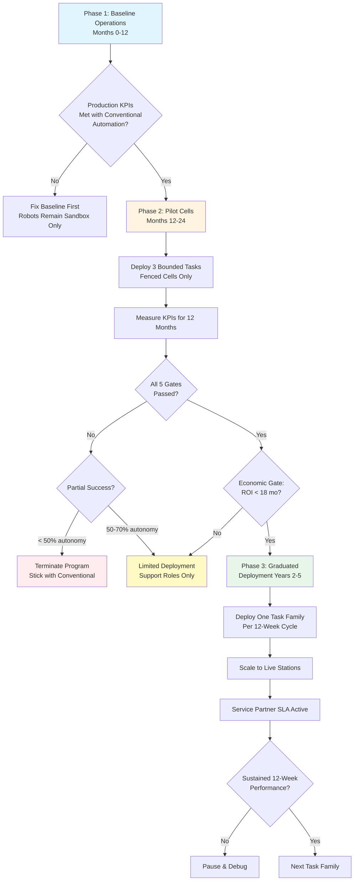

## 5.3 Humanoid KPI Gates (Not Production-Critical)

Humanoids enter as systematic experiments with rigorous performance gates, not production dependencies. The base plan achieves all throughput and cost targets using conventional automation only. Robot advancement follows a three-phase protocol with binary promotion criteria.

### Phase 1: Baseline Operations (Months 0-12)

**Philosophy:** Prove the factory works without robots. No humanoid capex in production budget.

| Element | Specification | Rationale |
|---------|--------------|-----------|
| **Scope** | Turnkey automation only (AMRs, fixed arms, vision systems) | Bankable technology; achieves < $0.24/W COGS target |
| **Humanoid Role** | Sandbox data gathering only; zero production tasks | Collect baseline: task cycle times, failure modes, ergonomics |
| **Production KPIs** | Alpha line reaches nameplate (1.5 GW/yr cell, 2 GW/yr module) | Conventional automation must succeed first |
| **Budget Allocation** | $0 humanoid capex in production; < $500K sandbox R&D | Robots earn their way in, not assumed |
| **Deliverables** | 720 hrs shadow-mode video; task taxonomy (Tier 1/2/3); baseline labor cost model | Phase 2 starts with data, not guesses |

**Success Criterion:** If baseline production fails to meet takt or cost targets, robots remain in sandbox indefinitely. Fix the conventional line first.

---

### Phase 2: Pilot Cells (Months 12-24)

**Philosophy:** Aggressive deployment in fenced, bounded tasks. Robots operate on live floor but isolated from critical path.

#### Three Bounded Tasks (Non-Production-Critical)

1. **Kitting & Light Replenishment**
   - Scope: Move small bins (< 20 lbs) from warehouse staging to line-side buffers
   - Cycle: 8-12 minutes per replenishment run
   - Fallback: Human technician can cover entire shift if robots fail

2. **Tool Changeovers (Consumable Replacement)**
   - Scope: Swap EL imaging cassettes, replace stringer wire spools, change potting nozzles
   - Cycle: 15-30 minute changeover tasks (currently 2nd-shift maintenance)
   - Fallback: Defer changeovers to scheduled maintenance windows

3. **Offline Visual Reinspection (Quality Sampling)**
   - Scope: Pull 1-in-500 modules from line; photograph 6 sides; upload to MES for human review
   - Cycle: 5 minute handling + imaging task
   - Fallback: Reduce sampling rate to 1-in-1000 (still exceeds IEC 61215 requirements)

**Key Design Principle:** All three tasks can be skipped or deferred for 4-8 hours without stopping production. Robots fail safely to human intervention.

#### Promotion Criteria: ALL Five Gates Must Pass

| KPI | Target | Measurement Method | Pass/Fail Threshold | Rationale (from Red-Teaming Docs) |
|-----|--------|-------------------|---------------------|----------------------------------|
| **Mean Time Between Failure (MTBF)** | > 1,000 hours | Continuous operation log across fleet; failure = any unplanned stop requiring human intervention | Binary gate: < 1,000 hrs = FAIL entire program | Figure AI achieved 500-800 hrs by month 18; 1,000 hrs is production-ready standard for industrial robots (ref: 22_Robotics_Acceleration, p.276) |
| **Task Success Rate** | ≥ 99.0% | Per-task completion tracking via MES; success = task completed within 2× baseline human time with zero quality defects | Binary gate: < 99.0% = extend Phase 2 for 6 months | Not 99.99% (unrealistic for early humanoids); 99.0% allows 1-in-100 failure rate, acceptable for non-critical tasks (ref: 22_Robotics_Acceleration, p.100-105) |
| **Software Reconfiguration Time** | < 5 minutes | Timed test: switch robot between 3 pre-defined task variants (e.g., kitting bin A vs. bin B vs. bin C) via OTA update or parameter change | Binary gate: ≥ 5 min = too rigid for dynamic factory | Validates fleet flexibility; prevents vendor lock-in to single-task robots (ref: 30_Autonomous_Acceleration, Appendix A) |
| **Safety Compliance** | 100% | ISO 10218-1/2 and ANSI/RIA R15.08 risk assessment signed off by third-party certifier (TÜV or UL) | Binary gate: No certification = cannot deploy to live floor | Legal/insurance requirement; non-negotiable (ref: 22_Robotics_Risks, Section 3.2) |
| **Cost per Task** | < $0.005/Watt-equivalent | Fully loaded cost: robot amortization (5-yr) + electricity + maintenance + supervision labor, divided by throughput-equivalent labor displacement | Economic gate: ≥ $0.005/W = ROI too long (> 18 months payback) | Target: $200K robot must save > $135K/year to justify; assumes displaces 1.5 FTEs @ $90K loaded cost (ref: 22_Robotics_Acceleration, p.112-130) |

**Measurement Period:** 12 consecutive months (Months 12-24). KPIs measured monthly; final gate evaluation at Month 24.

**Fleet Size:** 10-20 robots (not 50). Rationale: Large enough to discover fleet coordination issues; small enough to limit capital at risk if program fails. Reference: Tesla deployed 50 but had $4B cushion; Tavakiev uses conservative 10-20 for $1.6-4M exposure (ref: 22_Robotics_Acceleration, p.113-120).

#### Phase 2 Financial Structure

**Investment:**
- Robot hardware: $1.6-4.0M (10-20 units @ $80K-200K depending on vendor)
- Infrastructure: $600K (charging, networking, fencing, safety systems)
- Embedded vendor support: $800K (2 engineers × 12 months, co-funded with vendor)
- Integration labor: $960K (8 FTEs × 12 months @ $120K average)
- Shadow-mode simulation: $400K (cloud GPU training, months 6-12)
- Contingency (20%): $672K
- **Total Phase 2 Investment: $5.03M** (conservative midpoint)

**Offset Mechanisms:**
- §45X credits during Phase 2 period: $20-30M (covers entire robotics investment)
- Labor savings (graduated autonomy 50% → 70%): $400K-800K cumulative in months 18-24
- **Net Phase 2 Cost (after offsets): $4.2-4.6M**

**Conditional Buyback:** Negotiate with vendor (Figure/Tesla) to repurchase 50% of fleet at 40% residual value if Month 24 gates not met. Reduces downside to $2.5-3M.

---

### Financial Case for Promotion to Phase 3

**Requirement:** Economic gate must show < 18-month payback per deployed station.

**Calculation Example (Kitting Task):**

| Parameter | Value | Notes |
|-----------|-------|-------|
| **Humanoid cost** | $200,000 | Loaded cost including tooling, infrastructure allocation |
| **Annual operating cost** | $15,000 | Electricity ($3K), maintenance parts ($8K), supervision allocation ($4K) |
| **Fully loaded Year 1 cost** | $55,000 | $200K ÷ 5-yr amortization + $15K opex |
| **Labor displaced** | 1.5 FTEs | Kitting currently requires 3 FTEs across 3 shifts; 2 robots cover same scope |
| **Loaded labor cost** | $90,000/FTE | $65K wage + $25K burden (benefits, overhead) |
| **Annual savings per robot** | $135,000 | 1.5 FTE × $90K = $135K |
| **Year 1 ROI** | 145% | ($135K - $55K) ÷ $55K = 145% |
| **Payback period** | 17.8 months | $200K ÷ ($135K - $15K) = 1.67 years |

**Gate Status:** PASS (< 18-month target)

**Sensitivity:** If robot only displaces 1.0 FTE (not 1.5), payback extends to 26.7 months = FAIL gate. Proceed to limited deployment only (support roles, not scaled production).

---

### Phase 3: Graduated Deployment (Years 2-5)

**Trigger:** ALL Phase 2 gates passed (technical KPIs + economic gate). Board approval at Month 24 decision point.

**Deployment Protocol:**

1. **One Task Family at a Time**
   - Do NOT deploy all task types simultaneously
   - Sequence: Kitting (Months 24-30) → Tool changeovers (Months 30-36) → Inspection (Months 36-42)
   - Each task family requires 12-week sustained performance before next deployment

2. **12-Week Burn-In Per Task Family**
   - Operate 10-20 robots on new task for 12 consecutive weeks
   - Measure: MTBF, task success rate, unplanned stops
   - Gate: If MTBF drops below 800 hours or success rate < 97%, pause and debug before next task

3. **Service Partner SLA Requirement**
   - Vendor must provide on-site support SLA: 4-hour response time, 24-hour parts delivery
   - OR Tavakiev maintains $500K spare parts inventory (10% of fleet value)
   - Example: Tesla/Figure commits 1 resident engineer + quarterly on-site reviews (ref: 22_Robotics_Acceleration, p.220-235)

4. **Live Station Integration**
   - Graduate robots from fenced cells to integrated line positions
   - Install safety-rated sensors (light curtains, area scanners per ISO 13855)
   - Validate emergency stop integration with line PLC (< 200ms stop time)

**Phase 3 Decision Framework:**

| Scenario | Phase 2 Outcome | Phase 3 Action | Fleet Size Years 2-5 |
|----------|----------------|----------------|---------------------|
| **Full Success** | All 5 KPIs passed + ROI < 18 mo | Scale deployment across all Alpha stations; deploy at Peak Innovation Park (Giga 2) | 200-500 robots |
| **Partial Success** | KPIs passed but ROI = 18-24 mo | Limited deployment to support roles only; do not scale to critical path | 30-50 robots |
| **Technical Failure** | MTBF < 1,000 hrs OR success < 99% | Terminate program; sell robots to vendor or secondary market; reinvest in conventional automation | 0 robots (exit) |
| **Economic Failure** | Technical KPIs met but ROI > 24 mo | Sandbox for future cost reduction; revisit when robot prices drop 30-50% | 10 robots (R&D only) |

**Key Principle:** Production plan does NOT depend on Phase 3 succeeding. Alpha line operates at full nameplate with conventional automation regardless of humanoid outcome.

---

### Governance & Reporting

**Monthly KPI Dashboard (Months 12-24):**
- MTBF trending (fleet-wide and per-robot)
- Task success rate by task type (kitting, changeovers, inspection)
- Safety incidents log (near-misses, e-stops, injuries)
- Cost per task (updated with actual opex data)
- Software reconfiguration test results

**Quarterly Executive Review:**
- CAO presents to CEO + Board: progress vs. gates, risk register, Phase 3 readiness forecast
- Vendor partnership health: embedded engineer productivity, issue resolution time, hardware iteration velocity
- Go/no-go recommendation for Phase 3 (preliminary at Month 18, final at Month 24)

**Month 24 Decision Meeting:**
- Binary vote: Proceed to Phase 3 scaled deployment (200-500 robots) OR limit to support roles (30-50 robots) OR terminate program
- Requires: All 5 KPIs passed + economic gate passed + board approval for Phase 3 capex ($16-40M depending on fleet size)

---

### Risk Mitigation Summary

| Risk | Mitigation | Residual Impact |
|------|-----------|-----------------|
| **Robots underperform (MTBF < 1,000 hrs)** | Terminate at Month 24; conditional buyback recovers $800K-2M; §45X credits absorb loss | Net cost $2-3M; no production impact (conventional automation maintains nameplate) |
| **Economic case fails (ROI > 18 mo)** | Limit to support roles (30-50 robots); treat as R&D for future cost curve | Opportunity cost only; no stranded capex |
| **Safety incident (injury or major damage)** | Immediate pause; third-party investigation; resume only after corrective action + re-certification | 3-6 month delay; potential insurance premium increase; reputational risk |
| **Vendor fails to support (bankruptcy, pivots)** | Negotiate secondary support (e.g., Boston Dynamics acquires Figure assets) or open-source robot stack | Fleet becomes maintenance burden; likely force exit from program |
| **Organizational overload (team burnout)** | Hire 8-person team in Months 6-10 BEFORE robot deployment; embedded vendor engineers handle 50% of technical load | Low probability if staffing plan executed |

**Insurance Requirement:** $10M robotics liability coverage (ISO 10218 incidents); $2M property coverage (robot damage to facility). Estimated cost: $80-120K/year.

---

### Appendix Reference

For full three-phase roadmap including Phase 0 (pre-deployment shadow mode, months 6-12) and detailed task taxonomy (Tier 1/2/3 complexity levels), see:

- **Appendix A: Robotics Integration Roadmap** (lines 313-323 in FinalPlan.md, to be expanded per this section)
- **Red-Teaming Source:** `/offline/plan/red-teaming/30_Autonomous_Acceleration_Recommendations.md` (Appendix A, pages 406-500)
- **Red-Teaming Source:** `/offline/plan/red-teaming/22_Robotics_Acceleration_Recommendations.md` (full document, pages 1-858)

**Key Takeaway:** Humanoids are a calculated experiment with hard gates, not a production dependency. The factory succeeds with or without them. If they pass gates, we unlock 50-85% labor cost reduction in Years 3-5. If they fail gates, we operated a profitable 2 GW factory on conventional automation and invested $2-5M in strategic learning. Both outcomes are acceptable.
