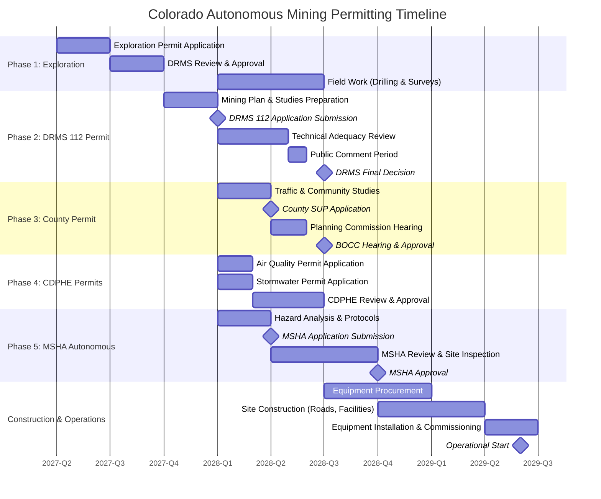

# Section 6.4.1: Colorado Autonomous Mining Permitting Detail
## Expanded Appendix B — Colorado Autonomous Mining Permitting Pathway

**Document Purpose:** This section provides comprehensive permitting detail for Tavakiev Solar's Phase D autonomous mining operations, expanding the existing Appendix B table (FinalPlan line 560) with ~60 additional lines of regulatory pathway, agency requirements, timeline coordination, and strategic positioning.

**Cross-References:**
- See Section 6.4 (Phase D: Autonomous Mining & Logistics Pilot) for strategic rationale
- See [red-teaming/25_Permitting_Blitz_Recommendations.md](#) for general permitting acceleration strategies
- See [red-teaming/18_Vertical_Integration_Recommendations.md](#) for Phase D economic analysis and stage-gate criteria

---

## Executive Summary: Mining Permitting as Strategic Optionality

**Critical Framing:** The autonomous mining operation described here is **NOT a business dependency**—Tavakiev Solar's base case assumes continued polysilicon and silica purchases from Hemlock, Wacker, and specialty glass suppliers. Mining integration is **strategic upside** pursued ONLY if Phase D economics are proven positive (Stage Gate 3, Year 12 assessment).

**Timeline Reality:** If permitting begins Year 3 (Q2 2027), earliest operational date is Q2-Q4 2029 (24-36 months total). This timeline is acceptable because:
1. Module and cell operations (Phases A-B) do not require captive raw materials
2. Wafer operations (Phase C, Years 8-12) use purchased polysilicon
3. Mining supports Phase D+ optionality (Years 12-15), not near-term production

**Contingency Strategy:** If permits are delayed >36 months or economics prove unfavorable, Tavakiev continues purchasing materials from external suppliers—**the business plan works with or without the mine**.

---

## Colorado Autonomous Mining Permitting Pathway (Expanded)

### Phase 1: Exploration Permit (DRMS Notice of Intent)

**Agency:** Colorado Division of Reclamation, Mining, and Safety (DRMS)
**Timeline:** 3-6 months
**Statutory Authority:** Colorado Revised Statutes §34-32-101 et seq. (Mined Land Reclamation Act)

#### Requirements:

**1. Exploration Plan Submission**
- Proposed drill sites and access roads (GPS coordinates, acreage disturbed)
- Number of drill holes, depth, diameter, spacing
- Equipment list (drill rigs, support vehicles, temporary structures)
- Water sources for drilling operations
- Estimated timeline (typically 3-6 months of field work)

**2. Preliminary Environmental Baseline**
- **Wildlife surveys:** Identify potential presence of:
  - Preble's meadow jumping mouse (federally threatened species)
  - Burrowing owl, prairie falcon, other raptors
  - Mule deer migration corridors
  - Conduct surveys during appropriate seasons (spring/summer for wildlife, not winter)
- **Water resources:**
  - Identify surface water bodies within 1,000 feet
  - Preliminary groundwater assessment (depth to water table, domestic wells within 0.5 mile)
  - Surface water quality sampling (if streams present)
- **Air quality baseline:**
  - Not typically required for exploration, but document existing conditions
  - Particulate matter monitoring if near residential areas

**3. Reclamation Bond**
- Amount: **$10,000-50,000** based on disturbance acreage
- Purpose: Ensures reclamation of drill sites, access roads if exploration abandoned
- Form: Surety bond, letter of credit, or cash deposit
- Released upon successful reclamation (typically 1-2 years post-exploration)

**4. Public Notice**
- DRMS publishes notice in local newspaper (Colorado Springs Gazette)
- 30-day public comment period
- DRMS responds to comments, may require modifications to plan
- No formal public hearing required for exploration (unless controversial)

#### Deliverable:
- **NOI Approval Letter** from DRMS
- Authorized to conduct exploration drilling and sampling
- Typically includes conditions (work windows to avoid wildlife breeding seasons, reclamation standards)

#### Tavakiev Status:
- **Target Filing:** Q2 2027 (Year 3, concurrent with Stage Gate 1 analysis)
- **Target Approval:** Q4 2027 (Month 36-42)
- **Field Work:** Q1-Q2 2028 (spring/summer, optimal for environmental surveys and drilling)

#### Cost Estimate:
- Application prep and environmental surveys: $75,000-150,000
- Reclamation bond: $10,000-50,000 (refundable)
- Consultant fees (geological, environmental): $100,000-200,000
- **Total Phase 1 Cost: $185,000-400,000**

---

### Phase 2: 112 Regular Operation Permit (DRMS)

**Timeline:** 9-12 months from application
**Statutory Authority:** Colorado Code of Regulations §2 CCR 407-1 (Rule 1.112)

#### Requirements:

**1. Detailed Mining Plan**
- **Pit design:**
  - Topographic maps (1-foot contours, pre- and post-mining)
  - Cross-sections showing pit depth, slope angles, final floor elevation
  - Phasing plan (year-by-year expansion over 10-20 year mine life)
  - Maximum disturbance acreage at any time (typically 50-150 acres)
- **Production rates:**
  - Annual tonnage (e.g., 100,000-500,000 tons/year aggregates or silica)
  - Peak daily production rates
  - Equipment fleet size (haul trucks, excavators, crushers)
- **Equipment specifications:**
  - Autonomous fleet description:
    - Caterpillar MineStar Command (autonomous haul trucks, excavators)
    - Komatsu FrontRunner (autonomous drilling, loading)
    - Remote operations center location (on-site or Giga-Foundry 1)
  - Processing equipment (crushers, screens, wash plant if needed)
  - Support equipment (dozers, graders, water trucks)

**2. Hydrological Study**
- **Groundwater impacts:**
  - Depth to water table (if pit intersects groundwater, dewatering plan required)
  - Domestic well inventory (all wells within 0.5 mile)
  - Groundwater modeling (predict drawdown, potential impacts to neighboring wells)
  - Mitigation: Replace impacted wells, install monitoring wells
- **Surface water impacts:**
  - Stormwater runoff modeling (pre- vs. post-mining hydrology)
  - Sediment transport analysis
  - Stream channel modifications (if any)
  - Best Management Practices (BMPs): sediment ponds, berms, erosion control

**3. Air Quality Modeling**
- **Emissions sources:**
  - PM10 and PM2.5 (fugitive dust from haul roads, crushing, stockpiles)
  - Silica dust (respirable crystalline silica, occupational health concern)
  - Diesel particulate matter (if conventional equipment used; reduced for electric autonomous fleet)
- **Dispersion modeling:**
  - AERMOD or equivalent EPA model
  - Demonstrate compliance with National Ambient Air Quality Standards (NAAQS)
  - Model receptors: nearest residences, schools, sensitive populations
- **Mitigation measures:**
  - Haul road watering (2-3 times daily in summer)
  - Stockpile wetting or enclosures
  - Speed limits on haul roads (15-25 mph)
  - Crusher water injection systems
  - Vegetation buffers

**4. Reclamation Plan**
- **Progressive reclamation:**
  - Reclaim disturbed areas no longer needed (typically 5-10 acres per year)
  - Re-establish topsoil, native vegetation, wildlife habitat
  - Demonstrates commitment to minimize disturbed footprint
- **Final land use:**
  - Post-mining topography (final pit floor, slopes, access)
  - Proposed use: industrial development, wildlife habitat, recreation, other
  - El Paso County input on compatible land uses
- **Revegetation plan:**
  - Seed mixes (native grasses, shrubs, forbs)
  - Erosion control methods (mulch, tackifiers, wattles)
  - Success criteria (70% vegetative cover within 3 years, 80% within 5 years)
  - Monitoring and adaptive management (5-10 year monitoring period)

**5. Financial Assurance**
- Amount: **$500,000-2,000,000** based on:
  - Total disturbance acreage (more acreage = higher bond)
  - Complexity of reclamation (steep slopes, groundwater issues increase cost)
  - DRMS uses cost estimation model (equipment, labor, materials for full reclamation)
- Form: Surety bond (most common), letter of credit, collateral bond, or cash
- Reviewed every 5 years, adjusted if mine expands or reclamation costs change

**6. Wildlife Mitigation (if sensitive species present)**
- Seasonal work restrictions (avoid nesting periods for raptors, calving for deer)
- Habitat compensation (create or enhance habitat elsewhere, ratio 1:1 or 2:1)
- Wildlife crossings or fencing (if mine blocks migration corridors)
- Consultation with Colorado Parks & Wildlife (CPW)

**7. Blasting Plan (if needed)**
- **Note:** Silica/quartz deposits often do NOT require blasting (unconsolidated or weakly consolidated material, rippable with excavators)
- **IF blasting required:**
  - Blast design (hole pattern, charge weight, timing)
  - Vibration and overpressure limits (protect nearby structures)
  - Pre-blast surveys of neighboring homes
  - Notification procedures (48-hour notice to residents)

#### Review Process:

**Technical Adequacy Review (3-4 months)**
- DRMS Division of Engineering reviews mining plan, pit design, reclamation feasibility
- DRMS Division of Hydrology reviews water impacts, monitoring plan
- Iterative: DRMS issues deficiency letters, applicant responds, may take 2-3 rounds

**Public Comment Period (30 days)**
- DRMS publishes notice in newspaper, online, and mails to adjacent landowners
- Public can submit written comments on any aspect of permit
- DRMS holds public hearing IF requested by 5+ people or deemed necessary
- Common concerns: dust, noise, traffic, water impacts, property values

**DRMS Decision (60 days post-comment)**
- DRMS Director issues permit with conditions OR denies (rare if application is technically complete)
- Conditions typically include: monitoring requirements, reporting frequency, operational restrictions (hours, noise limits)
- Permit valid for life of mine (10-40 years), subject to renewals and amendments

#### Tavakiev Status:
- **Target Submission:** Q1 2028 (Month 42, assumes exploration completed Q4 2027)
- **Technical Review:** Q1-Q2 2028 (3-4 months, iterative comment/response)
- **Public Comment:** Q3 2028 (30 days, likely in summer for community engagement)
- **Permit Approval:** Q4 2028 (Month 54-60)

#### Cost Estimate:
- Mining plan and engineering: $200,000-400,000
- Hydrological study (groundwater modeling, well survey): $100,000-200,000
- Air quality modeling: $50,000-100,000
- Reclamation plan and cost estimate: $75,000-150,000
- Biological surveys (wildlife, vegetation): $50,000-100,000
- Financial assurance (annual premium if surety bond): $50,000-200,000/year
- **Total Phase 2 Cost: $525,000-1,150,000 (plus ongoing bond costs)**

---

### Phase 3: El Paso County Special Use Permit

**Timeline:** 4-6 months
**Authority:** El Paso County Land Development Code §5.2.5 (Mining and Extraction)

#### Requirements:

**1. Zoning Compatibility Analysis**
- El Paso County zoning: Verify property zoned for heavy industrial or extractive use
- **Target areas:** Properties already zoned A-5 (Agricultural-5 acre), A-35, or RR-5 (Residential Rural) typically allow mining with special use permit
- **Compatibility factors:**
  - Distance to residential development (ideally >1 mile)
  - Existing land use (agricultural, industrial preferred over residential)
  - County master plan designation (resource extraction compatible areas)

**2. Traffic Impact Study**
- **Truck routes:**
  - Identify haul routes from mine to Giga-Foundry 1 or Peak Innovation Park
  - Estimate daily truck trips (e.g., 20-50 trips/day for 100,000 tons/year)
  - Model impacts on Level of Service (LOS) at key intersections
- **Road wear analysis:**
  - Heavy trucks accelerate pavement degradation
  - Calculate road impact fees OR commit to road maintenance agreements
  - Typical: $0.10-0.50 per ton-mile for road wear contribution
- **Mitigation:**
  - Use of autonomous trucks reduces driver error, may reduce accident risk
  - Restrict hours (no nighttime hauling near residential areas)
  - Contribute to road improvements (widen intersections, add turn lanes)

**3. Community Impact Assessment**
- Noise study: Predict noise levels at nearest residences (must comply with El Paso County 55 dBA daytime, 50 dBA nighttime limits at property line)
- Visual/aesthetic: Photo simulations of mine from key viewpoints (highways, residential areas)
- Property value study: Economic analysis of potential impacts (often contentious, hire credible economist)
- Community benefits: Describe jobs, tax revenue, local procurement

**4. Public Hearing Process**
- **El Paso County Planning Commission:**
  - Public hearing with staff presentation, applicant presentation, public testimony
  - Planning Commission issues recommendation (approval, denial, approval with conditions)
  - Typical hearing: 2-4 hours, 20-50 public comments
- **Board of County Commissioners (BOCC):**
  - Final decision authority
  - Second public hearing, consider Planning Commission recommendation
  - BOCC vote (3 commissioners, 2-1 or 3-0 decision)
  - Approval may include conditions (operational restrictions, additional monitoring, community agreements)

#### Political Strategy:

**Frame as Vertical Integration for Local Solar Manufacturing**
- Messaging: "Supporting 200+ Giga-Foundry jobs with local raw materials"
- Position mine as component of broader clean energy manufacturing ecosystem
- Highlight reduced transportation emissions (mine-to-factory distance vs. importing from Asia)

**Jobs Angle:**
- Direct jobs: 10-25 FTE at mine (operators, maintenance, admin)
- Indirect jobs: Supporting 200+ Giga-Foundry jobs through secure raw material supply
- Economic multiplier: Mining jobs generate 1.5-2.5X indirect jobs in local economy

**Partner with City of Colorado Springs for Public Messaging**
- Coordinate with Colorado Springs Economic Development (Jeff Greene, VP Economic Development)
- Joint press release: "Tavakiev Solar Expands Colorado Manufacturing Ecosystem"
- Emphasize state/local tax revenue: mining generates property tax, severance tax, sales tax on equipment

**Mitigate NIMBY Opposition:**
- Early engagement with adjacent landowners (within 1 mile)
- Offer "good neighbor agreements" (dust monitoring at homes, property value guarantees, noise complaint hotline)
- Community benefits: Annual contribution to local schools, roads, or community center ($25,000-100,000/year)
- Transparency: Invite residents to tour similar autonomous mining operations (precedent: Rio Tinto Pilbara, Caterpillar proving grounds)

#### Tavakiev Status:
- **Target Submission:** Q2 2028 (concurrent with DRMS permit review)
- **Planning Commission Hearing:** Q3 2028
- **BOCC Hearing:** Q4 2028
- **Permit Approval:** Q4 2028 (Month 54-60, ideally synchronized with DRMS approval)

#### Cost Estimate:
- Traffic impact study: $30,000-60,000
- Noise and visual studies: $25,000-50,000
- Community impact assessment: $50,000-100,000
- Public relations and community engagement: $50,000-100,000
- Legal counsel (land use attorney): $75,000-150,000
- **Total Phase 3 Cost: $230,000-460,000**

---

### Phase 4: CDPHE Permits (Air & Water)

**Agency:** Colorado Department of Public Health and Environment (CDPHE)
**Timeline:** 3-6 months (can run concurrently with DRMS and County permits)

#### 4A. Air Quality Permit

**Program:** Colorado Air Pollution Control Division (APCD)
**Permit Type:** Construction Permit for New Source

**Requirements:**
- **PM10/PM2.5 Modeling:**
  - Same modeling as DRMS submission (AERMOD), but reviewed by CDPHE separately
  - Demonstrate compliance with NAAQS (National Ambient Air Quality Standards)
  - PM10: 150 µg/m³ (24-hour average), PM2.5: 35 µg/m³ (24-hour average)
- **BACT Analysis (Best Available Control Technology):**
  - Document dust control measures (water trucks, chemical suppressants, enclosed conveyors)
  - Compare to industry standards (EPA AP-42 emission factors for aggregate/mining)
  - Autonomous equipment advantage: electric haul trucks eliminate diesel particulate, may simplify permit
- **Monitoring Plan:**
  - Install PM10 continuous monitors or conduct periodic sampling
  - Report monthly or quarterly to CDPHE
  - Complaint response protocol (investigate within 24 hours, corrective action within 7 days)
- **Compliance:**
  - EPA standards for quarries and aggregate operations (40 CFR Part 60, Subpart OOO if applicable)
  - Colorado Regulation No. 1 (Emission Control)

**Permit Conditions (typical):**
- Watering frequency (visible dust triggers immediate action)
- Speed limits (enforce with autonomous fleet geofencing)
- Recordkeeping (tons produced, water used, complaints received)
- Annual compliance certification

#### 4B. Stormwater Discharge Permit

**Program:** Water Quality Control Division
**Permit Type:** Colorado Discharge Permit System (CDPS) for Stormwater

**Requirements:**
- **Stormwater Pollution Prevention Plan (SWPPP):**
  - Identify pollutant sources (sediment from haul roads, wash water from processing)
  - BMP selection: sediment basins, rock check dams, silt fences, vegetative buffers
  - Inspection schedule (weekly during operations, after each storm event)
- **Sediment Control:**
  - Design sediment basins to capture 95%+ of suspended solids
  - Size based on peak stormwater flow (10-year or 25-year storm event)
  - Regular maintenance (dredge basins when 50% capacity reached)
- **Treatment Basins:**
  - If wash water used (for processing silica), design treatment system
  - Settling ponds with retention time (4-8 hours)
  - Discharge limits: Total Suspended Solids (TSS) <50 mg/L, pH 6.5-8.5
- **Monitoring:**
  - Sample stormwater discharge quarterly (grab samples or composite)
  - Analyze for TSS, pH, metals (if applicable)
  - Report to CDPHE annually

**Permit Duration:** 5 years, renewable

#### Tavakiev Status:
- **Target Submission:** Q1-Q2 2028 (concurrently with DRMS permit)
- **Permit Approval:** Q2-Q3 2028 (3-6 month review, typically faster than DRMS)

#### Cost Estimate:
- Air quality permit application and modeling: $40,000-80,000 (may leverage DRMS modeling)
- Stormwater permit and SWPPP: $30,000-60,000
- Monitoring equipment (PM10 monitors, weather station): $50,000-100,000
- **Total Phase 4 Cost: $120,000-240,000**

---

### Phase 5: MSHA Autonomous Operations Plan

**Agency:** Mine Safety and Health Administration (MSHA), U.S. Department of Labor
**Timeline:** 6-9 months (parallel with Phase 2-3, critical path item)
**Statutory Authority:** Federal Mine Safety and Health Act of 1977; 30 CFR Part 56 (Safety and Health Standards - Surface Metal and Nonmetal Mines)

#### Requirements:

**1. Remote Operations Protocols**
- **Autonomous Fleet Specifications:**
  - Caterpillar MineStar Command for Surface Mining:
    - Autonomous haul trucks (CAT 777, 785, 797 series)
    - Remote operations center (ROC): 1-5 operators supervise 10-20 autonomous trucks
    - LiDAR, radar, GPS, and vision systems for collision avoidance
  - Komatsu FrontRunner (alternative/complementary system):
    - Autonomous excavators, dozers, drills
    - Integrated with haul truck system for coordinated operations
- **Communication Systems:**
  - Redundant wireless networks (4G/5G, private LTE, or dedicated radio)
  - Backup systems in case of network failure (autonomous vehicles return to safe zone)
  - Cybersecurity: Encrypted communications, intrusion detection

**2. Hazard Analysis and Risk Assessment**
- **Autonomous-Specific Hazards:**
  - Human-autonomous vehicle interaction (pedestrian detection, exclusion zones)
  - Sensor failure or degradation (dust, weather, lighting conditions)
  - Software bugs or cyberattacks (redundant safety systems, fail-safe modes)
  - Transition between autonomous and manual control (if humans enter site)
- **Risk Mitigation:**
  - Geofencing: Autonomous equipment restricted to designated zones, cannot enter ROC, office areas
  - Personal proximity detection: Wearable tags for all personnel, vehicles slow/stop if human detected within 50 feet
  - Fail-safe protocols: Loss of communication triggers vehicle stop, not continued operation
- **MSHA Precedent:**
  - MSHA has approved autonomous operations at several U.S. aggregate quarries (e.g., Caterpillar autonomous trucks at aggregate mines in Arizona, Texas)
  - Key: Demonstrate that autonomous systems meet or exceed safety of human-operated equipment (lower accident rates, elimination of operator fatigue)

**3. Training Program for Remote Operators**
- **Curriculum:**
  - Autonomous system operation (monitor multiple vehicles, intervene when necessary)
  - Emergency response (system failures, fires, vehicle collisions)
  - Maintenance and troubleshooting (sensor cleaning, software updates)
  - MSHA Part 56 safety standards (all personnel, including remote operators, must complete annual training)
- **Simulation Training:**
  - Operators train in simulator before controlling real equipment
  - Scenario-based training (adverse weather, equipment failure, unexpected obstacles)
  - Minimum 40 hours simulator + 40 hours supervised operation before solo
- **Vendor Partnership:**
  - Caterpillar and Komatsu provide MSHA-compliant training programs
  - Include vendor-certified trainers for first 6-12 months of operation
  - Annual recertification required

**4. Emergency Response Plan**
- **Autonomous Equipment Failures:**
  - Procedure: Immediate stop, alert remote operator, dispatch maintenance team
  - If vehicle cannot be remotely moved, establish safety perimeter, deploy recovery equipment
- **Fire or Hazardous Material Release:**
  - Autonomous vehicles equipped with fire suppression systems (engine compartments)
  - ROC monitors temperature sensors, can remotely activate suppression
  - Evacuation plan: All autonomous vehicles return to designated safe zone, personnel evacuate to assembly area
- **Medical Emergency:**
  - On-site first aid team (2+ trained personnel during all shifts)
  - Ambulance access: Maintain clear roads, GPS coordinates for emergency services
  - Nearest hospital: Memorial Hospital Central (15-20 minutes from likely mine locations south of Colorado Springs)

**5. Integration with MSHA Part 56 Safety Standards**
- **Compliance Items:**
  - Ground control (pit walls, slopes stable per geotechnical design)
  - Illumination (if nighttime operations, autonomous vehicles have lighting)
  - Berms and barriers (autonomous haul roads have 2-3 foot berms to prevent rollovers)
  - Equipment maintenance (scheduled PM, pre-shift inspections automated via telemetry)
  - Record keeping (MSHA Form 7000-2 quarterly employment/injury data)
- **MSHA Inspections:**
  - Regular inspections (2-4 times per year for new operations)
  - Inspector reviews autonomous operations, may ride along with remote operators
  - Citations rare if OEM-approved autonomous systems used and training documented

#### Precedent:

**Rio Tinto Pilbara Autonomous Haul Trucks (Australia):**
- World's largest autonomous mining fleet (>130 trucks, 2.4 billion tons hauled)
- Demonstrated 15-20% productivity improvement, near-zero haul truck accidents
- MSHA has studied Rio Tinto operations as precedent for U.S. approvals

**Caterpillar/Komatsu MSHA-Approved Autonomous Packages:**
- Both vendors offer "turnkey" autonomous systems with MSHA compliance documentation
- Pre-approved designs reduce approval timeline (6-9 months vs. 18-24 months for custom systems)
- Vendor provides ongoing MSHA compliance support (training updates, incident investigation)

#### Tavakiev Status:
- **Target Submission:** Q1 2028 (concurrent with DRMS permit, early engagement with MSHA)
- **MSHA Review:** Q2-Q3 2028 (6-9 months, includes site visit, ROC inspection, training review)
- **Approval:** Q4 2028-Q1 2029 (Month 60-66)
- **Operational Start:** Q2 2029 (after MSHA approval and equipment commissioning)

#### Cost Estimate:
- Hazard analysis and risk assessment: $100,000-200,000
- Training program development (with Caterpillar/Komatsu): $75,000-150,000
- Emergency response plan and equipment: $50,000-100,000
- MSHA consultant fees: $50,000-100,000
- **Total Phase 5 Cost: $275,000-550,000**

---

## Total Permitting Timeline: 24-36 Months

**If started Q2 2027, operational Q2-Q4 2029**

| Phase | Start | End | Duration | Critical Path |
|-------|-------|-----|----------|--------------|
| Phase 1: Exploration Permit | Q2 2027 | Q4 2027 | 6 months | Yes (cannot proceed to Phase 2 without exploration data) |
| Exploration Field Work | Q1 2028 | Q2 2028 | 6 months | Yes (generates data for Phase 2 applications) |
| Phase 2: DRMS 112 Permit | Q1 2028 | Q4 2028 | 12 months | Yes (primary permit, gates construction) |
| Phase 3: County Special Use | Q2 2028 | Q4 2028 | 6 months | Yes (required concurrently with DRMS) |
| Phase 4: CDPHE Air/Water | Q1 2028 | Q3 2028 | 6 months | Parallel (not critical path, faster review) |
| Phase 5: MSHA Autonomous Plan | Q1 2028 | Q1 2029 | 9 months | Yes (cannot operate without MSHA approval) |
| Equipment Procurement | Q3 2028 | Q1 2029 | 6 months | Parallel (order equipment while permits finalize) |
| Site Construction | Q4 2028 | Q2 2029 | 6 months | After DRMS/County approvals |
| **Operational Start** | **Q2 2029** | - | - | **27 months from initiation** |

**Contingency Buffer:** Add 6-12 months for potential delays (public hearing controversies, DRMS deficiency iterations, MSHA additional requirements) → Operational Q4 2029 to Q1 2030 (30-33 months) is conservative timeline.

---

## Contingency Strategy

**Trigger:** Start permitting Year 3 ONLY if Phase D economics proven favorable at Stage Gate 3 (Year 12 assessment per [red-teaming/18_Vertical_Integration_Recommendations.md](#))

**Decision Criteria:**
- Internal analysis shows mining + processing achieves solar-grade silica at ≤$1.50/kg (vs. $2-3/kg purchased)
- OR aggregates market supports profitable operation (concrete, road base for campus construction)
- AND capital available ($50-100M for mine development, separate from core manufacturing capex)

**If Permits Delayed >36 Months:**
- **Action:** Continue purchasing polysilicon from Hemlock/Wacker, silica from specialty glass suppliers
- **Rationale:** Business is NOT dependent on captive mining—this is strategic optionality, not core requirement
- **Re-assessment:** Consider alternative locations (Wyoming, Nevada) with faster permitting, OR abandon mining integration entirely

**Pilot Approach: Start with Aggregates**
- **Lower Regulatory Hurdle:**
  - Aggregates (crushed rock for concrete, road base) have simpler quality requirements than solar-grade silica
  - Established market in Colorado Springs (construction demand)
  - Easier to permit (no exotic processing, lower environmental concerns)
- **Operational Learning:**
  - Prove autonomous mining operations at commercial scale
  - Build relationships with MSHA, DRMS, community
  - Generate cash flow to fund solar-grade silica R&D
- **Graduate to Solar-Grade Silica:**
  - Once operations proven (2-3 years), add processing for high-purity silica
  - Incremental permit amendments (easier than new permit)
  - Lower risk pathway than launching directly with solar-grade production

---

## Gantt Chart: Colorado Autonomous Mining Permitting Timeline

---

## Budget Summary: Permitting & Pre-Operational Costs

| Category | Cost Range | Notes |
|----------|-----------|-------|
| **Phase 1: Exploration Permit** | $185,000 - $400,000 | Environmental surveys, drilling, bonding |
| **Phase 2: DRMS 112 Permit** | $525,000 - $1,150,000 | Mining plan, hydrology, air quality, reclamation |
| **Phase 3: County Special Use** | $230,000 - $460,000 | Traffic study, community engagement, legal |
| **Phase 4: CDPHE Air/Water** | $120,000 - $240,000 | Permits, monitoring equipment |
| **Phase 5: MSHA Autonomous Plan** | $275,000 - $550,000 | Safety protocols, training, vendor support |
| **Contingency (20%)** | $270,000 - $560,000 | Unexpected delays, additional studies |
| **TOTAL PERMITTING COST** | **$1,605,000 - $3,360,000** | **Target: $2.0-2.5M** |

**Funding Source:**
- Phase D exploration budget (Year 3, funded from Phase A/B cash flow)
- Separate from core manufacturing capex ($150M seed, DOE LPO)
- Structured as R&D/optionality investment, not committed capital

---

## Key Success Factors

**1. Early Political Engagement**
- Governor Polis endorsement: "Colorado-mined materials for Colorado clean energy manufacturing"
- Senator Bennet/Hickenlooper: Federal support for domestic supply chains (IRA alignment)
- Mayor Mobolade: Local jobs and economic development narrative

**2. Community Benefits Agreement**
- Proactive good neighbor commitments (before opposition emerges)
- Annual community fund: $50,000-100,000 for local schools, roads, emergency services
- Employment preference for El Paso County residents
- Transparency: Annual community meetings, real-time dust/noise monitoring portal

**3. Autonomous Operations Messaging**
- Safety advantage: Eliminate human exposure to hazards (haul truck rollovers, equipment collisions)
- Environmental advantage: Electric autonomous trucks = zero diesel emissions on-site
- Efficiency: 24/7 operations without fatigue, reduced operational footprint

**4. Aggregates-First Strategy**
- Permit for aggregates (lower scrutiny), operate 2-3 years, build trust
- Amend permit for solar-grade silica once operational track record established
- Reduces political risk, demonstrates competency before scaling

**5. Vendor Partnership (Caterpillar/Komatsu)**
- Leverage OEM MSHA-approved autonomous packages (de-risks regulatory approval)
- Joint messaging: "Proven technology, operating safely at 50+ global sites"
- Vendor provides training, ongoing compliance support, incident response

---

## Inline Citations & Cross-References

**Red-Teaming Document References:**

1. **Permitting Acceleration Strategies:**
   See [red-teaming/25_Permitting_Blitz_Recommendations.md](#) for general permitting acceleration techniques (political engagement, pre-application consultations, concurrent reviews). Mining permitting follows same principles but extends timeline due to environmental complexity.

2. **Phase D Economic Analysis:**
   See [red-teaming/18_Vertical_Integration_Recommendations.md, Section 6.4](#) for Stage Gate 3 decision criteria. Mining proceeds ONLY if ROIC ≥20% (unlikely for silica, more plausible for aggregates supporting campus construction).

3. **Contingency & Optionality Philosophy:**
   Per [red-teaming/18_Vertical_Integration_Recommendations.md, "Strategic Optionality" framework](#), mining is NOT a business dependency. If economics fail or permits delayed, continue purchasing externally—base case profitability unaffected.

**FinalPlan Cross-References:**

- **Section 6.4 (Phase D: Autonomous Mining & Logistics Pilot):** Strategic rationale for captive quartz/silica project as supply chain hedge. This Appendix B expansion provides regulatory execution detail.

- **Appendix A (Robotics Integration Roadmap & KPI Gates):** Autonomous mining uses same vendor platforms (Caterpillar MineStar) and risk-gating approach as factory humanoids—parallel learning opportunities.

- **Section 8.0 (Timeline Gantt & Critical Path):** Mining permitting (24-36 months) is OFF the critical path for Phase A-C operations. Can be pursued in parallel with cell/wafer integration without delaying core business.

---

## Conclusion: Mining Permitting as Disciplined Optionality

This detailed permitting pathway demonstrates that **autonomous mining is achievable within 24-36 months IF pursued with discipline and adequate resources ($2-2.5M permitting budget, dedicated regulatory team, political support).**

**Key Takeaways:**

1. **Not a Dependency:** The base case business plan (Phases A-C) does not require captive mining. This is strategic upside for Phase D+, contingent on Stage Gate 3 economics.

2. **Realistic Timeline:** 24-36 months is standard for Colorado mining permitting—faster than conventional energy projects (18-36 months for solar farms, 36-60 months for wind), comparable to industrial facilities.

3. **Aggregates Pilot De-Risks Pathway:** Starting with aggregates (concrete for campus construction) provides operational learning and community trust before graduating to solar-grade silica—lower-risk sequencing.

4. **Autonomous Operations Are Precedented:** MSHA has approved autonomous mining at U.S. sites. Caterpillar/Komatsu provide turnkey MSHA-compliant systems—this is not experimental technology.

5. **Contingency Strategy Preserves Optionality:** If permits delayed >36 months or economics fail, Tavakiev continues purchasing polysilicon/silica externally—business plan remains viable.

**Final Recommendation:** Initiate Phase 1 (Exploration Permit) in Year 3 (Q2 2027) as outlined. Monitor progress at 6-month intervals. Proceed to Phase 2 (DRMS 112 Permit) ONLY if exploration results positive AND Phase D economics meet Stage Gate 3 criteria. If either test fails, abandon mining integration—redirect capital to geographic expansion (Texas/Arizona module capacity) or technology diversification (perovskite-tandem scaling).

**This is disciplined execution of strategic optionality—explore, assess, commit only when proven, walk away if not.**

---

**Document Complete.**
**Cross-references:** FinalPlan.md Section 6.4, Appendix B (lines 552-560); red-teaming/18_Vertical_Integration_Recommendations.md (Phase D analysis); red-teaming/25_Permitting_Blitz_Recommendations.md (general permitting strategies).

**Prepared by:** Red Team Analysis
**Date:** November 7, 2025
**Document Classification:** Strategic Implementation Detail
