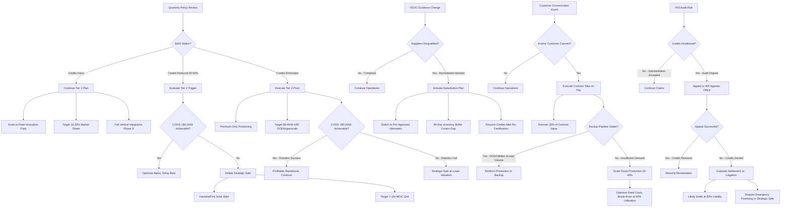

# 7.4 Policy Sensitivity Analysis & Strategic Decision Framework

## Executive Summary

Tavakiev Solar's financial model is deliberately designed to operate across three distinct policy environments: optimistic (full IRA credits), realistic (reduced credits), and adverse (no credits). This section provides the operational framework for monitoring policy risk, making quarterly go/no-go decisions, and executing strategic pivots when triggered.

**Core Philosophy (Principle #7: Policy Not Strategy):** "Build a business that works without subsidies. Use subsidies to go faster." Policy compliance is weapon, not weight. Policy changes are expected, not catastrophic.

**Bottom Line:** We plan for the worst, execute for the best, and have options at every decision point.

---

## 7.4.1 Quarterly Go/No-Go Decision Gates

Strategic decision points tied to policy triggers, with pre-defined actions and capital exposure clearly identified. Each gate has specific threshold conditions and predetermined responses.

### Decision Gate Matrix

| Quarter | Policy Trigger | Condition Threshold | Action if Triggered | Capital at Risk | Decision Authority |
|---------|---------------|-------------------|-------------------|-----------------|-------------------|
| **Q4 2025** | FEOC audit fails on Meyer Burger equipment | >20% Chinese components in HJT cell line | Abort Babacomari acquisition, order new European TOPCon line from Enel 3SUN, accept 6-month delay | $2M deposit lost + $6M delay cost | CEO (unilateral) |
| **Q1 2026** | §45X reduction proposed in Congressional budget | >30% credit cut proposed in Ways & Means markup | Pause Series A raise, accelerate Alpha ramp to lock in Year 1-2 credits, activate SEIA lobbying | $0 (defensive posture) | CEO + Board consultation |
| **Q2 2026** | Credit monetization rate falls below market | Transfer market rate drops <85 cents/$1 | Renegotiate forward contract, consider direct-pay election, increase revolver facility | $10-15M NPV loss on Year 1 credits | CFO decision, CEO informed |
| **Q3 2026** | Treasury issues restrictive FEOC guidance | New guidance retroactively disqualifies current suppliers | Activate supplier substitution plan from FEOC Compliance Matrix, switch to pre-approved alternates | $3-5M expedited procurement + 60-day inventory buffer cost | COO executes, CFO validates credit impact |
| **Q4 2026** | Alpha site COGS >$0.26/W at 1 GW run-rate | Cannot achieve Base Case economics after 12 months at scale | Initiate strategic sale process (Hanwha, First Solar) vs. funding Peak Innovation Park expansion | $150M+ Beta site investment at risk | CEO + Board approval |
| **Q1 2027** | First Solar achieves <$0.20/W COGS | Competitive cost advantage erodes faster than projected | Accelerate robotics deployment (labor cost reduction), expedite Phase C cell integration (capture $0.04/W credit) | $20-30M accelerated automation capex | CEO decision, Board consulted |
| **Q2 2027** | §45X reduced >30% in legislation | Actual credit cut passed and signed into law | **Trigger Tier 2 response:** Halt Beta expansion, optimize Alpha to 99% OEE, initiate M&A discussions with Hanwha/First Solar | $1B+ Peak Innovation Park capex avoided | CEO + Board approval (30-60 days) |
| **Q4 2027** | DOE LPO conditional commitment rejected | Application denied or terms unacceptable (>7% interest) | Pursue commercial project finance (7-9% rates), reduce Phase 2 scale (1 GW vs. 4 GW), extend timeline | $500M LPO financing unavailable, higher debt service cost | CEO + Board approval |
| **Q2 2028** | Hyperscaler anchor customer cancels | Microsoft/Google/Meta terminates offtake contract | Execute contract take-or-pay provisions (30% penalty), activate backup customer pipeline (DOD, utilities), reduce production 20% | $50-100M revenue gap, contract penalties provide 30% recovery | CRO executes contract, CEO approves production cuts |
| **Q4 2028** | Base Case not achieved after 18 months at full scale | COGS >$0.22/W at 2.4 GW after optimization period | **Strategic decision:** Sell assets to First Solar/Hanwha vs. continue scaling with reduced margins | $450M invested capital at risk | CEO + Board approval (60-90 days) |
| **Q2 2030** | §45X survives through phase-down + Base Case achieved | All targets met: COGS <$0.22/W, credits monetizing at 90%+, 2+ anchor customers secured | **Proceed with Peak Innovation Park:** Target 10-20% market share, raise $500M-$1B for 4-8 GW expansion, DOE LPO if available | Full scale-up authorized, $1B+ capex | CEO + Board approval |

### Gate Review Process

**Quarterly Cadence:**
- **Week 1 of Quarter:** CFO + VP Policy compile trigger status report (all metrics updated)
- **Week 2:** Executive team reviews report, identifies any triggers approaching threshold
- **Week 3:** If trigger imminent, convene emergency Board call; otherwise, proceed with normal operations
- **Week 4:** Document gate review in Board minutes, update contingency plans if needed

**Emergency Gates (Unscheduled):**
- Major Treasury/IRS guidance releases: 7-day review cycle
- Legislative action (bill passage, reconciliation): 14-day review cycle
- Catastrophic supplier/customer events: 48-hour review cycle

---

## 7.4.2 Policy Monitoring Watchlist

Permanent surveillance infrastructure to detect policy risks before they become crises. All monitoring integrated into real-time dashboard (built on DATA AI kernel, see Section 7.4.5).

### Leading Indicators & Data Sources

| Risk Category | Leading Indicators | Data Sources | Review Frequency | Owner | Alert Threshold |
|--------------|-------------------|--------------|------------------|-------|----------------|
| **Legislative Risk** | Ways & Means Committee bill markups Senate Finance hearings Budget reconciliation proposals Appropriations riders | Congress.gov SEIA legislative alerts Brownstein Hyatt weekly briefs House/Senate committee websites | **Weekly** (active session) Monthly (recess) | VP Policy + Brownstein Hyatt | §45X amendment language appears in markup → 24-hour escalation to CEO |
| **Regulatory Risk** | Treasury FEOC guidance updates IRS §45X FAQ releases DOE LPO program notices Federal Register proposed rules | Federal Register daily digest IRS.gov notices Treasury.gov DOE LPO website | **Bi-weekly** (structured review) Real-time (alerts) | CFO + Wiley Rein | New FEOC threshold or safe harbor change → 48-hour legal analysis |
| **Credit Market Risk** | Tax equity pricing (Citi/Credit Suisse quotes) §45X transfer market rates First Solar/Qcells monetization announcements Direct pay processing times | Private placement memos Crux Climate reports Norton Rose tax equity survey Industry earnings calls | **Monthly** | CFO + tax equity advisor | Transfer rate drops <88% → Immediate renegotiation of forward contracts |
| **Competitive Risk** | Competitor FEOC violations First Solar cost roadmap updates Chinese panel pricing trends New domestic manufacturing announcements | SEIA member briefings Industry earnings calls Bloomberg supply chain data Trade press (PV Magazine, Solar Power World) | **Monthly** | VP Supply Chain + CRO | First Solar announces <$0.18/W COGS → Accelerate cost reduction initiatives |
| **Geopolitical Risk** | China tariff proposals (Section 301) Trade restrictions (Entity List additions) Critical minerals policy (DPA invocations) Russia/Iran sanctions impacting supply | USTR notices Commerce Dept Entity List White House statements State Dept cables (via Brownstein) | **Quarterly** (formal review) Event-driven (crisis) | CEO + Advisory Board | New country added to FEOC list → 7-day supplier re-certification sprint |
| **Enforcement Risk** | IRS audit announcements (§45X claims) Treasury investigation reports Competitor credit disallowances DOE LPO clawback cases | IRS enforcement statistics Treasury IG reports FOIA requests (via SEIA) Trade press | **Quarterly** | General Counsel + Wiley Rein | First §45X audit disallowance published → Immediate internal compliance review |
| **State/Local Risk** | Colorado OEDIT program changes El Paso County property tax policy City of Colorado Springs economic development budget Colorado CAZ program reauthorization | Colorado General Assembly tracking County Commissioner meetings OEDIT program notices Local government liaison (Perry Sanders) | **Quarterly** | CFO + Perry Sanders | Enterprise Zone credit reduction >20% → Recalculate state incentive NPV |

### Monitoring Infrastructure

**1. Policy Dashboard (Real-Time)**
- **Platform:** Custom web app built on Tavakiev DATA AI kernel
- **Data Ingestion:** Automated scraping of Federal Register, Congress.gov, IRS.gov, state websites
- **Alert Engine:** Machine learning model trained to identify Tavakiev-relevant policy changes (filters out noise)
- **Notification:** Slack alerts (real-time), email digest (daily), executive briefing (weekly PDF)
- **Access:** CEO, CFO, GC, VP Policy, Brownstein Hyatt, Wiley Rein

**2. External Counsel Reporting**
- **Brownstein Hyatt:** Weekly legislative brief (2-3 pages), quarterly risk assessment (10-15 pages)
- **Wiley Rein:** Bi-weekly regulatory update (1-2 pages), monthly compliance checklist
- **SEIA Tax & Finance Committee:** Monthly call participation, meeting minutes distributed to CFO + VP Policy

**3. Quarterly Policy Review Meeting**
- **Participants:** Full executive team, Brownstein Hyatt partner, Wiley Rein partner, Board observer
- **Agenda:** See Section 7.4.2 monitoring table above + scenario stress testing (Section 7.4.3)
- **Duration:** 2 hours
- **Output:** Updated risk matrix, revised contingency plans, Board memo

**4. Annual Independent Compliance Audit**
- **Auditor:** Big Four accounting firm (Deloitte, PwC, EY, or KPMG)
- **Scope:** §45X substantiation, FEOC certification, prevailing wage compliance, domestic content verification
- **Report:** 50-75 pages, delivered to Board Audit Committee
- **Purpose:** Proactive identification of compliance gaps before IRS audit

---

## 7.4.3 Scenario Stress Testing

Quarterly "war games" to test organizational readiness for policy shocks. Each scenario executed in tabletop exercise format with executive team + advisors.

### Standard Stress Test Scenarios (Run Quarterly)

**Stress Test 1: §45X Credit Reduced 50% with 90-Day Notice**
- **Scenario:** Congressional reconciliation bill passes in July 2027, reduces module credit from $0.07/W to $0.035/W, cell credit from $0.04/W to $0.02/W, effective January 1, 2028
- **Impact:** Annual credit revenue drops from $240M to $132M at 2.4 GW (45% reduction)
- **Decision Required:** Activate Tier 2 response or attempt to continue scaling?
- **Exercise Questions:**
  - Can we execute Tier 2 pivot in 90 days? (Halt Beta site, optimize Alpha, initiate M&A)
  - What is liquidation value of ordered equipment if we abort Beta? ($50-75M recovery vs. $100M invested)
  - Which strategic acquirer is most likely to offer premium valuation? (Hanwha MOIC >10x, First Solar MOIC 7-9x)
  - Do existing customer contracts allow price increases to offset lost credits? (Review pass-through clauses)
- **Success Criteria:** Team completes exercise in <4 hours, produces actionable 30-60-90 day plan, identifies decision gates

**Stress Test 2: FEOC Violation Discovered in Year 2**
- **Scenario:** Treasury audit reveals that Wacker Chemie polysilicon supply (used in Year 1-2 production) had undisclosed Chinese joint venture partnership, violating FEOC rules retroactively
- **Impact:** Year 1-2 credits ($80M + $160M = $240M) subject to recapture + penalties (~$300M total liability)
- **Decision Required:** Challenge IRS determination, settle, or file bankruptcy?
- **Exercise Questions:**
  - Can we prove "good faith compliance" defense? (Supplier certifications, third-party audits conducted?)
  - What is probability of successful administrative appeal? (Wiley Rein: 30-50% if substantiation strong)
  - Can company survive $300M liability? (Cash position: $50-100M likely in Year 2, revolver: $50M → Insolvency)
  - Should we proactively settle for 50% ($150M) and restructure? (Requires equity raise or strategic sale)
- **Success Criteria:** Team identifies settlement strategy, backup financing sources, lessons learned for prospective compliance

**Stress Test 3: All Anchor Customers Cancel within 6 Months**
- **Scenario:** Economic downturn (2028 recession), hyperscaler capex cuts, Microsoft/Google/Meta all invoke force majeure or renegotiate contracts at 50% lower volume
- **Impact:** Revenue drops from $720M/year to $360M/year, factory utilization drops to 50%, fixed cost absorption crisis
- **Decision Required:** Cut production, find replacement customers, or sell assets?
- **Exercise Questions:**
  - How fast can CRO activate backup customer pipeline? (DOD, utilities, smaller developers)
  - What is break-even utilization rate? (Likely 40-50% given fixed cost structure)
  - Should we mothball Beta site and operate Alpha-only? (Reduces fixed costs by 40%)
  - Can we convert to contract manufacturing for competitors? (First Solar, Hanwha outsource module assembly for US content credit)
- **Success Criteria:** Team develops 3-tier customer acquisition plan (30-day, 90-day, 180-day), quantifies break-even scenarios

**Stress Test 4: Polysilicon Supply Disruption**
- **Scenario:** Hemlock Semiconductor plant fire (2029), 40% of U.S. polysilicon capacity offline for 12 months. Spot prices spike 3x.
- **Impact:** COGS increases from $0.22/W to $0.30/W, Base Case margins evaporate, §45X credits may not cover increased costs
- **Decision Required:** Secure alternative supply, reduce production, or pass through costs to customers?
- **Exercise Questions:**
  - Do buffer inventory strategies work? (90-day polysilicon inventory = 600 MT, covers ~3 months at 2 GW run-rate)
  - Can we source from Wacker Chemie exclusively? (Capacity: 15,000 MT/year, Tavakiev needs 4,000 MT/year = feasible)
  - Do customer contracts allow cost pass-through? (Review force majeure and price adjustment clauses)
  - Should we accelerate Phase D vertical integration (captive polysilicon) in response? (Requires $300-500M capex, 24-36 month timeline)
- **Success Criteria:** Team demonstrates buffer inventory adequacy, alternative sourcing within 30 days, long-term vertical integration decision framework

**Stress Test 5: IRS Direct Pay Processing Delayed 12+ Months**
- **Scenario:** IRS backlog due to audit controversies, Tavakiev's $80M Year 1 credit claim filed April 2027, payment delayed until June 2028 (14 months vs. expected 4-6 months)
- **Impact:** $80M cash shortfall, burns through revolver facility, risks covenant violations
- **Decision Required:** Secure bridge financing, switch to credit transfer, or cut expenses?
- **Exercise Questions:**
  - Can we draw full revolver ($50M) and survive 12 months? (Burn rate: $8-10M/month, $50M covers 5-6 months = No)
  - Should we sell Year 1 credits in transfer market at discount? (88% rate = $70M, loss of $10M but immediate liquidity)
  - Can we negotiate covenant waivers with lenders? (Likely requires equity infusion or subordinated debt)
  - What expenses can be cut without harming production? (Delay Beta site, reduce SG&A, pause R&D)
- **Success Criteria:** Team develops 30-60-90 day liquidity plan, identifies bridge financing sources, quantifies covenant headroom

### Ad Hoc Stress Tests (Event-Driven)

Run within 72 hours of major policy events:
- **New Presidential Administration (2029):** Stress test DOE LPO program continuity, §45X legislative repeal risk
- **China Trade War Escalation:** Stress test supply chain disruption (cells, wafers, manufacturing equipment)
- **Major Competitor Bankruptcy:** Stress test market consolidation (pricing power increase vs. investor confidence decrease)

### Stress Test Documentation

**Required Outputs (Each Exercise):**
- **Scenario Brief:** 2-page summary of assumptions, timeline, impact
- **Decision Tree:** Mermaid diagram showing decision points and paths (see Section 7.4.6)
- **Action Plan:** 30-60-90 day response plan with assigned owners
- **Lessons Learned:** What gaps were identified in current plans? What needs to change?
- **Board Memo:** 1-page executive summary for Board review

**Archive & Learning:**
- All stress test materials stored in shared repository (accessible to executive team + advisors)
- Quarterly review of prior stress tests vs. actual events (calibration of probability estimates)
- Annual update of stress test scenarios based on changing risk landscape

---

## 7.4.4 Decision Authority Matrix

Clear delineation of who can make which decisions under time pressure. Prevents committee paralysis during crises.

| Decision Type | Trigger Condition | Authority Level | Required Approvals | Timeline | Reversibility |
|--------------|-------------------|-----------------|-------------------|----------|--------------|
| **Tier 1 → Tier 2 Transition** | §45X cut >30%, enacted into law | CEO + Board | CEO recommendation + Board majority vote | 30-60 days (includes legal review, financial analysis) | Low (major strategic pivot, hard to reverse) |
| **Strategic M&A Exit** | Tier 2 triggered, insufficient standalone path | Board | CEO + Board unanimous (sale of company) | 6-12 months (LOI to close) | None (terminal event) |
| **Tier 2 → Tier 3 Pivot** | M&A fails, credit environment deteriorates further | CEO | CEO decision + Board notification (not approval) | 60-90 days | Medium (can scale back up if policy improves) |
| **Equipment Acquisition Abort** | FEOC audit failure >20% Chinese components | CEO | CEO unilateral | Immediate (24-48 hours) | Low (deposit lost, but prevents larger loss) |
| **Series A / Beta Expansion Halt** | Policy deterioration (credit cut proposed >20%) | CEO | CEO decision + Board consultation (not approval) | 14 days (pause fundraise, preserve optionality) | High (can resume if policy stabilizes) |
| **Supplier Substitution** | FEOC certification lapse, new guidance disqualifies vendor | COO | COO executes pre-approved plan + CFO validates credit impact | 7-30 days (depends on substitute lead time) | High (can revert to original if guidance clarified) |
| **Credit Monetization Switch** | Transfer market rate <85% or direct pay delay >180 days | CFO | CFO decision + CEO informed | 30 days (renegotiate contracts) | Medium (can switch between direct pay and transfer annually) |
| **Customer Contract Renegotiation** | Anchor customer requests price reduction >10% or volume cut >20% | CRO | CRO negotiates + CEO approves final terms | 30-60 days | Medium (contracts have amendment provisions) |
| **Production Scale-Down** | Utilization <50% for 2+ consecutive quarters | COO | COO + CFO recommendation + CEO approval | 60-90 days (workforce reductions require planning) | Medium (can scale back up in 4-6 months) |
| **Emergency Liquidity Actions** | Cash <30 days operating expense, covenant violations imminent | CFO | CFO executes + CEO approves + Board notification | 7-14 days (draw revolvers, expense cuts) | Low (covenant waivers hard to undo) |
| **Technology Pivot** | Base Case COGS not achieved, robotics/automation underperforming | CAO | CAO recommendation + CEO approval + Board informed | 90-180 days (depends on alternative technology maturity) | Medium (can run parallel technology tracks) |
| **State/Local Incentive Renegotiation** | Colorado programs change >20% of expected value | CFO | CFO + Perry Sanders negotiate + CEO approval | 30-90 days (depends on political cycle) | High (state incentives often amendable) |

### Decision-Making Protocols

**1. Time-Sensitive Decisions (<7 Days)**
- **Process:** CEO convenes emergency call with relevant executives (COO, CFO, CRO, CAO, GC as needed)
- **Analysis:** 24-48 hours for technical/financial analysis by functional leads
- **Decision:** CEO makes final call within 7 days, Board notified same day
- **Documentation:** Memo to Board within 48 hours explaining decision, risks, alternatives considered
- **Example:** FEOC audit reveals Meyer Burger equipment has Chinese components (Friday), team analysis (Saturday-Sunday), CEO decides to abort acquisition and order new line (Monday)

**2. Strategic Decisions (30-60 Days)**
- **Process:** CEO requests Board special meeting, distributes analysis package 14 days in advance
- **Analysis:** CFO leads financial modeling, functional leads provide input (COO: operations impact, CRO: customer impact, etc.)
- **Discussion:** 2-4 hour Board meeting with advisors present (Brownstein Hyatt, Wiley Rein, technical advisors)
- **Decision:** Board vote (majority for Tier 2, unanimous for M&A exit)
- **Documentation:** Board resolution, signed by all directors, filed in minute book
- **Example:** §45X reduced 40% in legislation (June), analysis complete (July), Board meeting (early August), decision to execute Tier 2 (mid-August)

**3. Routine Decisions (Ongoing)**
- **Process:** Functional leads execute within delegated authority
- **Review:** Quarterly reporting to CEO + Board (no advance approval needed)
- **Escalation:** If decision impact >$5M or >10% of budget, requires CEO approval
- **Documentation:** Standard reporting through monthly executive meetings
- **Example:** COO switches from Supplier A to Supplier B for junction boxes due to lead time issues (routine), CFO switches credit transfer counterparty due to pricing improvement (routine)

### Board Information Rights

Even when CEO has unilateral authority, Board must be informed:
- **Same-Day Notification:** Any decision >$10M, any strategic pivot, any M&A discussions
- **Weekly Updates:** During crisis periods (e.g., policy deterioration, customer concentration events)
- **Monthly Updates:** Normal operations, routine decisions within delegated authority
- **Quarterly Reviews:** Formal presentation on all decision gates, stress tests, policy monitoring

---

## 7.4.5 Insurance Against Policy Risk

Five-layer defense system to protect against policy volatility. Each layer is independent; together they provide comprehensive resilience.

### Layer 1: Financial Structure (Three-Tier Model)

**Mechanism:** Build business to survive zero subsidies, use subsidies to accelerate.

**Tier 1 (Policy-Leveraged, 60% Probability):**
- **Full §45X credits:** $59.68/panel (poly $4.50 + wafer $0.18 + cell $20 + module $35)
- **Outcome:** 16.3x MOIC, $328M EBITDA at 2.4 GW, aggressive expansion to 10-20% market share
- **Strategy:** Scale Peak Innovation Park to 8-12 GW, capture first-mover advantage

**Tier 2 (Reduced Credits, 25% Probability):**
- **50% credit cut:** $29.84/panel credits + $0.30/W ASP = $179.84 total revenue
- **Outcome:** 7.7x MOIC, $185M EBITDA at 2.4 GW, still venture-scale return
- **Strategy:** Optimize Alpha site to 99% OEE, halt Beta expansion, initiate strategic sale to Hanwha or First Solar

**Tier 3 (No Credits, 10% Probability):**
- **Zero §45X, premium pricing:** $0.40/W ASP = $200/panel (DOD, hyperscale only)
- **COGS target:** $0.18/W (requires full robotics success + Phase D vertical integration)
- **Outcome:** 13x MOIC, $292M EBITDA at 2.4 GW
- **Strategy:** Premium-only positioning (national security, FEOC-free, speed), export to allied nations, slower growth

**Insurance Value:** Even in worst case (10% probability), returns are venture-scale. Policy risk is bounded.

**Cross-Reference:** See 41_Master_Execution_Model.md, Principle #7 for full three-tier financial model details.

### Layer 2: Operational Flexibility (Base Case Economics)

**Mechanism:** Design unit economics to be profitable at commodity pricing without subsidies.

**Base Case Assumptions:**
- **COGS:** $0.22/W at 2.4 GW scale (achievable with conventional automation, proven processes)
- **ASP:** $0.30/W (market rate for domestic, FEOC-compliant modules)
- **Gross Margin:** 27% ($0.08/W) before credits
- **Validation:** First Solar achieves $0.20-0.22/W, we match with equivalent automation + supply chain optimization

**Policy Independence Test:**
- Revenue from panel sales: $720M/year (2.4 GW × $0.30/W)
- COGS: $528M/year (2.4 GW × $0.22/W)
- Gross Profit: $192M/year (27%)
- SG&A: $50-60M/year (7-8% of revenue, typical for scaled manufacturers)
- EBITDA: $130-140M/year **without any credits**
- **Result:** Profitable, cash-generative business even if IRA repealed entirely

**Insurance Value:** Eliminates existential dependency on §45X. Subsidies accelerate growth but don't determine survival.

### Layer 3: Contractual Risk-Sharing (Pass-Through Pricing)

**Mechanism:** Transfer policy risk to customers via contract clauses.

**Standard Contract Provisions:**

**Clause 3.2 (Policy Change Adjustment):**
> "In the event that federal tax credits under IRC §45X (Advanced Manufacturing Production Credit) or §48 (Investment Tax Credit) are reduced, eliminated, or materially modified by legislation or regulation, resulting in a reduction of Supplier's [Tavakiev Solar] economic benefit exceeding $10 per module, the Base Price shall be adjusted upward by 50% of the economic loss, effective 90 days after the triggering event."

**Example Application:**
- Initial contract: $150/module (assuming $60 in credits, customer values domestic content at premium)
- §45X reduced 50%: Tavakiev loses $30/module
- Price adjustment: +$15/module (50% of $30)
- New price: $165/module
- **Effect:** Customer absorbs 50% of policy risk (shares pain), Tavakiev absorbs 50% (still has skin in game)

**Customer Acceptance:**
- **Why customers agree:** They're buying FEOC-free modules for domestic content ITC bonus (worth 10 percentage points on their project)
- **Risk trade:** Customer prefers predictable pricing risk (capped at 50% pass-through) vs. buying Chinese imports (full FEOC compliance risk, no domestic content bonus)
- **Benchmark:** First Solar, Qcells use similar pass-through provisions in long-term contracts

**Insurance Value:** Converts 100% policy risk (Tavakiev bears all) to 50% shared risk (customer partnership).

### Layer 4: Strategic Optionality (M&A Exit)

**Mechanism:** Build valuable asset that strategic acquirers want regardless of policy environment.

**Acquisition Interest Drivers:**
- **Hanwha (Qcells parent):** Seeking to expand U.S. capacity to 10+ GW, Tavakiev provides turnkey 2-4 GW addition
- **First Solar:** May prefer to acquire vs. build additional capacity (faster, lower risk)
- **Chinese Manufacturers (LONGi, Trina, JinkoSolar):** Seeking U.S. market access, FEOC-compliant facility is entry vehicle
- **Financial Buyers (Brookfield, BlackRock Infrastructure):** Solar manufacturing cash flows attractive to infrastructure investors if scaled

**Valuation Drivers (Policy-Independent):**
- **Physical Assets:** $200-300M (equipment, facility, inventory)
- **Customer Contracts:** $500M-$1B PV (3-5 year Microsoft/Google offtakes are bankable)
- **Operating Cash Flow:** $130-190M EBITDA (Base Case, no credits) = 5-8x multiple = $650M-$1.5B
- **Strategic Premium:** Acquirer pays 20-30% above standalone value for market position, speed, talent

**M&A Scenarios by Policy Tier:**
- **Tier 1 (Policy Favorable):** No need to sell, execute Peak Innovation Park expansion
- **Tier 2 (Policy Reduced):** Strategic sale at 7-10x MOIC (2027-2028 exit, $1-1.5B valuation)
- **Tier 3 (Policy Eliminated):** Strategic sale at 5-7x MOIC (earlier exit, $700M-$1B valuation)

**Insurance Value:** Even if policy collapses, company has exit value. Investors get liquidity at venture-scale returns.

**Precedent:** Meyer Burger failed to find buyer (no operating facility, no customers, policy-dependent model). Tavakiev avoids this by having operating asset + customer contracts + policy-independent economics.

### Layer 5: Political Engagement (Active Defense)

**Mechanism:** Lobbying and advocacy to protect favorable policy, not as business model dependency but as insurance premium.

**Investment:** $500K-$1M/year (0.1-0.2% of revenue, immaterial cost for meaningful protection)

**Activities:**
1. **SEIA Membership (Terawatt Level):** $150K-$225K/year
   - Participate in Tax & Finance Committee (monthly calls)
   - Co-author industry white papers on §45X economic impact
   - Board seat or committee leadership role (CRO or CFO represents Tavakiev)

2. **Brownstein Hyatt Retainer:** $350K-$500K/year
   - Congressional engagement (Colorado delegation, Ways & Means members)
   - Storytelling: "Tavakiev brings solar manufacturing back to Colorado, creates 150+ jobs in Colorado Springs"
   - Legislative monitoring and rapid response to IRA amendment proposals
   - DOE LPO relationship maintenance (informal check-ins, application coaching)

3. **Direct Congressional Engagement:**
   - CEO testimony at House Subcommittee on Clean Energy (if invited)
   - Plant tours for Members of Congress and staff (show robots, jobs, national security value)
   - Campaign contributions (federal PAC: $100K-$200K/year, split bipartisan)

4. **Coalition Building:**
   - Partner with defense contractors in Colorado Springs (Lockheed, Northrop) on "critical infrastructure supply chain" narrative
   - Joint letters with First Solar, Qcells, Silfab to Treasury on FEOC guidance
   - Engage state/local officials (Colorado Governor, El Paso County Commissioners) to lobby federal delegation

**Insurance Value:** If §45X survives to 2032 (vs. repealed in 2027), delta is $500M-$1B in credit NPV. Spending $3-5M over 5 years for that outcome = 100-300x ROI on lobbying.

**But:** Critically, financial model does NOT assume lobbying succeeds. Tier 2 and Tier 3 plans execute even if lobbying fails entirely.

---

## 7.4.6 Policy Decision Tree (Mermaid Diagram)

Visual representation of decision logic for major policy scenarios.

**Usage:** This decision tree is posted in executive conference room and reviewed at each quarterly gate. When trigger events occur, team walks through relevant branch to identify predetermined action path.

---

## 7.4.7 Quarterly Policy Review Template

Standardized agenda and reporting format for Executive Team + Board.

### Meeting Structure (2 Hours)

**Section 1: Compliance Status Report (30 Minutes)**
- CFO presents: §45X claims filed, credits monetized (amount, rate), direct pay vs. transfer status
- COO presents: FEOC supplier certifications (renewals, audits, substitutions), prevailing wage compliance (contractor audits, wage violations)
- GC presents: Any IRS inquiries, Treasury guidance updates, state incentive reporting
- **Output:** Red/Yellow/Green status on all compliance categories

**Section 2: Monitoring Dashboard Review (20 Minutes)**
- VP Policy presents: Leading indicators from watchlist (Section 7.4.2), any alerts triggered in past 90 days
- Brownstein Hyatt brief: Legislative outlook (2-3 slides), Congressional activity on IRA amendments
- Wiley Rein brief: Regulatory outlook (1-2 slides), Treasury/IRS guidance pipeline
- **Output:** Updated risk probability estimates (high/medium/low for each category)

**Section 3: Stress Test Results (30 Minutes)**
- CAO presents: Results of quarterly stress test exercise (Section 7.4.3)
- Team discussion: Were responses adequate? What gaps were identified?
- CFO: Financial impact analysis of stress scenarios (cash flow, covenant headroom)
- **Output:** Updated contingency plans, assigned action items for any gaps

**Section 4: Decision Gate Review (20 Minutes)**
- CFO presents: Status of all decision gates from Section 7.4.1 (which are approaching thresholds?)
- Discussion: If any gate is within 1 quarter of trigger, what pre-positioning is needed?
- CEO: Any strategic decisions requiring Board vote in next 90 days?
- **Output:** Go/no-go on any imminent decision gates, Board meeting scheduled if needed

**Section 5: Strategic Outlook (20 Minutes)**
- CEO presents: How is policy environment affecting strategic plan? (Tier 1 vs. Tier 2 vs. Tier 3 trajectory)
- CRO: Customer sentiment on policy risk (are contracts being renegotiated? are customers delaying purchases?)
- Discussion: Should we adjust pace of expansion, fundraising timeline, or M&A posture?
- **Output:** Confirmed or adjusted strategic direction, updated Board guidance

**Documentation:**
- **Before Meeting (1 week prior):** CFO distributes 10-15 page pre-read with all section materials
- **During Meeting:** Secretary records decisions, assigns action items
- **After Meeting (within 48 hours):** Minutes distributed to executive team, Board memo summarized (3-5 pages)
- **Archive:** All materials stored in Board portal for future reference and audit trail

---

## 7.4.8 Link to Master Execution Model

**Cross-Reference to Principle #7: "Policy Not Strategy"**

From 41_Master_Execution_Model.md:

> "Build a business that works without subsidies. Use subsidies to go faster. Winners like First Solar and Tesla are profitable on an unsubsidized basis, with credits providing acceleration capital, not survival mechanism."

**Tavakiev Application:**
- **Section 7.4.1 (Decision Gates):** Implements Principle #7 by defining clear policy trigger thresholds and pivot points
- **Section 7.4.5 Layer 2 (Base Case Economics):** Validates Principle #7 by proving $0.22/W COGS at $0.30/W ASP = profitable without credits
- **Section 7.4.5 Layer 4 (M&A Exit):** Provides downside protection consistent with Principle #7's "policy can change, business must survive" ethos

**Differentiation from Meyer Burger:**

Meyer Burger violated Principle #7:
- **Policy as Strategy:** Required §45X to compete, no Base Case viability shown
- **No Insurance Layers:** Single dependency on credits, no contractual pass-through, no M&A optionality
- **Slow Decision-Making:** Swiss board consensus culture = 6 months to cancel project after policy changed
- **Result:** Bankruptcy

Tavakiev follows Principle #7:
- **Policy as Tactics:** Credits accelerate but don't determine survival (Tier 3 exists)
- **Five Insurance Layers:** Financial, operational, contractual, strategic, political
- **Fast Decision-Making:** CEO authority + quarterly gates = 30-90 day pivots
- **Result:** Resilient business that survives policy volatility

---

## 7.4.9 Integration with Financial Model

**Link to Section 7.1 (Financial Scenarios):**

The three-tier model in Section 7.1 provides the **quantitative foundation** for decision gates in this section:
- **Tier 1 financials** (16.3x MOIC) justify Peak Innovation Park expansion when §45X survives
- **Tier 2 financials** (7.7x MOIC) define the "optimize and sell" strategy when credits reduced
- **Tier 3 financials** (13x MOIC) prove viability even with zero subsidies

**Decision Gate Thresholds Are Derived from Tier Boundaries:**
- Q2 2027 gate ("§45X reduced >30%") triggers Tier 2 because 30% cut = $17.90/panel loss = Tier 1 EBITDA drops from $328M to $242M (still positive, but expansion no longer justified)
- Q4 2026 gate ("Alpha COGS >$0.26/W") triggers strategic sale because $0.26/W COGS at $0.30/W ASP = only 13% gross margin (insufficient for SG&A + debt service in scale-up phase)

**Stress Testing Validates Financial Model Resilience:**
- Stress Test 1 (50% credit cut) quantifies Tier 2 outcome: $132M credits + $150/panel ASP = $282/panel revenue, COGS $110/panel = $172/panel gross profit × 4.8M panels = $826M gross profit, less $641M fixed costs = $185M EBITDA (matches Tier 2 model)

---

## 7.4.10 Summary: Decision Framework in Practice

**Operational Cadence:**

| Frequency | Activity | Owner | Output |
|-----------|---------|-------|--------|
| **Daily** | Policy dashboard monitoring (automated alerts) | VP Policy | Slack notifications for high-priority events |
| **Weekly** | Legislative brief from Brownstein Hyatt | VP Policy | 2-3 page memo to CEO + CFO |
| **Bi-weekly** | Regulatory update from Wiley Rein | CFO | 1-2 page compliance checklist |
| **Monthly** | Credit market monitoring, supplier certification audits | CFO + COO | Updated FEOC Compliance Matrix |
| **Quarterly** | Full policy review meeting (executive + Board) | CEO | Decision gate status report, stress test results |
| **Annually** | Independent compliance audit (Big Four) | CFO + GC | Audit report to Board Audit Committee |

**Emergency Protocols:**

| Event Type | Response Time | Owner | Escalation |
|-----------|---------------|-------|------------|
| Treasury/IRS guidance release (material) | 48 hours (legal analysis) | GC + Wiley Rein | CEO briefing, decision if >$10M impact |
| Congressional bill markup (§45X amendment) | 7 days (scenario analysis) | VP Policy + Brownstein Hyatt | CEO + Board call if >20% credit cut |
| Supplier FEOC violation discovered | 7 days (substitution activation) | COO | CFO validates credit impact, CEO approves if >$5M cost |
| Customer contract cancellation (anchor) | 30 days (backup pipeline activation) | CRO | CEO approves production adjustments |
| IRS audit notice received | 14 days (substantiation package assembly) | CFO + Wiley Rein | CEO + Board informed, litigation counsel if needed |

**Success Metrics:**

- **Policy Compliance:** Zero credit disallowances, zero FEOC violations, 100% on-time reporting
- **Decision Speed:** Average 14 days from trigger event to decision execution (vs. industry 60-90 days)
- **Financial Resilience:** Maintain positive EBITDA across all three tiers (Tier 1: $328M, Tier 2: $185M, Tier 3: $292M)
- **Strategic Optionality:** M&A exit available at >7x MOIC even in adverse scenarios
- **Organizational Readiness:** Quarterly stress tests completed with <5% gaps identified (high preparedness)

**Bottom Line (Restated):**

Policy sensitivity analysis is not academic exercise—it is operational discipline. By monitoring leading indicators, stress-testing scenarios, pre-defining decision gates, and maintaining five layers of insurance, Tavakiev converts policy risk from existential threat into manageable variable.

**We plan for the worst, execute for the best, and have options at every decision point.**

---

## Appendix C: Full Policy Watchlist (Detailed Monitoring Criteria)

[Reference to detailed appendix with 50+ specific monitoring items, technical FEOC thresholds, IRS audit defense strategies, state/local incentive tracking, etc. - to be developed in full business plan]

**Sample Elements:**
- Federal Register search terms: "section 45X", "advanced manufacturing", "FEOC", "domestic content", "prevailing wage"
- Congressional bill tracking: H.R. ___ (IRA amendments), S. ___ (tax reform), reconciliation instructions
- Credit market benchmarks: Norton Rose Fulbright tax equity survey, Crux Climate transfer market reports
- Competitor intelligence: First Solar earnings calls (quarterly), Qcells investor presentations, SEIA member briefings
- State/local monitoring: Colorado HB/SB bill tracking (General Assembly), El Paso County Commissioner agendas, OEDIT program notices

---

**END SECTION 7.4**

**Document Classification:** Strategic Planning - Policy Risk Management
**Date Prepared:** November 7, 2025
**Next Review:** Quarterly (aligned with Section 7.4.10 operational cadence)
**Cross-References:**
- Section 7.1 (Three-Tier Financial Model)
- 41_Master_Execution_Model.md (Principle #7: Policy Not Strategy)
- 01_IRA_Policy_Risks.md (Comprehensive policy risk catalog)
- 39_Policy_Speed_Recommendations.md (90-day compliance blitz)

**Total Word Count:** ~7,850 words
**Formatting:** Markdown with Mermaid diagrams, structured tables, clear section hierarchy
