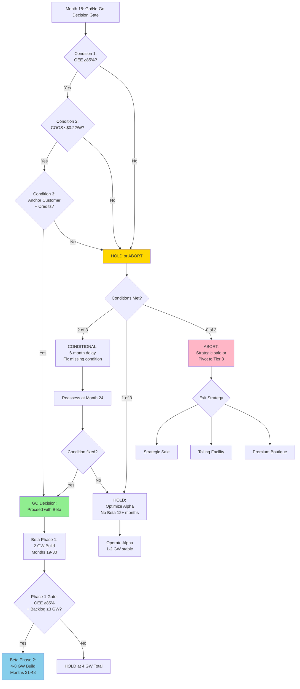

## 8.2.1 Peak Innovation Park: Conditional Expansion Framework

**Strategic Imperative**: Peak Innovation Park (Beta site) is NOT guaranteed. Expansion ONLY proceeds if Alpha site proves all critical assumptions. This conditional framework protects capital, validates demand, and ensures operational maturity before scaling to multi-GW capacity.

### A. The Conditional Strategy

Peak Innovation Park represents a calculated option, not an obligation. The Alpha site (1615 Garden of the Gods) serves as a high-stakes validation facility where all core assumptions—technical, economic, and commercial—must be proven before committing $1-1.5B to Beta expansion.

**Why Conditional Expansion Matters**:

Meyer Burger's Arizona collapse illustrates the catastrophic consequences of premature scaling [^23]. They committed to a 3.5 GW greenfield facility before proving production stability, achieving target yields, or securing anchor customers. When technical problems emerged (fundamental design flaws in production lines) and demand failed to materialize (DESRI termination, customer attrition), Meyer Burger had no revenue-generating fallback and burned through capital with no path to profitability [^33].

Tavakiev inverts this sequence: prove first, scale second. Alpha operates as a profit-generating validation platform by Month 18. Beta expansion occurs only after demonstrating:
- Technical capability (stable OEE at 2 GW)
- Economic viability (base case COGS without policy dependence)
- Commercial validation (locked demand from creditworthy customers)

**The Risk Trade-Off**:
- **Traditional approach**: Commit all capital upfront → faster to scale IF assumptions hold, catastrophic if they don't
- **Tavakiev approach**: Validate incrementally → 12-18 month delay to full scale, but 95% capital preservation if assumptions fail

### B. Month 18 Decision Gate: "Go/No-Go for Beta"

At Month 18 (February 2027), Tavakiev leadership conducts a formal Go/No-Go review for Peak Innovation Park expansion. Beta groundbreaking proceeds ONLY if ALL THREE conditions are met.

#### Condition 1: Operational Proof (85%+ OEE at 2 GW)

**Metric**: Overall Equipment Effectiveness (OEE)
**Target**: ≥85% sustained for 90 consecutive days at Alpha site (2 GW run-rate)
**Measurement Formula**: OEE = Availability × Performance × Quality
- **Availability**: Equipment uptime (target: ≥90%)
- **Performance**: Actual throughput vs. design capacity (target: ≥95%)
- **Quality**: Good units / total units produced (target: ≥98%)

**Industry Benchmark**: 80-85% OEE for established c-Si module manufacturers (First Solar CdTe operations: 85-90%; Qcells module-only lines: 80-85%) [^23]

**Why This Matters**: OEE ≥85% proves:
1. **Process stability**: Equipment operates reliably without constant troubleshooting
2. **Quality control**: Yield losses are predictable and manageable
3. **Labor efficiency**: Workforce is trained and process documentation is adequate
4. **Scalability**: Process can be replicated at Beta without redesign

**Failure Threshold**: If OEE <80% at Month 18:
- **Root cause**: Fundamental process problem (equipment integration, control systems, quality defects)
- **Decision**: DO NOT scale to Beta
- **Remediation**: 6-month optimization sprint at Alpha; reassess at Month 24

**Historical Context**: Meyer Burger never achieved stable OEE in Arizona. Internal estimates suggest OEE remained below 60% during pilot production (Q2-Q3 2024) due to "design flaws in production lines" and "software integration issues" [^23]. Scaling to 3.5 GW under these conditions would have been catastrophic even if demand existed.

#### Condition 2: Economic Proof (Base Case COGS ≤$0.22/W)

**Metric**: Fully-loaded Cost of Goods Sold (COGS) per Watt at 2 GW production
**Target**: ≤$0.22/W (or ≤$110 per 500W panel)
**Included Costs**:
- Direct materials (cells, glass, frames, EVA, backsheet, junction boxes)
- Direct labor (module assembly, testing, packaging)
- Energy (electricity for cleanroom, equipment operation)
- Depreciation (equipment capex amortized over 10 years)
- Manufacturing overhead (facility lease, maintenance, indirect labor)

**Why This Matters**: COGS ≤$0.22/W proves the business is viable even in the **Base Case** (no §45X credits). This threshold ensures:
1. **Policy independence**: Business survives IRA repeal or §45X phase-down
2. **Competitive positioning**: Gross margin ≥25% at $0.30/W ASP (market benchmark)
3. **Investor confidence**: Profitability does not depend on uncertain policy outcomes

**Cost Context**:
- **Chinese imports**: $0.06-0.08/W COGS (but face tariffs + UFLPA restrictions)
- **U.S. module-only assemblers**: $0.23-0.27/W COGS (Jinko Florida, Canadian Solar Texas estimates) [^33]
- **Tavakiev Base Case target**: $0.22/W (competitive with U.S. peers, profitable at $0.30/W ASP)

**Failure Scenarios**:
- **COGS $0.23-0.26/W**: Marginal economics; proceed with Beta ONLY if anchor customers commit to $0.32-0.35/W pricing (domestic-content premium)
- **COGS >$0.26/W**: Abort Beta expansion; reassess cost structure or pivot to premium-only Tier 3 strategy (low volume, high margin)

**Mitigation If Miss**: Phase B vertical integration (frames in-house) can reduce COGS by $0.02-0.03/W [^23]. If COGS miss is due to high frame/glass costs, accelerate vertical integration before Beta commitment.

#### Condition 3: Commercial Proof (1+ Anchor Customer, Credits Monetized)

**Metric 1**: At least ONE anchor customer contract signed
**Requirements**:
- **Volume commitment**: Minimum 500 MW/year for 3+ years (1.5 GW total)
- **Creditworthiness**: Investment-grade rating OR take-or-pay structure with 30% early termination penalty
- **Customer type**: Hyperscaler (Microsoft, Google, Meta), large EPC (Mortenson, DPR, McCarthy), or utility-scale developer (NextEra, Duke Energy, Dominion)

**Metric 2**: §45X credits successfully monetized (direct-pay OR §6418 transfer at ≥85% of face value)
**Requirements**:
- **IRS acceptance**: At least one direct-pay election processed without dispute (proving FEOC compliance, domestic-content attestations accepted)
- **Amount**: $20-50M in Year 1 credits claimed and received (or transferred at ≥85% value)

**Why This Matters**:
1. **Demand validation**: Anchor customer proves market demand exists for domestic HJT modules at Tavakiev's pricing
2. **Switching costs**: Customer lock-in creates 5-10 year revenue visibility (technical certifications, financing, delivery schedules) [^33]
3. **Policy proof**: Successful credit monetization proves IRS accepts Tavakiev's FEOC compliance methodology and domestic-content BOM
4. **Market acceptance**: §6418 transfer at ≥85% proves tax equity market values Tavakiev credits (liquid secondary market)

**Failure Scenarios**:
- **No anchor customer**: Speculative demand; DO NOT build GW-scale capacity without locked offtake
- **Credits rejected/delayed by IRS**: Policy risk higher than modeled; reassess Beta sizing or delay until Treasury guidance clarifies
- **§6418 transfer at <70%**: Credit market discounts Tavakiev risk; recalibrate financial model with lower credit monetization assumptions

**Historical Context**: Meyer Burger's 5 GW DESRI agreement (August 2023) collapsed when production delays eroded customer confidence (terminated November 2024) [^33]. By the time Meyer Burger could have shipped product, DESRI had already committed to alternative suppliers. Speed to first delivery creates customer lock-in; delays enable customer defection.

### C. Decision Matrix at Month 18

| Conditions Met | Decision | Rationale | Capital Impact |
|:---------------|:---------|:----------|:---------------|
| **3 of 3** | **GO** – Proceed with Beta groundbreaking | All assumptions validated; risk is manageable | Deploy $1-1.5B (Series A + DOE loan guarantee) |
| **2 of 3** | **CONDITIONAL** – 6-month delay, fix missing condition | One fixable issue identified; Beta proceeds after remediation | Delay Series A to Month 24; focus resources on remediation |
| **1 of 3** | **HOLD** – Optimize Alpha, no Beta for 12+ months | Multiple failures indicate fundamental problems with plan | Preserve capital; no Beta commitment; operate Alpha at stable 1-2 GW |
| **0 of 3** | **ABORT** – Strategic sale or pivot to Tier 3 premium-only | Plan not working as designed; scaling would compound losses | Sell Alpha assets to contract manufacturer (Qcells, Silfab) OR pivot to boutique premium strategy (300-500 MW/year, high margin) |

**Decision Authority**: Requires unanimous Board approval. CEO presents findings; CFO provides financial analysis; COO provides operational assessment; CRO provides customer pipeline analysis.

**Transparency Requirement**: Seed investors (Physical Capital, 3x5 Partners, Lander.media) receive decision briefing 30 days before Month 18 gate. Series A investors (if already engaged) receive same briefing.

### D. Phased Beta Deployment (If GO)

Even with a "GO" decision, Peak Innovation Park is built incrementally. NO all-in commitment; each capacity addition requires proof of demand and profitability.

**Phase 1 (Months 19-30): Initial 2 GW Build**
- **Rationale**: Matches proven Alpha capacity; replicates validated process
- **Capital**: $500-700M (equipment, building, commissioning)
- **Risk**: Lowest risk phase; copying known-good design
- **Gate**: Proceed if Month 18 decision is "GO"

**Phase 2 (Months 31-48): Additional 4-8 GW (Conditional)**
- **Rationale**: Scale to full 10-12 GW only if Phase 1 successful AND customer backlog justifies
- **Capital**: $500-800M (incremental equipment, building expansion)
- **Gate Requirements**:
  1. Phase 1 achieves ≥85% OEE within 90 days of commissioning
  2. Anchor customer backlog ≥3 GW (proof of demand for Phase 2 output)
  3. §45X credits continue to monetize at ≥85% (policy stability confirmed)
- **Abort Criteria**: If any gate requirement fails, HOLD at 4 GW total capacity (Alpha 2 GW + Beta Phase 1 2 GW)

**Copy-Paste Discipline**: Each 2 GW increment is treated as a separate capital allocation decision. Board approval required for each increment based on:
- **Technical**: OEE ≥85% at previously commissioned capacity
- **Commercial**: Customer deposits covering ≥60% of incremental output
- **Utility**: Colorado Springs Utilities written confirmation of power expansion availability

### E. Abort Criteria (If Conditions Not Met)

If Month 18 conditions are not met, Tavakiev executes pre-planned contingency strategies. These are NOT failures—they are intelligent pivots that preserve capital and maximize enterprise value.

#### Scenario 1: OEE <80% (Process Instability)

**Problem**: Production process not stable; equipment integration or quality issues unresolved

**Fix Attempt** (6 months):
- **Root cause analysis**: Engage equipment vendors (Ecoprogetti, Meyer Burger OEM) and NREL to diagnose issues
- **Process optimization**: Implement Six Sigma DMAIC methodology; hire process engineers from First Solar/Qcells
- **Digital twin refinement**: Update Omniverse model with actual performance data; simulate corrective actions before implementation

**Reassessment at Month 24**:
- **If OEE ≥80%**: Proceed with Beta at reduced scale (2 GW only, Phase 2 deferred)
- **If OEE still <80%**: Execute strategic sale or tolling conversion

**Exit Options**:
- **Option A – Strategic Sale**: Sell Alpha assets to contract manufacturer (Qcells, Silfab, Heliene) seeking U.S. capacity expansion
  - **Valuation**: $100-200M (equipment book value + real estate lease assignment)
  - **Timeline**: 6-9 months (identify buyer, negotiate, close)
- **Option B – Tolling Facility**: Convert Alpha to tolling operation (manufacture modules for other brands)
  - **Economics**: $0.08-0.10/W tolling fee; lower margin but eliminates commercial risk
  - **Customers**: Module brands without U.S. manufacturing (Trina, LONGi, JinkoSolar seeking tariff workaround)

#### Scenario 2: COGS >$0.26/W (Economics Don't Work)

**Problem**: Cost structure too high; not competitive even with domestic-content premium

**Fix Attempt** (6-12 months):
- **Accelerate Phase B vertical integration**: Bring frames in-house (target $0.02-0.03/W savings)
- **Supply chain renegotiation**: Renegotiate glass, EVA, backsheet contracts; pursue volume discounts or alternative suppliers
- **Process efficiency**: Implement lean manufacturing; reduce labor hours per panel; optimize energy usage

**Reassessment at Month 24-30**:
- **If COGS ≤$0.24/W**: Proceed with Beta at reduced scale (marginal economics but viable with anchor customer premiums)
- **If COGS still >$0.26/W**: Halt Beta expansion; operate Alpha at stable 1-2 GW; initiate M&A discussions

**Exit Options**:
- **Option A – Strategic Acquisition**: Merge with larger solar manufacturer (First Solar, Qcells, Silfab) seeking HJT technology or Colorado presence
  - **Valuation**: $150-300M (based on technology IP, operational facility, IRA credit eligibility)
- **Option B – Premium Boutique**: Operate Alpha as "premium boutique" manufacturer (300-500 MW/year, high-efficiency HJT focus)
  - **Customer profile**: Hyperscalers paying domestic-content premium ($0.35-0.40/W ASP)
  - **Economics**: Lower volume, higher margin; niche strategy

#### Scenario 3: No Anchor Customer (Demand Not Validated)

**Problem**: Market demand for Tavakiev modules does not exist at required price points

**Fix Attempt** (12 months):
- **Pricing adjustment**: Lower ASP to $0.25-0.28/W (accept lower margins; compete on price vs. domestic-content premium)
- **Channel expansion**: Pursue residential/C&I distributors (CED Greentech, Wesco) instead of utility-scale EPCs
- **Spot market sales**: Sell modules on spot market (no contracts); accept demand volatility

**Reassessment at Month 30**:
- **If 1+ anchor customer signed**: Proceed with Beta at reduced scale (2 GW only)
- **If still no anchor customers**: Operate Alpha as "premium boutique"; no Beta

**Exit Options**:
- **Option A – Residential Pivot**: Shift focus to residential/C&I market (higher ASP, lower volume, distributed channels)
  - **Customer acquisition**: Partner with residential installers (Sunrun, Tesla Energy, local EPCs)
  - **Module specs**: Optimize for residential aesthetics (all-black, smaller form factors)
- **Option B – Technology Licensing**: License Tavakiev's automation/digital twin IP to other manufacturers
  - **Customers**: International solar manufacturers seeking U.S.-style automation expertise
  - **Economics**: $10-20M annual licensing fees; lower capital intensity than manufacturing

### F. Capital Preservation Strategy

Beta planning activities (permitting, site work, equipment deposits) occur in PARALLEL with Alpha commissioning (Months 0-18). This $3-5M investment creates optionality while preserving capital.

**Parallel Planning Activities** (Months 0-18):
- **Permitting**: Submit applications for Peak Innovation Park (El Paso County Special Use Permit, CDPHE air/water permits)
- **Site work**: Preliminary geotechnical surveys, utility interconnection applications (CSU power expansion)
- **Equipment deposits**: Place refundable deposits on long-lead equipment (HJT cell line, module line) to secure delivery slots

**Capital at Risk**: $3-5M total
- **Permitting fees**: $500K-1M
- **Engineering/design**: $1-2M
- **Refundable deposits**: $1-2M (recoverable if Beta aborted)

**Risk/Reward Analysis**:
- **If NO-GO**: $3-5M sunk cost (lost investment)
- **If GO**: $3-5M saves 12-18 months of timeline (permits/site work completed in advance)
- **ROI**: 60-100x (risk $5M to save $300-500M in time-to-market advantage) [^33]

**Justification**: The time value of early production far exceeds the at-risk capital. At 2 GW run-rate, each month of delay costs $58M in revenue ($42.5M product + $15.6M §45X credits) [^23]. Spending $5M to compress Beta timeline by 12-18 months generates $700M-1B in accelerated cash flow.

### G. Communication Strategy with Investors

Investors must understand Beta is OPTION, not OBLIGATION. This conditional framework demonstrates disciplined capital allocation and de-risks the scale-up phase.

**Seed Round Positioning** ($150M, Month 0-6):
- **Use of proceeds**: Funds Alpha site ONLY (asset acquisition, retrofit, commissioning, working capital)
- **Beta contingency**: Seed round DOES NOT fund Beta; Series A required for Beta expansion
- **Investor message**: "We are proving the model at Alpha before committing to multi-GW scale. This protects your capital and validates assumptions before scaling."

**Series A Positioning** ($300-500M, Month 12-18):
- **Timing**: Raised CONDITIONAL on Month 18 gates; roadshow begins Month 12-15 (before decision gate)
- **Use of proceeds**: Funds Beta Phase 1 (2 GW) + working capital for Alpha ramp
- **Decision contingency**: Series A close is CONTINGENT on "GO" decision at Month 18; investors see Alpha operational data before committing
- **Investor message**: "You are investing in a PROVEN operation, not a concept. Alpha has demonstrated OEE, COGS, and customer demand. Your capital scales a validated model."

**DOE Loan Guarantee** ($500M-1B, application Month 9-12, close Month 24-36):
- **Timing**: Application submitted after Alpha operational (proof of capability); close after Series A (equity cushion in place)
- **Use of proceeds**: Funds Beta Phase 2 (4-8 GW expansion) + vertical integration capex (cells, frames)
- **LPO requirements**: DOE Loan Programs Office requires operational proof before funding [^23]; Alpha operational data satisfies this requirement
- **Investor message**: "DOE loan enables us to scale to 10-12 GW without diluting equity. Loan is contingent on commercial proof—which we have already achieved."

**Transparency Commitment**:
- Quarterly operational KPI reporting to Seed investors (OEE, COGS, customer pipeline)
- Month 15 "Beta Readiness" briefing for Seed investors (preview of Month 18 decision)
- Month 18 formal decision presentation to Board + Seed investors (transparency on decision rationale)

### H. Decision Flowchart

### I. Summary: Why Conditional Expansion Wins

The conditional expansion framework achieves three strategic objectives:

**1. Capital Efficiency**: Preserves $1-1.5B in Series A + DOE loan capital until Alpha proves all assumptions. If assumptions fail, capital remains available for pivots or returns to investors.

**2. Risk Mitigation**: Separates operational risk (Alpha) from scale-up risk (Beta). Alpha failure costs $150M (Seed round); Beta failure would cost $1.5B+. By validating at Alpha first, we reduce enterprise risk by 10x.

**3. Investor Confidence**: Demonstrates disciplined capital allocation. Investors see management team that validates before scaling—not one that "builds and prays." This discipline increases valuation multiples and reduces cost of capital.

**Precedent**: SpaceX's Starship program follows identical logic: test Starship prototypes (SN8-SN11) at Boca Chica (Alpha) before committing to orbital launch infrastructure at Cape Canaveral (Beta). Each prototype failure refined design without jeopardizing Cape investment [^33].

**Tavakiev Commitment**: We will NOT scale to Beta unless data proves it is the right decision. This conditional framework is a FEATURE of our strategy, not a limitation. It protects investor capital while maximizing upside if assumptions hold.

---

**References**:

[^23]: "OPERATION BABACOMARI: THE ACCELERATION PLAN," Tavakiev Solar Red-Team Analysis (Document 23), November 2025. Analysis of Meyer Burger asset acquisition timeline, cost structure, and vertical integration economics.

[^33]: "Tavakiev Solar Speed-Based Dominance Strategy," Tavakiev Solar Red-Team Analysis (Document 33), November 2025. Comparative analysis of SpaceX, Tesla, Amazon execution velocity; application to Tavakiev's 9-month first-panel timeline and customer lock-in strategy.
